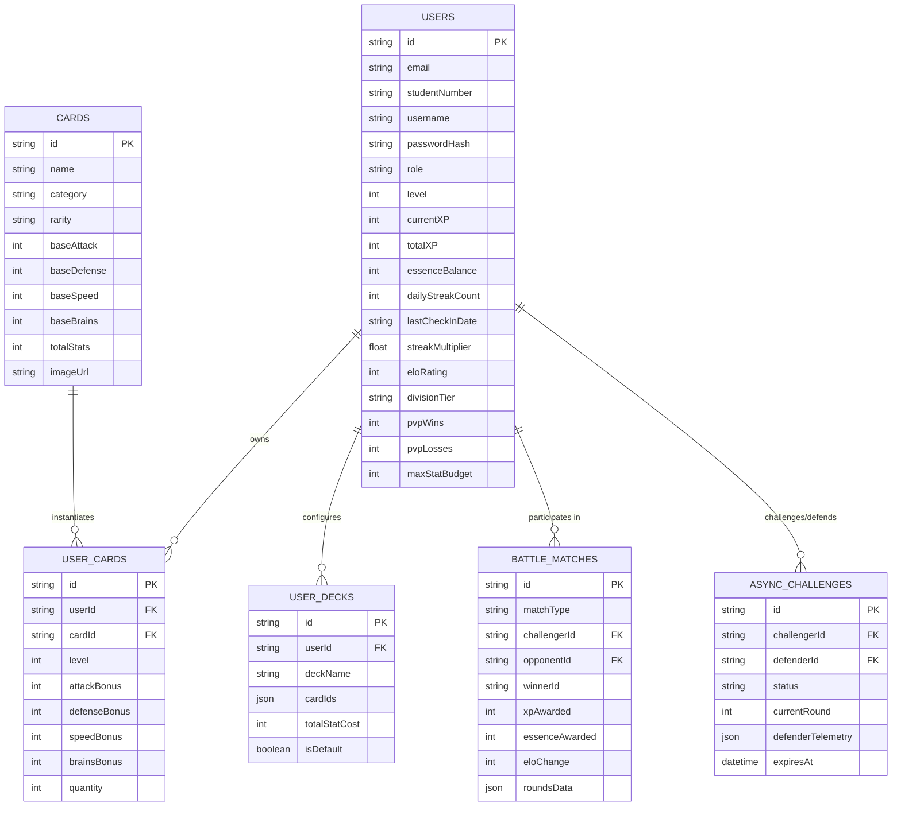

# Wits Quest - Comprehensive Database Architecture & Schema Design Plan

> **Document Purpose**: This guide provides the complete relational database architecture and table schema specifications for **Wits Quest**. It details how student registrations, progressive XP leveling, Essence currency, card inventories, custom decks, match history, and async PvP defensive telemetry are structured and persisted across the application backend.

---

## 1. Entity Relationship Diagram (ERD)

---

## 2. Table Specifications & Attribute Definitions

### Table 2.1: `users` (Student Registration & Profile State)
Contains authentication credentials, student identification, progression levels, XP, Essence currency, streak multipliers, and competitive Elo ladder standing.

| Column Name | Data Type | Constraints | Description |
| :--- | :--- | :--- | :--- |
| `id` | `VARCHAR(36)` | `PRIMARY KEY` | Unique User UUID / Student ID |
| `email` | `VARCHAR(255)` | `UNIQUE, NOT NULL` | Wits student email (`@students.wits.ac.za`) |
| `studentNumber` | `VARCHAR(20)` | `UNIQUE, NOT NULL` | Wits student reference number |
| `username` | `VARCHAR(50)` | `UNIQUE, NOT NULL` | Explorer avatar display name |
| `passwordHash` | `VARCHAR(255)` | `NOT NULL` | Bcrypted secure password hash |
| `role` | `ENUM` | `DEFAULT 'STUDENT'` | `STUDENT`, `ADMIN`, `LECTURER` |
| `level` | `INTEGER` | `DEFAULT 1` | Current player level (`Lv.1` -> `Lv.28`) |
| `currentXP` | `INTEGER` | `DEFAULT 0` | XP accumulated within current level |
| `totalXP` | `INTEGER` | `DEFAULT 0` | Lifetime XP score |
| `essenceBalance` | `INTEGER` | `DEFAULT 100` | Shard currency for Card Forge upgrades |
| `dailyStreakCount` | `INTEGER` | `DEFAULT 1` | Consecutive 24-hr check-in streak |
| `lastCheckInDate` | `TIMESTAMP` | `NOT NULL` | Timestamp of last GPS landmark check-in |
| `streakMultiplier` | `FLOAT` | `DEFAULT 1.0` | `1.0` (0d), `1.10` (+10% at 3d), `1.25` (+25% at 7d) |
| `eloRating` | `INTEGER` | `DEFAULT 1000` | Competitive Ranked rating score |
| `divisionTier` | `ENUM` | `DEFAULT 'GOLD'` | `BRONZE`, `SILVER`, `GOLD`, `PLATINUM`, `DIAMOND` |
| `pvpWins` | `INTEGER` | `DEFAULT 0` | Total PvP victory counter |
| `pvpLosses` | `INTEGER` | `DEFAULT 0` | Total PvP defeat counter |
| `pvpDraws` | `INTEGER` | `DEFAULT 0` | Total PvP tie counter |
| `maxStatBudget` | `INTEGER` | `DEFAULT 300` | Max stat points allowed per deck (Upgrades with Level) |
| `legendaryCap` | `INTEGER` | `DEFAULT 1` | Maximum Legendary cards allowed in deck |
| `createdAt` | `TIMESTAMP` | `DEFAULT NOW()` | Registration timestamp |
| `updatedAt` | `TIMESTAMP` | `DEFAULT NOW()` | Last profile update timestamp |

---

### Table 2.2: `cards` (Master Landmark Card Catalog)
Master reference catalog defining landmark collectible cards across Wits campus.

| Column Name | Data Type | Constraints | Description |
| :--- | :--- | :--- | :--- |
| `id` | `VARCHAR(36)` | `PRIMARY KEY` | Card identifier (`card-101`) |
| `name` | `VARCHAR(100)` | `NOT NULL` | Card name (e.g., *Great Hall Pillars*) |
| `category` | `ENUM` | `NOT NULL` | `Science`, `History`, `Landmarks`, `Lifestyle`, `Sports` |
| `rarity` | `ENUM` | `NOT NULL` | `Common`, `Rare`, `Epic`, `Legendary` |
| `baseAttack` | `INTEGER` | `NOT NULL` | Base ATK value |
| `baseDefense` | `INTEGER` | `NOT NULL` | Base DEF value |
| `baseSpeed` | `INTEGER` | `NOT NULL` | Base SPD value |
| `baseBrains` | `INTEGER` | `NOT NULL` | Base BRN value |
| `totalStats` | `INTEGER` | `NOT NULL` | Sum of base stat points |
| `imageUrl` | `VARCHAR(255)` | `NOT NULL` | WebP artwork path |
| `landmarkId` | `VARCHAR(36)` | `NULLABLE` | Associated campus landmark ID |

---

### Table 2.3: `user_cards` (Student Inventory & Card Upgrades)
Tracks cards owned by each student along with upgrade levels from the Card Forge.

| Column Name | Data Type | Constraints | Description |
| :--- | :--- | :--- | :--- |
| `id` | `VARCHAR(36)` | `PRIMARY KEY` | Inventory record ID |
| `userId` | `VARCHAR(36)` | `FOREIGN KEY` | References `users.id` |
| `cardId` | `VARCHAR(36)` | `FOREIGN KEY` | References `cards.id` |
| `level` | `INTEGER` | `DEFAULT 1` | Forge upgrade level (+5 all stats per level) |
| `attackBonus` | `INTEGER` | `DEFAULT 0` | Accumulated ATK bonus |
| `defenseBonus` | `INTEGER` | `DEFAULT 0` | Accumulated DEF bonus |
| `speedBonus` | `INTEGER` | `DEFAULT 0` | Accumulated SPD bonus |
| `brainsBonus` | `INTEGER` | `DEFAULT 0` | Accumulated BRN bonus |
| `quantity` | `INTEGER` | `DEFAULT 1` | Duplicate count for scrapping |
| `acquiredAt` | `TIMESTAMP` | `DEFAULT NOW()` | Acquisition timestamp |

---

### Table 2.4: `user_decks` (Constructed Battle Decks)
Stores custom 5-card battle decks created by students under budget constraints.

| Column Name | Data Type | Constraints | Description |
| :--- | :--- | :--- | :--- |
| `id` | `VARCHAR(36)` | `PRIMARY KEY` | Deck ID |
| `userId` | `VARCHAR(36)` | `FOREIGN KEY` | References `users.id` |
| `deckName` | `VARCHAR(50)` | `NOT NULL` | Deck display name |
| `cardIds` | `JSON` | `NOT NULL` | Array of exactly 5 card IDs |
| `totalStatCost` | `INTEGER` | `NOT NULL` | Sum of stat costs (Must be <= `user.maxStatBudget`) |
| `isDefault` | `BOOLEAN` | `DEFAULT FALSE` | Active battle deck indicator |
| `createdAt` | `TIMESTAMP` | `DEFAULT NOW()` | Creation timestamp |
| `updatedAt` | `TIMESTAMP` | `DEFAULT NOW()` | Update timestamp |

---

### Table 2.5: `battle_matches` (Combat History & Logs)
Logs end-of-match outcomes across CPU, Live WebSocket, and Async PvP modes.

| Column Name | Data Type | Constraints | Description |
| :--- | :--- | :--- | :--- |
| `id` | `VARCHAR(36)` | `PRIMARY KEY` | Match UUID |
| `matchType` | `ENUM` | `NOT NULL` | `CPU`, `LIVE_PVP`, `ASYNC_PVP` |
| `challengerId` | `VARCHAR(36)` | `FOREIGN KEY` | References `users.id` |
| `opponentId` | `VARCHAR(36)` | `FOREIGN KEY` | References `users.id` or `'CPU_BOT'` |
| `winnerId` | `VARCHAR(36)` | `NOT NULL` | Winner User ID or `'DRAW'` |
| `roundsWonChallenger` | `INTEGER` | `NOT NULL` | Rounds won by challenger |
| `roundsWonOpponent` | `INTEGER` | `NOT NULL` | Rounds won by opponent |
| `xpAwarded` | `INTEGER` | `NOT NULL` | XP granted to winner/loser |
| `essenceAwarded` | `INTEGER` | `NOT NULL` | Essence granted |
| `eloChange` | `INTEGER` | `NOT NULL` | Elo points delta (+15 to +25) |
| `roundsData` | `JSON` | `NOT NULL` | Detailed round stat picks & outcomes |
| `createdAt` | `TIMESTAMP` | `DEFAULT NOW()` | Match timestamp |

---

### Table 2.6: `async_pvp_challenges` (Async Turn Queue & Defensive Telemetry)
Manages asynchronous turn-based challenges and stores failure feedback for offline defenders.

| Column Name | Data Type | Constraints | Description |
| :--- | :--- | :--- | :--- |
| `id` | `VARCHAR(36)` | `PRIMARY KEY` | Challenge ID |
| `challengerId` | `VARCHAR(36)` | `FOREIGN KEY` | Initiated by player |
| `defenderId` | `VARCHAR(36)` | `FOREIGN KEY` | Challenged offline player |
| `status` | `ENUM` | `DEFAULT 'PENDING'` | `PENDING_DEFENDER_TURN`, `COMPLETED`, `EXPIRED` |
| `currentRound` | `INTEGER` | `DEFAULT 1` | Active round number |
| `defenderTelemetry` | `JSON` | `NULLABLE` | Defensive failure report (failed stat, deficit, advice) |
| `expiresAt` | `TIMESTAMP` | `NOT NULL` | 24-hour expiration timestamp |
| `createdAt` | `TIMESTAMP` | `DEFAULT NOW()` | Creation timestamp |

---

## 3. Student Registration Seeding Workflow

When a new student registers (`POST /api/auth/register`):
1. **Insert into `users`**: Creates user profile with baseline level 1, 1000 Elo rating, 300 Stat Budget limit, 100 Essence shards, and `divisionTier = 'GOLD'`.
2. **Insert into `user_cards`**: Assigns 5 starter landmark cards to student inventory.
3. **Insert into `user_decks`**: Builds starter 5-card deck.

---

## 4. Division Tier Calculation Rules

Ranked Division Tiers are computed dynamically based on `user.eloRating`:

- **Bronze**: 0 – 499 Elo
- **Silver**: 500 – 999 Elo
- **Gold**: 1000 – 1499 Elo
- **Platinum**: 1500 – 1799 Elo
- **Diamond**: 1800+ Elo
