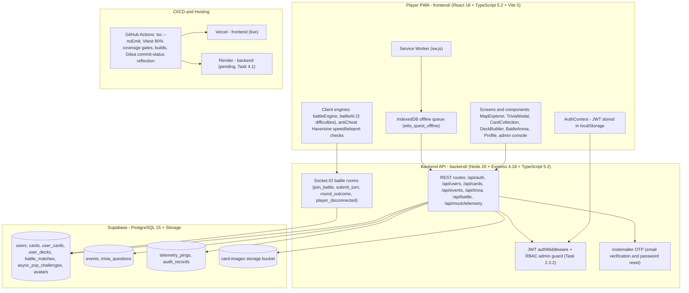

# Wits Quest (COMS3011A Project 6) — Master Architecture & Task Specification Guide — v2.0

**Prepared by:** Mahlatse Clayton
**Date:** 7 September 2026
**Revision:** v2.0 — Roadmap Update. Supersedes the execution plan of the 4 August 2026 v1 guide (which remains on record as the original specification).
**Project:** COMS3011A Software Design Project
**Affiliation:** University of the Witwatersrand, Johannesburg

**What changed in v2**

- **Section 1.3** now records the _implemented_ stack against the v1 recommendation (Prisma, Redis, PostGIS, Mapbox GL and NestJS were never adopted — see the descope register in §7.2).
- **Section 2** replaces the "2-Sprint Front-Load Push" with a **consolidate → complete → extend** strategy, re-planned against the verified state of the codebase on 7 September 2026.
- **Section 3** annotates every tier expectation with its audited build status.
- **Section 4** re-plans the remaining sprints member-by-member, with explicit **P0/P1/P2 priorities** and **traceability IDs** (`F##`, `B-#`, `I-#` refer to the master fix register in `WITS_QUEST_FIXES_AND_OUTSTANDING_FEATURES.md`).
- **Section 7** (new) adds the risk register and the Advanced-tier descope decisions with re-entry criteria.

## Table of Contents

1. System Context & Software Background
2. Project Execution Strategy & Milestone Timeline
3. Analysis of Project Tier Expectations
4. Engineering & Software Task Matrix
5. Definition of Done & QA Standard
6. UI/UX Screen Specifications & Component Breakdown
7. Risk Register & Descoping Decisions

---

## 1. System Context & Software Background

### 1.1 What is Wits Quest?

Wits Quest is a progressive, location-based web application (PWA) designed for the University of the Witwatersrand (Wits). Inspired by Pokémon GO and turn-based card strategy games, Wits Quest replaces traditional static campus tours with an interactive, location-gated trivia and collectible card battle experience. The software combines several complex computer science domains into a single unified web platform:

1. **Geographic Information Systems (GIS) & Geolocation Verification**: Real-time interactive campus mapping with server-side mathematical validation of GPS coordinates.
2. **Offline-First Synchronous & Asynchronous Data Resilience**: Ability to explore campus and complete challenges in signal "dead-zones", caching attempts locally and securely syncing with the server upon reconnection.
3. **Turn-Based RPG Strategy & Rule Engine**: Card deck construction, stat attribute comparisons, CPU AI opponents, and real-time live WebSocket multiplayer.
4. **Game Economy & Progression Systems**: Card rarities, category attributes, daily streaks, achievement hooks, and atomic peer-to-peer trading.
5. **Security, Telemetry & Behavioral Anti-Cheat**: Speed-over-ground movement verification, anti-teleportation trajectory analysis, and trust-score computation.
6. **Authoring & Curation Governance Console**: Multi-stage content lifecycle management and campus foot-traffic heatmaps.

### 1.2 System Architecture Overview (as implemented, 7 Sep 2026)

### 1.3 Technology Stack — v1 Recommendation vs Implemented Reality

| Layer           | v1 Recommendation (4 Aug)            | Implemented (verified)                                                        | Notes                                                                                                 |
| :-------------- | :----------------------------------- | :---------------------------------------------------------------------------- | :---------------------------------------------------------------------------------------------------- |
| Frontend        | React (Vite) or Next.js, TypeScript  | React 18.2 + Vite 5.4 + TypeScript 5.2                                        | As recommended                                                                                        |
| Map & Spatial   | Leaflet.js / Mapbox GL JS, OSM tiles | Leaflet 1.9 + react-leaflet 4.2 + OSM                                         | Mapbox GL not adopted — OSM tiles are sufficient at campus scale                                      |
| Backend API     | Node.js with Express or NestJS       | Node 20 + Express 4.18 + TypeScript 5.2                                       | NestJS not adopted — Express matches team experience                                                  |
| Database & ORM  | PostgreSQL with Prisma ORM           | Supabase hosted PostgreSQL 15 via `@supabase/supabase-js`                     | Prisma not adopted — Supabase client + quoted camelCase columns; no ORM layer needed at current scale |
| Real-time       | WebSockets (socket.io)               | Socket.IO 4.7 (server rooms + client)                                         | Live-battle room handler exists in-memory (Member 2 scope)                                            |
| Offline         | Service Worker + IndexedDB           | `public/sw.js` + IndexedDB queue (`wits_quest_offline`)                       | Queue service is built but **not yet wired into the trivia flow** (Task 2.3.5)                        |
| Security & Auth | Custom auth, Wits email validation   | JWT (7-day) + bcrypt(10) + `@students.wits.ac.za` validation + nodemailer OTP | OTP codes still in-memory (Task 3.3)                                                                  |

**Never adopted from v1 (now formally descoped, §7.2):** Redis cache layer, PostGIS indexing, Mapbox GL, NestJS, Prisma, Glicko-2, Monte-Carlo balancing, 2PC trading engine, heatmap aggregation service.

### 1.4 Verified Delivery Status (audit of 7 Sep 2026)

| Tier         | Gap-analysis estimate | Headline verified findings                                                                                                                                                                                                                                                                                                                                             |
| :----------- | :-------------------- | :--------------------------------------------------------------------------------------------------------------------------------------------------------------------------------------------------------------------------------------------------------------------------------------------------------------------------------------------------------------------- |
| Basic        | ~85%                  | Map, GPS gating (client-side), trivia marking, collection, CPU battle, admin authoring all work — but the **integrity core is missing**: no server-side location verification on attempts (F1), client-side battle resolution (F2), unauthenticated authoring via route shadowing (F4), no role guard (F5), repeat-answer farming (F6), Deck Builder unreachable (F13) |
| Intermediate | ~35%                  | Offline queue built but never enqueues (F42); async PvP not implemented (I-3); streaks never evaluated (F28); no achievements (F39); quest trails mock (I-6); curation lifecycle absent (I-7); leaderboard hardcoded (F18)                                                                                                                                             |
| Advanced     | ~15%                  | Socket.IO live-battle rooms exist (in-memory); Elo + divisions exist but with conflicting thresholds (F26); territory/trading/heatmaps/trust-score are static mocks or absent                                                                                                                                                                                          |

---

## 2. Project Execution Strategy & Milestone Timeline

### 2.1 Strategic Rationale v2: Consolidate → Complete → Extend

The v1 strategy ("The 2-Sprint Front-Load Push") committed to **100% of Basic and 100% of Intermediate by 15 September**. The front-load instinct was correct — it produced a working end-to-end product in Sprint 1 — but with eight days left in Sprint 2 the verified position is ~85% Basic and ~35% Intermediate, and the missing 15% of Basic is precisely the part the brief weights most heavily: _the location of a player's device must be treated "as a claim to be checked rather than as fact"_, a correct answer must award the card "once", and "the rules of a match should be the game's to enforce, not the player's". None of those three hold today.

v2 therefore re-orders the remaining work under three rules:

1. **Integrity before features.** Every reward path (trivia, battle, streaks) becomes server-verified before any new feature consumes it. A reward handed out by an unverified endpoint devalues every system downstream of it.
2. **Finish before new.** Six built screens are currently unrouted (F14), the offline queue is built but unwired (F42), and the Deck Builder is imported but never rendered (F13). Wiring existing work is days; replacing it with new work is weeks.
3. **Select Advanced by foundation, not ambition.** Live PvP (socket handler exists) and ranked/Elo (exists, needs consolidation) are cheap Advanced wins. 2PC trading, Redis, PostGIS, procedural spawning and heatmaps have zero foundation and are descoped with re-entry criteria (§7.2).

Each remaining sprint carries a **theme**, a **priority ladder (P0 > P1 > P2)** and **exit criteria**, so if time runs out the drop-order is pre-agreed rather than improvised.

### 2.2 Official Milestone Schedule (unchanged — course dates)

| Milestone Event               | Deadline Date     | Target Scope & Deliverable Focus                                   |
| :---------------------------- | :---------------- | :----------------------------------------------------------------- |
| Group Selection               | 26 July 2026      | Team formed (6 Members assigned)                                   |
| Project Proposals             | 31 July 2026      | Proposal submitted                                                 |
| Project Assignments           | 02 August 2026    | Official project allocation                                        |
| Milestone 1: Sprint 1         | 25 August 2026    | Basic Tier Complete: GIS, Trivia, CPU Battle, Auth                 |
| Milestone 2: Sprint 2         | 15 September 2026 | Intermediate Tier Complete: Offline Sync, Async PvP                |
| Milestone 3: Sprint 3         | 29 September 2026 | Advanced Core Engine: WebSocket Live PvP, 2PC Trading              |
| Milestone 4: Final Submission | 11 October 2026   | Full System Polish: Territory Control, Elo Rating, Final Bug Fixes |

### 2.3 Revised Sprint Plan (the v2 roadmap)

| Sprint                       | Window          | Theme                                          | Exit criteria                                                                                          |
| :--------------------------- | :-------------- | :--------------------------------------------- | :----------------------------------------------------------------------------------------------------- |
| **Sprint 2 — Rescue Window** | 07 Sep → 15 Sep | **Integrity-Secured Core**                     | All P0 tasks merged; P1 substantially merged; M2 acceptance (§2.4) demonstrable on a real device       |
| **Sprint 3**                 | 15 Sep → 29 Sep | **Intermediate Complete + Selective Advanced** | Every Intermediate brief requirement (I-1…I-7) verifiably done; live PvP playable; M3 acceptance green |
| **Sprint 4**                 | 29 Sep → 11 Oct | **Production Hardening & Submission**          | Full stack deployed; CI green from `main`; docs/UML complete; feature freeze 04 Oct                    |

### 2.4 Revised Milestone Acceptance (replaces v1's "100% + 100% by 15 Sep")

- **M2 (15 Sep) — "Trusted Core".** Someone _not_ at a location cannot attempt its challenge (server-verified coordinates + once-only awarding, Tasks 2.3.1–2.3.3); authoring endpoints require ADMIN/LECTURER (Task 2.3.2); match rules enforced server-side (Task 2.2.2); offline attempts reconcile using capture-time coordinates (Task 2.3.5); leaderboard and streaks are live data (Tasks 2.5.2–2.5.3); event time-window states visible on the map (Task 2.1.1). Async PvP (Task 2.2.1) is the P2 stretch of this window — if it slips, its hard deadline is 22 Sep, not 15 Sep.
- **M3 (29 Sep) — "Intermediate Complete + Selective Advanced".** Quest trails completed in order with nearby-unvisited surfacing (I-6); full curation lifecycle draft → review → publish with retirement and missed-question repair (I-7); achievements live (F39); duplicates worth something via the Forge (F40/F20); movement-history and low-accuracy corroboration server-side (F35–F37); live PvP playable with real decks and turn clocks (foundation exists); division thresholds unified (F26).
- **M4 (11 Oct) — "Submission".** Backend deployed and reachable from the Vercel frontend (F47, F11); deploys only from `main` (F45); README/docs/UML consistent (F48–F53); regression pass on real devices on campus; zero known high-severity bugs.

---

## 3. Analysis of Project Tier Expectations (status-annotated)

### 3.1 Basic Tier Expectations

| Expectation                                                      | Verified status                                                               | Outstanding (traceability)                           |
| :--------------------------------------------------------------- | :---------------------------------------------------------------------------- | :--------------------------------------------------- |
| Campus map & events (Leaflet, active markers)                    | **Built** — MapExplorer + GeoJSON campus bounds                               | Add time-window states UPCOMING/ACTIVE/EXPIRED (B-1) |
| Location verification (server-side coordinate checks)            | **Missing** — 25 m Haversine gate is client-only                              | F1, F36 — Task 2.3.3 (P0)                            |
| Trivia & marking engine (server-side validation, varied formats) | **Built** — MC + text, always reveals the answer                              | Harden the answer path: F3, F4, F29                  |
| Card collection & deck builder                                   | **Partial** — collection works; Deck Builder unreachable; locked cards hidden | F13, F25, F15 — Task 2.5.4                           |
| Card awarded **once** per event                                  | **Missing** — repeat submissions re-award every time                          | F6 — Task 2.3.3 (P0)                                 |
| CPU battle minigame (rules enforced by the game)                 | **Partial** — engine works but resolution is client-side                      | F2, F31 — Task 2.2.2 (P0)                            |
| Admin console (place events, write questions, define cards)      | **Partial** — UI works; APIs unauthenticated via route shadowing              | F4, F5 — Tasks 2.3.1–2.3.2 (P0)                      |

### 3.2 Intermediate Tier Expectations

| Expectation                                                                              | Verified status                                                           | Outstanding (traceability)                       |
| :--------------------------------------------------------------------------------------- | :------------------------------------------------------------------------ | :----------------------------------------------- |
| Offline signal resilience (attempt caching, checked "as it would have been at the time") | **Partial** — queue service + reconnect listeners built, nothing enqueues | F42, F43, F1 — Tasks 2.1.2, 2.3.5 (P1)           |
| Movement anti-spoofing (speed-over-ground, server-side)                                  | **Missing** — detection runs only in the browser                          | F35–F37 — Tasks 2.6.1–2.6.2, 3.6                 |
| Async PvP battle (persistent state, eventual forfeit)                                    | **Missing** — static mock screen; table exists in migration SQL           | I-3 — Task 2.2.1 (P2)                            |
| Progression & economy (profiles, XP, achievements, streaks)                              | **Partial** — XP works in battle only; streaks/achievements dead          | F18, F27, F28, F38, F39 — Tasks 2.5.1–2.5.3, 3.5 |
| Guided trails & radar (sequential quests, unvisited surfacing)                           | **Missing** — hardcoded mock                                              | I-6 — Task 3.1                                   |
| Curation governance (draft → review → publish)                                           | **Missing** — admins publish directly                                     | I-7 — Tasks 2.4.1 (seed), 3.4 (full)             |

### 3.3 Advanced Tier Expectations

| Expectation                                   | Verified status                                                                 | v2 decision                                                             |
| :-------------------------------------------- | :------------------------------------------------------------------------------ | :---------------------------------------------------------------------- |
| Live WebSocket PvP (sync battles, spectating) | **Partial** — in-memory room handler + mock arena screen                        | **Selected** — harden on existing foundation (Task 3.2)                 |
| Heuristic/ML anti-cheat trust score           | **Missing**                                                                     | Descoped (§7.2)                                                         |
| Algorithmic dynamic event spawner             | **Missing**                                                                     | Descoped (§7.2)                                                         |
| Ranked matchmaking & seasons (Elo/Glicko-2)   | **Partial** — Elo + divisions exist; mock ladder screen; conflicting thresholds | **Partially selected** — unify thresholds (F26); seasons/queue descoped |
| Territory & zone control                      | **Missing** — static SVG mock                                                   | Descoped (§7.2)                                                         |
| Atomic P2P trading (2PC)                      | **Missing** — client-side fairness mock                                         | Descoped (§7.2)                                                         |

---

## 4. Engineering & Software Task Matrix

> Task IDs `2.x.y` / `3.x.y` / `4.x` are new in v2. Traceability IDs (`F##`, `B-#`, `I-#`) reference `WITS_QUEST_FIXES_AND_OUTSTANDING_FEATURES.md`. Priorities: **P0** = must land by 11 Sep to make M2; **P1** = must land by 15 Sep; **P2** = stretch of the window, hard deadline 22 Sep.

### 4.1 SPRINT 2 — Rescue Window: Integrity-Secured Core (07 Sep → 15 Sep)

**MEMBER 3 — Database Architecture & Secure API** _(critical path)_

- **Task 2.3.1 (P0): Route Shadowing Elimination**
  - _Technical Explanation:_ `server.ts` registers inline handlers (`POST /api/cards` at line 45, events CRUD, trivia authoring, `POST /api/events/:id/answer`) _before_ mounting `contentRoutes` at line 364; Express matches in registration order, so the `authMiddleware`-protected versions never run. Delete the inline duplicates, keep the route-file versions, and add a route-inventory test asserting every state-changing route is authenticated.
  - _Traceability:_ F4, B-3, B-6.
- **Task 2.3.2 (P0): RBAC Admin Guard**
  - _Technical Explanation:_ Add `requireAdmin` middleware (verify JWT, then `users.role ∈ {ADMIN, LECTURER}`) and apply to all event/card/trivia authoring and telemetry-audit endpoints. Seeds one ADMIN account. Completes v1 Task 1.4.1, which was specified but never merged.
  - _Traceability:_ F5, B-6.
- **Task 2.3.3 (P0): Server-Side Location Verification & Award-Once Ledger**
  - _Technical Explanation:_ Every trivia attempt submits `{lat, lng, accuracy, capturedAt}`; the server recomputes the Haversine distance against the event's coordinates and radius, checks `capturedAt` lies inside the event's active window, derives `userId` from the JWT (never the body), and records the attempt in a ledger so a correct answer awards the card **once**. This single task closes the brief's "claim, not fact" requirement.
  - _Traceability:_ F1, F3, F6, B-2, B-4.
- **Task 2.3.4 (P0): Credential Rotation & Environment Templates**
  - _Technical Explanation:_ Rotate the Gmail app password and JWT secret currently printed in `deployment/RENDER_DEPLOYMENT.md`, strip the values from the document, un-ignore `.env.example`, and commit the templates.
  - _Traceability:_ F7, F8.
- **Task 2.3.5 (P1): Offline Queue Wiring**
  - _Technical Explanation:_ In `TriviaModal`, when `!navigator.onLine`, enqueue the attempt via `enqueueCheckIn()` with the coordinates and timestamp captured at attempt time (Task 2.1.2), render an "Offline Mode Active" badge, and replay through the protected check-in endpoint on reconnect so the server validates the attempt _as it would have been at the time_.
  - _Traceability:_ F42, I-1.

**MEMBER 2 — Turn-Based Battle Engine & PvP**

- **Task 2.2.1 (P2): Async PvP Match Store & Endpoints**
  - _Technical Explanation:_ Implement `POST /api/battle/async/challenge`, `GET /api/battle/async/my-matches`, `POST /api/battle/async/play-turn` on the existing `async_pvp_challenges` table. The server holds match state between turns; a match whose `expiresAt` (24 h) passes without a defender turn resolves as a forfeit; completion stores `defenderTelemetry` (failed stat + deficit). Route `AsyncPvP.tsx`.
  - _Traceability:_ I-3, F14, F17.
- **Task 2.2.2 (P0): Server-Side Round Resolution**
  - _Technical Explanation:_ `POST /api/battle/record` must no longer trust the client-declared outcome: fetch the player's server-held deck, verify each claimed stat value, recompute round winners and the match result, then award XP/Essence/Elo. Consolidate the overlapping `/record` and `/result` endpoints into one implementation.
  - _Traceability:_ F2, F31, B-5.
- **Task 2.2.3 (P1): Battle Hub Navigation**
  - _Technical Explanation:_ Replace `alert("Multiplayer is coming soon!")` (`BattleArena.tsx:338`) with a mode selector navigating to CPU / Async PvP / Live PvP, each entry enabled as its backend lands.
  - _Traceability:_ F17.

**MEMBER 1 — Geolocation, Map & Spatial Engine**

- **Task 2.1.1 (P1): Event Temporal State Engine**
  - _Technical Explanation:_ Compute UPCOMING / ACTIVE / EXPIRED from `startDate`/`endDate` in one shared helper; render distinct marker styles and an explicit "passed" state so players tell at a glance which events are in reach, too far, or gone.
  - _Traceability:_ B-1.
- **Task 2.1.2 (P1): Coordinate Capture Service**
  - _Technical Explanation:_ One module returning `{lat, lng, accuracy, capturedAt}` from `watchPosition`, consumed by `TriviaModal` and the offline queue, so online and replayed attempts are verified against identical evidence. Consolidate the duplicated `CAMPUS_LANDMARKS` list while touching the map layer.
  - _Traceability:_ F1, F42, F34.

**MEMBER 5 — Card Collection, Deck Construction & Progression**

- **Task 2.5.1 (P1): Shared Progression Helper**
  - _Technical Explanation:_ Extract `applyXpAndLevel()` (implemented formula: level-up while `currentXP ≥ level × 200` — this replaces v1's `100 × level^1.5` sketch) and one `calculateDivisionTier()` (documented thresholds: Diamond ≥ 1800, Platinum ≥ 1500, Gold ≥ 1000, Silver ≥ 500 — resolving the 2000-vs-1800 conflict). Every XP-awarding path calls it, including trivia and the stat-budget scaling 300 → 350 (Lv.10) → 400 (Lv.20).
  - _Traceability:_ F26, F27, F41.
- **Task 2.5.2 (P1): Live Leaderboard**
  - _Technical Explanation:_ Replace `DEFAULT_PLAYERS` with a `GET /api/users/leaderboard` query sorted by `totalXP`/`eloRating`, rendering division badges and streaks.
  - _Traceability:_ F18, I-4.
- **Task 2.5.3 (P1): Streak Evaluation & Multipliers**
  - _Technical Explanation:_ On the first _verified_ check-in of each day, compare against `lastCheckInDate`: increment within 24 h, reset beyond 48 h, store the multiplier (1.0 / 1.10 @ 3 days / 1.25 @ 7 days) and apply it inside the shared XP helper.
  - _Traceability:_ F28, F38, I-4.
- **Task 2.5.4 (P1): Collection & Deck Reachability**
  - _Technical Explanation:_ Add the missing `{screen === 'deck' && <DeckBuilder />}` block, remove the `unlocked`-only filter so locked cards render dimmed with "walk to unlock" hints, and implement the Profile quick-access hub using the already-passed `onNavigate` prop.
  - _Traceability:_ F13, F25, F15, B-4, B-5.

**MEMBER 6 — Custom Auth Security & Audit Engine**

- **Task 2.6.1 (P0): Server-Side Velocity Engine**
  - _Technical Explanation:_ On telemetry-ping ingestion, compute Haversine distance/velocity against the player's previous ping: speed > 15 m/s (v1's 5 m/s draft was revised upward to tolerate GPS jitter) or ≥ 200 m within ≤ 5 s writes an `audit_records` violation. The browser keeps its checks for UX, but the server now decides.
  - _Traceability:_ F35, I-2.
- **Task 2.6.2 (P1): Violation Gating**
  - _Technical Explanation:_ When a trivia attempt arrives, inspect the player's recent violations and reject attempts made from flagged movement sessions — a proportionate response (block the attempt, not the account).
  - _Traceability:_ F36, B-2.

**MEMBER 4 — Admin Engine & Data Services**

- **Task 2.4.1 (P1): Content Status Gate (curation seed)**
  - _Technical Explanation:_ Add a `status` column (`draft → pending_review → published → retired`) to events and trivia; player-facing queries filter `published` only, so content no longer goes live as written. Full workflow UI follows in Sprint 3.
  - _Traceability:_ I-7.
- **Task 2.4.2 (P1): Admin Role UX**
  - _Technical Explanation:_ Gate the admin screens on the authenticated role (not just UI state), surface role in `AuthContext`, and add the CURATION nav tab scaffold.
  - _Traceability:_ F5, F16.

### 4.2 SPRINT 3 — Intermediate Complete + Selective Advanced (15 Sep → 29 Sep)

| Member | Focus Area                  | Core Task Summary                                                                                                                                                                                                                | Traceability            |
| :----- | :-------------------------- | :------------------------------------------------------------------------------------------------------------------------------------------------------------------------------------------------------------------------------- | :---------------------- |
| M1     | Quest Trails Engine         | `quest_trails` + `user_trail_progress` tables; fetch/progress/next-stop endpoints with ordered-completion validation; wire `QuestTrails.tsx`; surface nearby unvisited stops on the map                                          | I-6, F14, F21           |
| M2     | Live PvP Hardening          | Route `LivePvPArena` with real saved decks over the existing Socket.IO handler; 30 s turn clock; reconnect/`player_disconnected` handling; socket URL from `VITE_API_URL`                                                        | F24, F11, F14           |
| M3     | Supabase Resilience         | Wrap data calls with `mockDb` fallback (or clean 503s) so outages stop crashing auth; persist OTP codes with expiry; review service-worker caching so stale answers are never served during an offline attempt                   | F30, F9, F12, F43       |
| M4     | Curation Workflow           | `AdminCuration.tsx` review board (draft → review → publish, retire), scheduled campaigns honouring `startDate`/`endDate`, per-question pass/fail counters surfacing frequently-missed questions for repair                       | I-7, F16                |
| M5     | Economy Completion          | `achievements` + `user_achievements` schema, award logic on check-ins/battles/streaks, Profile display; scrap (duplicate → Essence) and upgrade (2 duplicates + 100 Essence → +5 all stats) endpoints wired into `CardForge.tsx` | F39, F40, F20, I-4, I-5 |
| M6     | Movement History & Accuracy | Trajectory analysis across `telemetry_pings` (journeys nobody could walk, attempts faster than the walk allows); low-accuracy fixes require corroboration before a check-in is trusted                                           | F37, I-2                |

### 4.3 SPRINT 4 — Production Hardening & Submission (29 Sep → 11 Oct)

- **Deployment completion:** deploy the backend on Render, set `VITE_API_URL` on Vercel, point the Socket.IO client at the deployed URL — the live frontend currently has no API to talk to.
- **Branch discipline:** production deploys trigger from `main` only (never a personal WIP branch); add the Gitea workflow or correct the README.
- **Containerisation:** add the missing `deployment/Dockerfile` or retire the compose file.
- **Documentation pass:** resolve the committed merge-conflict markers in the handover guide, reconcile the two division-tier definitions, author the remaining UML diagrams, backfill or remove empty meeting records, fix dead README links, and adopt one design system.
- **Regression:** full backend + frontend test suites green with the 80% coverage gates; on-campus device bug bash (GPS, offline, live battle).
- **Stretch re-entry (only if all M3 acceptance is green by 26 Sep):** territory map on the existing scaffold, or a Monte-Carlo balance report for the battle engine.

> **[ALERT] Final-Submission Notice:** no feature work merges after **04 October**; the final week is bug-fix, documentation and demo preparation only.

---

## 5. Definition of Done & QA Standard

For any software task to be marked as complete, it must satisfy the following checklist:

1. **Code Review:** Merged via Pull Request with at least 1 peer approval.
2. **Automated Testing:** Unit or integration tests written and passing.
3. **API Verification:** Verified with valid status codes (200, 201) and JSON payloads — and, for any endpoint that awards or changes state, verified **authenticated and server-validated**.
4. **No High Blockers:** Zero unresolved high-severity bugs on the task.
5. **CI Green (added in v2):** `tsc --noEmit` clean and Vitest 80% coverage gates pass for both packages on the PR branch.
6. **Secrets Hygiene (added in v2):** no credentials in code or docs; configuration flows through `.env.example` templates.
7. **Traceability (added in v2):** the PR description references the Task ID and the fix-register ID(s) it closes.

---

## 6. UI/UX Screen Specifications & Component Breakdown

### 6.1 Selected Screen Components (status-annotated)

- **Screen 2 — Campus Map:** Full-screen Leaflet map, pulsing blue GPS dot, floating XP/Level progress badge. _Built (`MapExplorer.tsx`)._ v2 adds: temporal state styling from Task 2.1.1 and nearby-unvisited trail surfacing from Task 3.1.
- **Screen 4 — Card Gallery:** Responsive grid with rarity-specific borders (Gold, Purple, Blue, Gray) and "Scrap for Essence" buttons. _Built (`CardCollection.tsx`)._ v2 adds: locked cards remain visible, dimmed, with unlock hints (Task 2.5.4); scrap buttons go live with Task 3.5.
- **Screen 6 — Combat Arena:** 30-second circular countdown clock, card-vs-card collision animations, Elo change indicators. _Built (`BattleArena.tsx`)._ v2 adds: the mode hub (CPU / Async / Live) replacing the placeholder alert (Task 2.2.3); async entries activate with Task 2.2.1.
- **Screen 10 — P2P Trade:** Split-screen "Your Offer" vs "Their Offer" boxes with a stat-difference validation badge. _Static mock only (`Trades.tsx`, unrouted)._ Backend descoped to the backlog (§7.2) — the screen stays parked until re-entry.
- **Screen 15 — Admin Heatmaps:** Glowing intensity overlays of campus movement with time-range filters. _Not built._ Descoped (§7.2); `AntiCheatDashboard` remains the admin telemetry view.

### 6.2 Navigation Reachability Matrix (new in v2)

| Screen                       | State                    | Action                     |
| :--------------------------- | :----------------------- | :------------------------- |
| `DeckBuilder`                | Imported, never rendered | Task 2.5.4 (P1)            |
| `Profile` hub (`onNavigate`) | Prop passed, unused      | Task 2.5.4 (P1)            |
| `AsyncPvP`                   | Built, unrouted          | Task 2.2.1 (P2)            |
| `QuestTrails`                | Mock, unrouted           | Task 3.1                   |
| `CardForge`                  | Static, unrouted         | Task 3.5                   |
| `LivePvPArena`               | Mock, unrouted           | Task 3.2                   |
| `Trades`, `TerritoryMap`     | Static, unrouted         | Parked — re-entry per §7.2 |

---

## 7. Risk Register & Descoping Decisions

### 7.1 Risk Register

| Risk                                      | Impact                                                                        | Mitigation                                                                                                                         |
| :---------------------------------------- | :---------------------------------------------------------------------------- | :--------------------------------------------------------------------------------------------------------------------------------- |
| Sprint 2 rescue slips (highest risk)      | M2 missed entirely                                                            | Priority ladder P0 → P1 → P2 with a pre-agreed drop order; P0 merged by 11 Sep or the scope call is made then, not on the 14th     |
| Supabase outage during marking/demo       | Auth and all data paths fail                                                  | Task 3.3 fallback wrapper; health endpoint survives data-layer failure                                                             |
| GPS false positives punish honest players | Poor campus play experience, missed marks                                     | Proportionate responses (attempt-level blocks, not bans); 15 m/s threshold; accuracy corroboration instead of rejection (Task 3.6) |
| Six-way merge conflicts                   | Lost work, broken builds (one unresolved conflict is already committed — F49) | Small PRs per task ID; trunk-based integration; the DoD review requirement                                                         |
| Coverage gate friction as wiring lands    | CI red on large screens                                                       | Tests written with the task (DoD #2/#5), not after                                                                                 |
| Personal-branch production deploys        | Unreviewed code ships                                                         | Task 4.x branch discipline; CI deploy triggers on `main` only                                                                      |

### 7.2 Descope Register (Advanced tier — parked with re-entry criteria)

| Item                                    | Rationale                                                                      | Re-entry criteria                                           |
| :-------------------------------------- | :----------------------------------------------------------------------------- | :---------------------------------------------------------- |
| 2PC atomic trading (v1 Sprint 3)        | Zero backend foundation; highest complexity-per-mark item in the brief         | M2 + M3 acceptance green by 26 Sep **and** two members free |
| Redis session cache (v1 Sprint 3 alert) | Never adopted; in-memory rooms + Postgres persistence suffice for 6-team scale | Only with live-PvP load evidence                            |
| PostGIS indexing (v1 Sprint 4)          | Campus-scale Haversine over ~dozens of events needs no spatial index           | Query times exceed 100 ms measured                          |
| Procedural event spawner                | Admin console authoring already meets the tier requirement                     | After curation (I-7) stabilises                             |
| Heatmap analytics console               | No aggregation service; telemetry already serves anti-cheat                    | After trust-score seed, post-submission                     |
| Trust-score engine (0–100)              | Depends on movement-history data that doesn't exist yet (lands Task 3.6)       | Post-submission / demo day stretch                          |
| Territory control (v1 Sprint 4)         | Static mock only; faction model undefined                                      | Post-submission                                             |
| Monte-Carlo balancing (10,000 matches)  | Nice-to-have evidence, not a brief requirement                                 | Stretch re-entry per §4.3                                   |
| Glicko-2                                | Elo with K=32 already implemented                                              | Never (Elo retained)                                        |

**Rationale for descoping:** the brief awards Advanced tier work as optional depth. A verifiably complete Basic + Intermediate product — every reward walked to, every match enforced by the game, offline attempts reconciled, curation governed — is worth more marks than a broken trading engine or an unused cache layer. These items are parked, not cancelled: each carries an explicit re-entry condition.

---

_Document note: v2 was prepared with the assistance of an AI coding agent, grounded in the official brief (`wits_quest.pdf`), the v1 guide of 4 August 2026, the team gap analysis, and a line-level audit of the current codebase (all file and line references verified against the working tree). Task-level detail for every traceability ID cited here lives in `WITS_QUEST_FIXES_AND_OUTSTANDING_FEATURES.md`._
