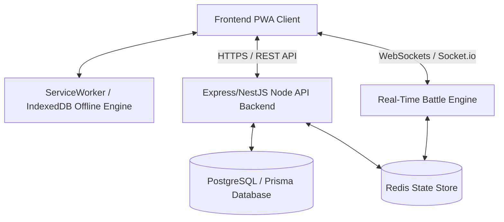
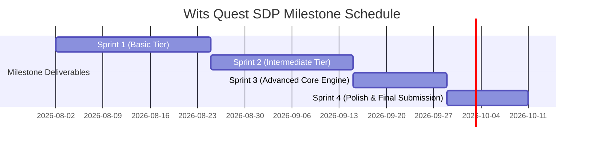
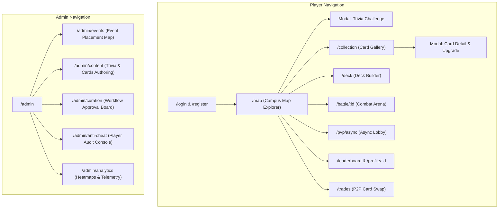

> [!IMPORTANT]
> ### 📋 AI DOCUMENT GENERATOR / GOOGLE DOCS PROMPT INSTRUCTIONS
> **Copy and paste this entire document into Google Docs AI, ChatGPT, Claude, or your PDF exporter with the prompt below:**
> 
> *"Act as an expert technical documentation designer. Transform the following complete Markdown document into a beautifully formatted, publication-ready PDF document for our software engineering project. Ensure you:*
> *1. Generate a clean, styled cover title page and an automatic Table of Contents.*
> *2. Render all Mermaid code blocks (`mermaid`) as clean visual flowcharts and Gantt diagrams.*
> *3. Format all Markdown tables with crisp headers, alternating row colors, and proper column alignment.*
> *4. Use clear typography, modern section breaks, and styled alert callout boxes for key notes.*
> *5. Retain 100% of the text, technical task specifications, formulas, and UI screen descriptions without truncating anything."*

---

# Wits Quest (COMS3011A Project 6) - Master Architecture & Task Specification Guide

---

## 1. System Context & Software Background

### 1.1 What is Wits Quest?
**Wits Quest** is a progressive, location-based web application (PWA) designed for the University of the Witwatersrand (Wits). Inspired by *Pokémon GO* and turn-based card strategy games, Wits Quest replaces traditional static campus tours with an interactive, location-gated trivia and collectible card battle experience.

The software combines several complex computer science domains into a single unified web platform:
1. **Geographic Information Systems (GIS) & Geolocation Verification**: Real-time interactive campus mapping with server-side mathematical validation of GPS coordinates.
2. **Offline-First Synchronous & Asynchronous Data Resilience**: Ability to explore campus and complete challenges in signal "dead-zones" (inside concrete university buildings), caching attempts locally and securely syncing with the server upon reconnection.
3. **Turn-Based RPG Strategy & Rule Engine**: Card deck construction, stat attribute comparisons, CPU AI opponents, asynchronous turn-based player challenges, and real-time live WebSocket multiplayer.
4. **Game Economy & Progression Systems**: Card rarities, category attributes, daily streaks, achievement hooks, duplicate scrapping/upgrading, sequential quest trails, and atomic peer-to-peer trading.
5. **Security, Telemetry & Behavioral Anti-Cheat**: Speed-over-ground movement verification, anti-teleportation trajectory analysis, match-collusion anomaly detection, and trust-score computation.
6. **Authoring & Curation Governance Console**: Multi-stage content lifecycle management (`Draft` -> `Review` -> `Published` -> `Retired`), campaign scheduling, broken question diagnostics, and campus foot-traffic heatmaps.

### 1.2 Recommended Technology Stack
* **Frontend Framework**: React (Vite) or Next.js with TypeScript.
* **Map & Spatial Rendering**: Leaflet.js / Mapbox GL JS with OpenStreetMap tiles restricted to Wits Campus bounding box.
* **Backend API**: Node.js with Express or NestJS (TypeScript).
* **Database & ORM**: PostgreSQL with Prisma ORM (or MongoDB with Mongoose).
* **Real-Time Communication**: WebSockets (`socket.io` or `ws`).
* **Offline Engine**: Service Worker API + IndexedDB (`idb` library).
* **Security & Auth**: Custom Authentication Engine (Wits Email validation `@students.wits.ac.za`, `bcrypt` password hashing, JWT Access/Refresh tokens).

---

## 2. Project Execution Strategy & Milestone Timeline

### 2.1 Strategic Rationale: The 2-Sprint Front-Load Push
To secure high marks early and avoid last-minute panic, the team will complete **100% of Basic Tier** and **100% of Intermediate Tier** by the end of **Sprint 2 (15 September)**. The final two sprints (**Sprints 3 & 4**) are dedicated to **Advanced Tier** features (Live WebSockets, Heuristic Anti-Cheat, Dynamic Event Spawning, Territory Control, and P2P Trading).

### 2.2 Official Milestone Schedule

| Milestone Event | Deadline Date | Target Scope & Deliverable Focus |
| :--- | :--- | :--- |
| **Group Selection** | 26 July 2026 | Team formed (6 Members assigned) |
| **Project Proposals** | 31 July 2026 | Proposal submitted |
| **Project Assignments** | 02 August 2026 | Official project allocation |
| **Milestone 1: Sprint 1** | **25 August 2026** | **Basic Tier Complete**: Map GIS integration, location verification API, trivia engine, CPU battle rules state machine, database schema & custom auth. |
| **Milestone 2: Sprint 2** | **15 September 2026** | **Intermediate Tier Complete**: ServiceWorker/IndexedDB offline sync, velocity anti-spoofing engine, Async PvP state store, XP/streak engine, guided trails logic, curation workflow backend. |
| **Milestone 3: Sprint 3** | **29 September 2026** | **Advanced Core Engine**: WebSocket Live PvP state server, dynamic path spawner algorithm, atomic 2PC trade engine, behavioral trust score calculator, spatial heatmap aggregation. |
| **Milestone 4: Final Submission** | **11 October 2026** | **Full System Polish & Submission**: Territory zone influence engine, Ranked Elo rating logic, Anti-Cheat Admin Audit services, integration & bug fixes. |

---

## 3. Analysis of Project Tier Expectations

### 3.1 Basic Tier Expectations
* **Campus Map & Events**: Leaflet/Mapbox map focused on Wits Campus showing active event markers, activation radius circles, and expiration timers. Events visually categorized: *In Reach*, *Too Far*, *Expired*.
* **Location Verification**: Client device location claims are verified server-side using coordinate calculations before unlocking any challenge.
* **Trivia & Marking Engine**: Server-side validation of trivia answers (multiple choice, text input) returning correctness and correct answers.
* **Card Collection & Deck Builder**: Single card reward per event completion. Cards have category, attributes (Attack, Defense, Speed, Brains), and rarity weights. Inventory and deck selection interfaces.
* **CPU Battle Minigame**: Turn-based stat comparison battle against a computer player enforcing official rules and saving match outcomes to the database.
* **Admin Console**: Interface for creating/placing events on map, writing trivia questions, and defining card stats/attributes.

### 3.2 Intermediate Tier Expectations
* **Offline Signal Resilience**: Full gameplay support inside campus signal dead-zones. Local attempt caching in ServiceWorker/IndexedDB, holding attempts until network reconnects, verified using server-side timestamps.
* **Movement Anti-Spoofing**: Speed-over-ground verification (calculating travel velocity between event attempts to block impossible speeds/teleportation).
* **Asynchronous PvP Battle**: Async turn-based player challenges, persistent turn state in database, and forfeit timers for inactive players.
* **Progression & Economy**: User profiles, XP/leveling, achievements, daily streaks, global leaderboards, duplicate card breakdown/upgrades, and deck building cost constraints.
* **Guided Trails & Radar**: Sequential quest lines (must complete event A before B) and a compass/radar pointing to unvisited nearby spots.
* **Curation Governance**: Multi-stage content approval workflow (`Draft` -> `Review` -> `Published` -> `Retired`), campaign scheduler, and automatic flagging of high error-rate questions.

### 3.3 Advanced Tier Expectations
* **Live WebSocket PvP & Spectating**: Synchronous real-time turn battles with active turn timers, instant reconnection recovery, and live spectator streaming.
* **Heuristic / ML Anti-Cheat Engine**: Behavioral profiling engine building player trust metrics over time (movement feasibility, submit frequency, match rigging detection). Graduated, proportionate penalties managed via console.
* **Algorithmic Dynamic Event Spawner**: Automated event placement along walkable campus paths maintaining spacing, density, and anti-clustering constraints.
* **Ranked Matchmaking & Seasons**: Elo/Glicko-2 rating system, ladder matchmaking, and seasonal resets.
* **Territory & Zone Control**: Faction-based territorial control where campus zones are contested, captured, and held by players.
* **Atomic P2P Trading**: Secure 2-phase commit trading mechanism with daily limits to prevent account funneling.
* **Admin Analytics & Heatmaps**: Campus foot-traffic heatmaps and card economy flow telemetry.

---

## 4. Engineering & Software Task Matrix (6 Team Members)

*Note: UI visual styling, component layouts, and screen mockups are separated into Section 6 so this section remains 100% focused on core software engineering, backend logic, APIs, algorithms, and data structures.*

### Team Domain Assignments
* **Member 1**: Geolocation, Anti-Spoofing & Spatial Engine Lead
* **Member 2**: Battle Engine, AI & Real-Time Multiplayer Lead
* **Member 3**: Database Architecture, Offline Sync & Security Lead
* **Member 4**: Admin Engine, Workflow Curation & Telemetry Analytics Lead
* **Member 5**: Progression Engine, Economy Systems & Guided Trails Lead
* **Member 6**: Advanced Anti-Cheat, Matchmaking & Territory Control Lead

---

### 4.1 SPRINT 1: Basic Tier Foundation (Aug 02 - Aug 25)

#### MEMBER 1 — Geolocation, Map & Spatial Engine
* **Task 1.1.1: Leaflet/Mapbox Spatial Initialization Engine**
  * *Technical Explanation*: Initialize Leaflet/Mapbox engine restricted to Wits Campus bounding box (Center: -26.1929, 28.0305). Implement `watchPosition` GPS tracking pipeline with accuracy filtering.
  * *DoD*: Map engine initializes cleanly, traps panning to campus boundaries, and emits real-time coordinate updates.
* **Task 1.1.2: Server-Side Spatial Haversine Distance Engine**
  * *Technical Explanation*: Write a backend mathematical utility implementing the Haversine formula to compute distance in meters between user claim $(lat_1, lon_1)$ and target event $(lat_2, lon_2)$.
  * *DoD*: Function passes unit test suite verifying distance calculations against known campus landmark coordinates.
* **Task 1.1.3: Location Claim Verification API (`POST /api/events/:id/verify-location`)**
  * *Technical Explanation*: Accept user GPS coordinates, compute Haversine distance, and verify $distance \le event.radius$ and $time \in [activeStart, activeEnd]$. Return signed claim token or `403 Forbidden`.
  * *DoD*: Endpoint rejects out-of-reach claims and returns signed verification payload for valid attempts.
* **Task 1.1.4: Dynamic Spatial Marker State Calculator**
  * *Technical Explanation*: Calculate spatial marker states (`IN_REACH`, `TOO_FAR`, `EXPIRED`) based on real-time distance and timestamp comparisons.
  * *DoD*: State engine updates marker state array on every GPS position tick.

#### MEMBER 2 — Turn-Based Battle Engine & CPU AI
* **Task 1.2.1: Turn-Based Battle Rules Engine (State Machine)**
  * *Technical Explanation*: Create pure TypeScript battle state machine. Evaluate round attribute choices (`Attack`, `Defense`, `Speed`, `Brains`), determine round winner, track round scores (best of 5), and emit victory/defeat events.
  * *DoD*: State machine processes moves, enforces game rules, and resolves match outcome without state corruption.
* **Task 1.2.2: CPU Opponent Decision AI Engine**
  * *Technical Explanation*: Implement CPU opponent decision logic: `Easy` (random attribute selection) and `Medium` (evaluates visible player cards and calculates mathematically optimal attribute).
  * *DoD*: CPU engine returns valid move decision within 200ms per round.
* **Task 1.2.3: Battle State Event Dispatcher**
  * *Technical Explanation*: Build event dispatcher binding battle engine actions (`START_MATCH`, `SUBMIT_MOVE`, `RESOLVE_ROUND`, `END_MATCH`) to state transitions.
  * *DoD*: Dispatcher cleanly handles turn sequences and emits state updates.
* **Task 1.2.4: Match Result Persistence Backend Service (`POST /api/matches/cpu`)**
  * *Technical Explanation*: Store completed CPU match logs (player ID, CPU level, cards played, round logs, winner ID) into database.
  * *DoD*: DB write transaction commits match records permanently with full audit history.

#### MEMBER 3 — Database Architecture & Secure API
* **Task 1.3.1: Database Schema & Migration Architecture**
  * *Technical Explanation*: Design and execute schema migrations (PostgreSQL/Prisma or MongoDB) for `User`, `Event`, `Question`, `Card`, `Deck`, `UserCard`, and `Match` models.
  * *DoD*: DB schema initializes cleanly; foreign keys and unique constraints pass migration checks.
* **Task 1.3.2: Secure JWT Authentication Middleware**
  * *Technical Explanation*: Build JWT verification middleware inspecting `Authorization: Bearer <token>` headers, decoding user claims (`userId`, `role`), and rejecting invalid requests.
  * *DoD*: Unauthorized requests return `401 Unauthorized`; valid tokens populate request context.
* **Task 1.3.3: Transactional Event Completion & Card Award API (`POST /api/events/:id/submit-answer`)**
  * *Technical Explanation*: Wrap question validation and card awarding inside an isolated DB transaction ensuring a user receives a card reward exactly once per event.
  * *DoD*: Correct answers award cards transactional-safe; duplicate submissions return `400 Bad Request`.
* **Task 1.3.4: Persistent Match History Query Service (`GET /api/matches/history`)**
  * *Technical Explanation*: Write paginated database query service returning historical matches for the authenticated user.
  * *DoD*: Service returns paginated match JSON payload within $< 100\text{ms}$.

#### MEMBER 4 — Admin Engine & Data Services
* **Task 1.4.1: RBAC Middleware & Security Guard**
  * *Technical Explanation*: Create role-based route guard ensuring only users with `role: "ADMIN"` or `role: "LECTURER"` can execute admin API endpoints.
  * *DoD*: Non-admin requests to `/api/admin/*` are blocked with `403 Forbidden`.
* **Task 1.4.2: Spatial Event Creation Service (`POST /api/admin/events`)**
  * *Technical Explanation*: API service for creating new campus events with coordinates, activation radius, timestamps, and assigned card reward IDs.
  * *DoD*: Event record persists to database and appears in spatial queries.
* **Task 1.4.3: Multi-Format Question Authoring Backend API (`POST /api/admin/questions`)**
  * *Technical Explanation*: API for creating trivia questions linked to events (Multiple Choice options or exact match text answers).
  * *DoD*: Question payload validates option integrity and stores record in DB.
* **Task 1.4.4: Card Definition & Attribute Management API (`POST /api/admin/cards`)**
  * *Technical Explanation*: API service to create card definitions, setting category, rarity weights (`Common` to `Legendary`), and stat values (0-100).
  * *DoD*: Card definition created and usable as event reward.

#### MEMBER 5 — Card Collection & Deck Construction Engine
* **Task 1.5.1: Inventory Query & Filtering Service (`GET /api/player/inventory`)**
  * *Technical Explanation*: Query service fetching all cards owned by authenticated user, supporting category and rarity filter parameters.
  * *DoD*: Returns formatted user card collection JSON payload within $< 50\text{ms}$.
* **Task 1.5.2: Card Metadata & Rarity Distribution Engine**
  * *Technical Explanation*: Business logic resolving card stat attributes and evaluating rarity drop weights when rewards are triggered.
  * *DoD*: Rarity engine returns weighted random card according to configured drop percentages.
* **Task 1.5.3: Server-Side Deck Validation Engine**
  * *Technical Explanation*: Validate active deck configuration: exactly 5 cards, max 1 `Legendary` card, total deck stat cost $\le 300$ points.
  * *DoD*: Invalid deck submissions are rejected with specific validation error messages.
* **Task 1.5.4: Deck Save & Update API (`PUT /api/player/deck`)**
  * *Technical Explanation*: Endpoint to update player's active 5-card deck configuration in database after passing server-side validation.
  * *DoD*: Active deck updates cleanly in `UserDeck` table.

#### MEMBER 6 — Custom Auth Security & Audit Engine
* **Task 1.6.1: Custom Wits Student Email Auth Engine (`POST /api/auth/register`, `/login`)**
  * *Technical Explanation*: Build authentication endpoints validating email ends with `@students.wits.ac.za` or `@wits.ac.za`. Hash passwords using `bcrypt` (12 salt rounds). Return signed JWT Access & Refresh tokens.
  * *DoD*: Non-Wits emails rejected; passwords securely hashed; valid credentials return signed JWTs.
* **Task 1.6.2: Immutable Event Attempt Audit Logger**
  * *Technical Explanation*: Middleware logging every attempt to `EventAttemptLog` DB table (user ID, event ID, claimed coords, timestamp, IP address).
  * *DoD*: Every event unlock attempt writes immutable log entry asynchronously.
* **Task 1.6.3: Rate-Limiting Security Middleware**
  * *Technical Explanation*: Implement rate-limiter restricting location verification and submission endpoints to max 10 requests per minute per IP/user.
  * *DoD*: Exceeding rate limit triggers `429 Too Many Requests`.
* **Task 1.6.4: Session Management & Revocation Engine (`POST /api/auth/logout`)**
  * *Technical Explanation*: Session revocation service invalidating refresh tokens in database/Redis.
  * *DoD*: Token revocation prevents reuse of logged-out refresh tokens.

---

### 4.2 SPRINT 2: Intermediate Tier Completion (Aug 25 - Sep 15)

#### MEMBER 1 — Movement Anti-Spoofing & Trajectory Validation
* **Task 2.1.1: Velocity Calculation Engine (Impossible Speed Detection)**
  * *Technical Explanation*: Calculate velocity $v = \frac{Haversine(loc_1, loc_2)}{\Delta t}$. If $v > 5.0\text{ m/s}$ (18 km/h), flag attempt as `SPOOF_SPEED_EXCEEDED` and reject location claim.
  * *DoD*: Speed check rejects attempts made at impossible travel speeds.
* **Task 2.1.2: Anti-Teleportation Time-Delta Checker**
  * *Technical Explanation*: Enforce minimum elapsed time delta between consecutive event claims based on spatial distance.
  * *DoD*: Rapid submissions across distant campus events are blocked.
* **Task 2.1.3: GPS Fix Confidence Scoring Algorithm**
  * *Technical Explanation*: Evaluate reported GPS accuracy radius (`coords.accuracy`). If $> 50\text{m}$, require secondary verification proof.
  * *DoD*: Low-accuracy fixes return secondary verification requirement flag.
* **Task 2.1.4: Movement Vector Serialization & Verification**
  * *Technical Explanation*: Accept client rolling buffer of 5 GPS points and verify trajectory continuity server-side.
  * *DoD*: Inconsistent trajectory vectors are flagged as spoofed.

#### MEMBER 2 — Asynchronous PvP Battle Challenge Engine
* **Task 2.2.1: Async PvP Challenge Queue & State Store**
  * *Technical Explanation*: `AsyncMatch` database model supporting state transitions (`PENDING`, `IN_PROGRESS`, `COMPLETED`, `FORFEITED`), storing turn history and deadline timestamps.
  * *DoD*: Async match records persist state cleanly across player turns.
* **Task 2.2.2: Async Turn Hydration API (`GET /api/pvp/async/active`, `POST /api/pvp/async/:id/turn`)**
  * *Technical Explanation*: Hydrate match state for returning player, validate turn submission, update board state, and notify opponent.
  * *DoD*: Players execute turns asynchronously hours apart without state corruption.
* **Task 2.2.3: Automatic Match Forfeit Timeout Scheduler**
  * *Technical Explanation*: Background cron job scanning active matches. If idle $> 24\text{ hours}$, set status `FORFEITED` and award win points to active player.
  * *DoD*: Idle matches forfeit automatically after 24 hours.
* **Task 2.2.4: Async Matchmaking Queue Engine**
  * *Technical Explanation*: Service finding available opponent players for async challenges based on level proximity.
  * *DoD*: Returns active match instance upon challenge creation.

#### MEMBER 3 — Offline Signal Resilience Architecture
* **Task 3.3.1: ServiceWorker Offline Static Caching Service**
  * *Technical Explanation*: Configure `sw.js` to cache app shell, core scripts, map tile assets, and UI components for offline execution.
  * *DoD*: PWA loads completely when network is placed offline.
* **Task 3.3.2: IndexedDB Offline Attempt Local Queue**
  * *Technical Explanation*: Implement IndexedDB storage engine caching event attempts locally when offline inside buildings.
  * *DoD*: Offline attempts persist locally across browser sessions.
* **Task 3.3.3: Server-Side Sync & Cryptographic Timestamp Verifier (`POST /api/sync/offline`)**
  * *Technical Explanation*: Reconnection sync worker uploading queued attempts. Server validates signed client timestamp against event active windows.
  * *DoD*: Queued offline attempts sync upon reconnection and process rewards safely.
* **Task 3.3.4: Connection State Synchronization Listener**
  * *Technical Explanation*: Client state manager detecting network status transitions and triggering auto-sync.
  * *DoD*: Auto-sync fires automatically when online event listener triggers.

#### MEMBER 4 — Curation Workflow & Diagnostic Engine
* **Task 2.4.1: Multi-Stage Governance Workflow Engine**
  * *Technical Explanation*: State machine managing event/question states (`DRAFT` $\rightarrow$ `PENDING_REVIEW` $\rightarrow$ `PUBLISHED` $\rightarrow$ `RETIRED`).
  * *DoD*: Draft questions cannot be returned in public student API queries.
* **Task 2.4.2: Automated Campaign Scheduling Engine**
  * *Technical Explanation*: Background job evaluating campaign activation windows (`startDate`, `endDate`) and toggling visibility.
  * *DoD*: Events activate and retire automatically on scheduled timestamps.
* **Task 2.4.3: High Error-Rate Question Diagnostic Scanner**
  * *Technical Explanation*: Analytical query scanning 7-day question attempt history. Flag questions with error rate $> 85\%$.
  * *DoD*: Scanner outputs list of flagged ambiguous/flawed questions.
* **Task 2.4.4: Content State Transition API (`PUT /api/admin/content/:id/status`)**
  * *Technical Explanation*: Endpoint allowing authorized admins to approve or retire content.
  * *DoD*: Content status updates cleanly in database.

#### MEMBER 5 — Progression, Economy & Guided Trails
* **Task 2.5.1: XP, Leveling & Achievement Unlock Engine**
  * *Technical Explanation*: XP calculation engine ($XP = 100 \times level^{1.5}$) and event listener evaluating achievement criteria unlocks.
  * *DoD*: Earning XP triggers level-up calculation and unlocks eligible achievements.
* **Task 2.5.2: Daily Login Streak Tracking Engine**
  * *Technical Explanation*: Service tracking consecutive daily user activity in `UserStreak` DB table, resetting on missed days.
  * *DoD*: Streak increments on consecutive days and resets after missing 24h window.
* **Task 2.5.3: Duplicate Card Scrapping & Attribute Upgrade Economy**
  * *Technical Explanation*: Service allowing players to destroy duplicate cards for "Essence" currency and spend essence to boost card stats up to +10%.
  * *DoD*: Duplicate destruction and essence stat upgrades execute inside DB transactions.
* **Task 2.5.4: Sequential Event Trails Quest Engine**
  * *Technical Explanation*: Logic enforcing strict completion order for trail events (Event B locked until Event A complete).
  * *DoD*: Out-of-order attempts on sequential trail events are rejected.

#### MEMBER 6 — Async Matchmaking & Fraud Heuristics
* **Task 2.6.1: Level-Proximity Async Matchmaking Algorithm**
  * *Technical Explanation*: Matchmaking query matching player with candidate opponents within $\pm 3$ levels.
  * *DoD*: Returns appropriate opponent match instance.
* **Task 2.6.2: Rapid Attempt Fraud Detection Heuristics**
  * *Technical Explanation*: Heuristic monitoring system flagging accounts exceeding 5 attempts in $< 60$ seconds.
  * *DoD*: Flagged accounts are marked `FLAGGED_FOR_AUDIT`.
* **Task 2.6.3: Account Collision & IP Duplicate Detector**
  * *Technical Explanation*: Analytical script searching for concurrent access from identical IP and device fingerprints.
  * *DoD*: Outputs suspicious account cluster IDs for admin inspection.
* **Task 2.6.4: Player Leaderboard Data Aggregator (`GET /api/leaderboard`)**
  * *Technical Explanation*: High-performance query returning top 50 players ranked by XP, Collection Size, and PvP Wins.
  * *DoD*: Leaderboard JSON payload returns in $< 100\text{ms}$.

---

### 4.3 SPRINT 3: Advanced Core & Live Engines (Sep 15 - Sep 29)

#### MEMBER 1 — Algorithmic Dynamic Event Spawner
* **Task 3.1.1: Campus Walkable Path Grid Data Engine**
  * *Technical Explanation*: Define GeoJSON walkable path grid data for Wits Campus and load into spatial table `WalkablePathNode`.
  * *DoD*: Spatial query extracts valid path coordinates.
* **Task 3.1.2: Dynamic Spacing & Event Distribution Algorithm**
  * *Technical Explanation*: Automated spawner algorithm running every 4 hours, selecting walkable nodes maintaining min 50m separation between dynamic events.
  * *DoD*: Spawner places temporary events across campus dynamically.
* **Task 3.1.3: Campus Quadrant Density & Relocation Engine**
  * *Technical Explanation*: Calculate event density across campus quadrants and shift events from high-density to bare zones.
  * *DoD*: Bare zones receive relocated dynamic events automatically.
* **Task 3.1.4: Dynamic Event Lifecycle Cleanup Service**
  * *Technical Explanation*: Lifecycle service expiring and purging dynamic events after 2-hour active duration.
  * *DoD*: Expired dynamic events despawn automatically.

#### MEMBER 2 — Live WebSocket PvP & Spectator Engine
* **Task 3.2.1: Real-Time WebSocket Battle Server State Machine**
  * *Technical Explanation*: WebSocket server implementation using `socket.io` managing match channels (`join`, `move`, `turn`, `end`) with Redis state caching.
  * *DoD*: Two socket clients exchange moves with sub-50ms latency.
* **Task 3.2.2: Synchronous Turn Countdown Clock & Timeout Handler**
  * *Technical Explanation*: Server-enforced 30-second turn countdown clock emitting per-second ticks and auto-playing default move on timeout.
  * *DoD*: Turn timer auto-advances turn when clock hits 0.
* **Task 3.2.3: Socket Disconnect & Room Rehydration Logic**
  * *Technical Explanation*: Handle socket disconnects, holding room state for 45s and re-attaching client upon reconnection.
  * *DoD*: Reconnecting client resumes active live match smoothly.
* **Task 3.2.4: Live Match Spectator Broadcast Pipeline**
  * *Technical Explanation*: Read-only socket channel broadcasting live match state changes to spectator clients.
  * *DoD*: Spectators receive live match state updates without move submission rights.

#### MEMBER 3 — Atomic P2P Trading System
* **Task 3.3.1: Two-Phase Commit (2PC) Atomic Trade Engine**
  * *Technical Explanation*: 2PC transaction engine locking trade cards (Phase 1) and swapping ownership atomically (Phase 2) inside isolated DB transaction.
  * *DoD*: Card trade completes atomically or rolls back cleanly.
* **Task 3.3.2: Trade Offer Negotiation Backend API (`/api/trades/*`)**
  * *Technical Explanation*: Endpoints to create, accept, reject, and inspect P2P trade offers.
  * *DoD*: Complete trade lifecycle API operational.
* **Task 3.3.3: Anti-Exploit Trade Volume Cap & Value Checker**
  * *Technical Explanation*: Validation rules enforcing max 3 trades/day and blocking trades with card stat difference $> 25\%$.
  * *DoD*: Exploitative or excessive trades are blocked with validation errors.
* **Task 3.3.4: Trade State Lock & Release Service**
  * *Technical Explanation*: Service locking card availability during active trade negotiations to prevent duplicate trading.
  * *DoD*: Cards locked in trade cannot be listed in other trades or added to active decks.

#### MEMBER 4 — Heatmaps & Card Economy Telemetry
* **Task 3.4.1: Spatial Foot-Traffic Aggregator Service**
  * *Technical Explanation*: Aggregation service processing event attempt coordinates into spatial density clusters.
  * *DoD*: Outputs aggregated intensity matrix for heatmap rendering.
* **Task 3.4.2: Heatmap Data Serialization API (`GET /api/admin/analytics/heatmap`)**
  * *Technical Explanation*: Endpoint returning weighted spatial coordinate array for admin Leaflet heatmap display.
  * *DoD*: Returns spatial density JSON within $< 150\text{ms}$.
* **Task 3.4.3: Card Economy Velocity Telemetry Service**
  * *Technical Explanation*: Calculation engine computing daily card award rates, scrapping volume, and currency inflation.
  * *DoD*: Telemetry service outputs economic indicator metrics.
* **Task 3.4.4: Question Performance Analytics Pipeline**
  * *Technical Explanation*: Data pipeline computing success/failure rates and average attempt durations per question.
  * *DoD*: Returns structured question performance metrics.

#### MEMBER 5 — Ranked Ladder & Social System
* **Task 3.5.1: Elo / Glicko-2 Matchmaking Rating Calculation Engine**
  * *Technical Explanation*: Implement Elo rating recalculation formula $R_{new} = R_{old} + K(S - E)$ post-match.
  * *DoD*: Player ratings update accurately after rated PvP matches.
* **Task 3.5.2: Seasonal Division Classification Engine**
  * *Technical Explanation*: Logic categorizing players into tiers (`Bronze`, `Silver`, `Gold`, `Diamond`) based on rating thresholds.
  * *DoD*: Returns correct division classification for any given rating.
* **Task 3.5.3: Public Player Profile Data Service (`GET /api/player/:id/profile`)**
  * *Technical Explanation*: Service fetching public player profile data, showcase cards, and stats.
  * *DoD*: Returns public profile payload.
* **Task 3.5.4: Seasonal Payout & Reset Automation Service**
  * *Technical Explanation*: Automated service calculating end-of-season rewards and applying rating compression.
  * *DoD*: Seasonal reset script executes cleanly.

#### MEMBER 6 — Behavioral Trust Engine & Anomaly Detection
* **Task 3.6.1: Composite Player Trust Score Calculation Engine**
  * *Technical Explanation*: Algorithm computing player Trust Score ($0-100$) based on spatial speed violations, submission bursts, and fix confidence.
  * *DoD*: Trust score recalculates on audit event triggers.
* **Task 3.6.2: Win-Trading & Match Collusion Detector**
  * *Technical Explanation*: Statistical pattern analyzer detecting suspicious repeated forfeit patterns between specific player pairs.
  * *DoD*: Flags collusion pattern instances in database.
* **Task 3.6.3: Graduated Penalty Enforcement Middleware**
  * *Technical Explanation*: Middleware enforcing restrictions based on Trust Score: Trusted ($\ge 70$), Throttled ($40-69$), Locked ($< 40$).
  * *DoD*: Applies restriction levels automatically to API requests.
* **Task 3.6.4: Suspicion Telemetry Pipeline**
  * *Technical Explanation*: Audit streaming service piping flagged attempt logs to moderation queue.
  * *DoD*: Flagged events appear in audit log stream.

---

### 4.4 SPRINT 4: System Polish, Territory Control & Submission (Sep 29 - Oct 11)

#### MEMBER 1 — GPS Trust & Spatial Engine Final Polish
* **Task 4.1.1: Spatial Verification & Trust Engine Pipeline Integration**
  * *Technical Explanation*: Connect Member 1's velocity verification outputs to Member 6's Trust Score calculation pipeline.
  * *DoD*: Spatial violations automatically decrement trust score.
* **Task 4.1.2: Map Spatial Query Performance Optimization**
  * *Technical Explanation*: Add spatial database indexing (`PostGIS` ST_DWithin / compound coordinate indexing) optimizing event spatial queries.
  * *DoD*: Spatial queries execute in $< 15\text{ms}$.
* **Task 4.1.3: Real-World Campus Spatial Boundary Validation**
  * *Technical Explanation*: Execute real-world coordinate tests across campus boundaries and refine radius tolerances.
  * *DoD*: Verification logs validate spatial boundary accuracy.
* **Task 4.1.4: Spatial Engine API Documentation**
  * *Technical Explanation*: Write comprehensive technical documentation for spatial formulas and APIs.
  * *DoD*: Documentation committed to repository docs.

#### MEMBER 2 — Battle Engine Balance & Performance Optimization
* **Task 4.2.1: Card Attribute Stat Balance Simulator**
  * *Technical Explanation*: Build Monte-Carlo simulation script testing 10,000 automated card matches to evaluate stat balance.
  * *DoD*: Simulation report confirms stat balance across categories.
* **Task 4.2.2: WebSocket Payload Compression & Latency Tuning**
  * *Technical Explanation*: Optimize WebSocket serialization payloads to minimize byte size and latency.
  * *DoD*: Message payload size reduced by $> 40\%$.
* **Task 4.2.3: Spectator Room Event Optimization**
  * *Technical Explanation*: Tune spectator event broadcasting to prevent socket event saturation under heavy load.
  * *DoD*: Spectator channel handles 50+ concurrent clients smoothly.
* **Task 4.2.4: Battle Engine Integration Test Suite**
  * *Technical Explanation*: Comprehensive integration test suite covering battle state machine edge cases.
  * *DoD*: Test suite achieves $> 90\%$ code coverage on battle engine.

#### MEMBER 3 — Offline Edge Cases & Data Audit
* **Task 4.3.1: Offline Sync Edge-Case Stress Testing**
  * *Technical Explanation*: Automated test suite simulating corrupt offline payloads, clock skews, and duplicate sync attempts.
  * *DoD*: Sync engine demonstrates complete transaction safety under error injection.
* **Task 4.3.2: P2P Trade & Transaction Security Audit**
  * *Technical Explanation*: Security audit verifying resistance against race conditions and parameter tampering in trades.
  * *DoD*: Audit report confirming zero transaction vulnerabilities.
* **Task 4.3.3: Database Query Execution Plan Optimization**
  * *Technical Explanation*: Optimize slow database queries using `EXPLAIN ANALYZE` and compound indexes.
  * *DoD*: All primary API query execution times under $20\text{ms}$.
* **Task 4.3.4: Security Architecture Documentation**
  * *Technical Explanation*: Write comprehensive security architecture documentation covering auth, cryptography, and DB transactions.
  * *DoD*: Security documentation finalized in repo.

#### MEMBER 4 — Anti-Cheat Admin Console & Final System Report
* **Task 4.4.1: Flagged Account Moderation API (`/api/admin/moderation/*`)**
  * *Technical Explanation*: Endpoints allowing admins to override trust scores, issue warnings, or unlock accounts.
  * *DoD*: Moderation actions execute cleanly and record audit log entries.
* **Task 4.4.2: Audit Log Query & Inspection Service**
  * *Technical Explanation*: Paginated query service fetching detailed movement and attempt audit logs for flagged accounts.
  * *DoD*: Returns audit history payload formatted for admin inspection.
* **Task 4.4.3: Game Telemetry CSV/JSON Export Engine**
  * *Technical Explanation*: Service generating downloadable telemetry export files for game analytics.
  * *DoD*: Generates valid CSV/JSON data exports on request.
* **Task 4.4.4: System Seed Script & Demonstration Setup**
  * *Technical Explanation*: Create DB seed scripts populating realistic campus events, trivia, card sets, and demo accounts.
  * *DoD*: `npm run seed` populates clean demonstration database environment.

#### MEMBER 5 — Economy Balancing & Seasonal Resets
* **Task 4.5.1: Economy Progression Curve Verification**
  * *Technical Explanation*: Verify mathematical progression models for XP, levels, and essence upgrade costs.
  * *DoD*: Progression curves verified against game economy targets.
* **Task 4.5.2: Seasonal Rating Compression Script**
  * *Technical Explanation*: Script executing seasonal Elo compression ($R_{new} = 1200 + 0.5 \times (R_{old} - 1200)$).
  * *DoD*: Compresses ladder ratings accurately for new season start.
* **Task 4.5.3: Sequential Quest Progression Verification**
  * *Technical Explanation*: Verify trail quest unlocking logic and prerequisite dependency trees.
  * *DoD*: Quest progression trees validate cleanly.
* **Task 4.5.4: Game Economy Specification Report**
  * *Technical Explanation*: Finalize technical documentation detailing economy formulas and deck constraint math.
  * *DoD*: Economy documentation committed to repo.

#### MEMBER 6 — Territory Zone Control & Final Project Integration
* **Task 4.6.1: Campus Territory Zone Control Engine**
  * *Technical Explanation*: Engine dividing campus map into 5 territory zones (`Science`, `Arts`, `Engineering`, `Commerce`, `Sports`) and calculating zone ownership from player event wins.
  * *DoD*: Zone ownership percentages calculate accurately from win logs.
* **Task 4.6.2: Simultaneous Faction Influence Aggregator**
  * *Technical Explanation*: Rolling 7-day aggregation algorithm computing faction control weights per campus territory.
  * *DoD*: Aggregator returns current faction influence percentages per zone.
* **Task 4.6.3: Territory Control API (`GET /api/territories`)**
  * *Technical Explanation*: Endpoint returning territory polygon boundaries and current faction control states.
  * *DoD*: Returns territory JSON payload for client map overlay.
* **Task 4.6.4: System Docker Build & Final Integration Setup**
  * *Technical Explanation*: Create production `Dockerfile` and `docker-compose.yml` orchestrating API, Database, Redis, and WebSockets.
  * *DoD*: Entire application boots and runs cleanly via `docker-compose up`.

---

## 5. Definition of Done & QA Standard

### 5.1 Quality Assurance Standard
For any software task to be marked as complete:
1. **Code Review**: Code committed to Git feature branch and merged via Pull Request with at least 1 peer approval.
2. **Automated Testing**: Unit or integration tests written and passing.
3. **API Verification**: Backend endpoints verified with valid status codes and JSON payloads.
4. **No High Blockers**: Zero unresolved high-severity bugs on the task.

---

## 6. UI/UX Screen Specifications & Component Breakdown

*This section details every required page and modal in the application, specifying the exact on-screen components, layout requirements, and state dependencies so team members can assign UI design tasks separately.*

---

### 6.1 PLAYER-FACING SCREENS

#### Screen 1: Auth & Registration Screen
* **Route**: `/login` & `/register`
* **Purpose**: User onboarding and authentication restricted to Wits student emails.
* **On-Screen Components & Layout**:
  1. **Header Banner**: Wits Quest branding logo, campus vector graphic, and welcome message.
  2. **Form Card**:
     - Email Input Field (with placeholder `studentNumber@students.wits.ac.za` and inline domain validation indicator).
     - Password Input Field (with show/hide toggle icon).
     - Confirm Password Field (Register mode only).
     - Login / Register Submit Button.
     - Toggle link ("Already have an account? Sign In" / "Need an account? Register").
  3. **Feedback Alerts**: Toast notification container displaying invalid domain errors or incorrect password warnings.

#### Screen 2: Main Campus Exploration Map
* **Route**: `/map` (Default App Home)
* **Purpose**: Primary game view displaying user position on campus, nearby active events, activation radii, and unvisited targets.
* **On-Screen Components & Layout**:
  1. **Full-Screen Leaflet Map**: Custom dark/light map tiles centered on Wits Campus.
  2. **Top Floating Bar**:
     - User Profile Badge (Avatar, Level, XP progress bar, Daily Streak counter icon).
     - Network Status Indicator Badge (`Online` green pill / `Offline` amber pill with pending sync queue count).
  3. **Map Marker Overlays**:
     - User GPS Location Marker (pulsing blue dot with accuracy circle).
     - Event Markers: Green icon (*In Reach*), Amber icon (*Too Far*), Gray icon (*Expired*).
     - Activation Radius Circles rendered around active events.
  4. **Bottom Quick Action Bar**:
     - "Center Map on Me" Floating Action Button.
     - "Target Nearest Event" Compass Button.
     - Bottom Navigation Bar links (`Map`, `Collection`, `Deck`, `Battle`, `Profile`).

#### Screen 3: Trivia Challenge Modal Component
* **Route**: Modal overlay triggered on `/map`
* **Purpose**: Location-gated trivia question screen unlocked when within event radius.
* **On-Screen Components & Layout**:
  1. **Modal Header**: Event title, campus landmark image, and distance check badge (`Verified 12m away`).
  2. **Question Card Container**:
     - Category Tag (e.g., `Wits History`, `Alumni`, `Architecture`).
     - Trivia Question Text.
     - **For Multiple Choice**: 4 selectable option buttons with hover/active states.
     - **For Text Input**: Text entry box with "Submit Answer" button.
  3. **Result Feedback Panel** (Post-Submit):
     - Correct/Incorrect Icon Banner.
     - Detailed explanation text revealing the correct historical answer.
     - **Card Award Showcase**: Animated card reveal displaying the awarded card with stats and rarity animations.
     - "Continue Exploring" / "Close" action button.

#### Screen 4: Card Collection Gallery
* **Route**: `/collection`
* **Purpose**: Player inventory screen for viewing owned cards, stats, and upgrading duplicates.
* **On-Screen Components & Layout**:
  1. **Top Filter & Search Bar**:
     - Search input field (filter cards by name).
     - Category Dropdown (`All`, `Science`, `History`, `Sports`, `Landmarks`).
     - Rarity Dropdown (`All`, `Common`, `Rare`, `Epic`, `Legendary`).
     - Essence Currency Counter (displaying total card essence available for upgrades).
  2. **Card Grid**: Responsive grid rendering collectible card frames:
     - Card Artwork Image.
     - Card Name & Rarity Border (Gold for Legendary, Purple for Epic, Blue for Rare, Gray for Common).
     - Stat Bars (`Attack`, `Defense`, `Speed`, `Brains`).
     - Duplicate Badge (e.g., `x3 Owned`).
  3. **Card Detail Modal** (Tapped Card):
     - High-res card display.
     - "Scrap Duplicate" Button (shows essence gain).
     - "Upgrade Attributes (+10%)" Button (shows essence cost).

#### Screen 5: Deck Construction & Inventory Manager
* **Route**: `/deck`
* **Purpose**: Interactive deck builder for assembling active 5-card battle decks.
* **On-Screen Components & Layout**:
  1. **Active Deck Banner** (Top Half):
     - 5 Active Deck Slots (showing selected cards or empty "+" placeholder slots).
     - **Deck Constraint Meter**:
       - Slot Counter (`5/5 Cards`).
       - Rarity Counter (`1/1 Legendary Max`).
       - Total Stat Points Progress Bar (`240/300 Cost Limit`).
     - "Save Active Deck" Action Button (disabled when deck validation fails).
  2. **Available Collection Drawer** (Bottom Half):
     - Scrollable grid of owned cards eligible to be added to active deck.
     - Quick "Add to Deck" / "Remove from Deck" buttons on card hover.

#### Screen 6: Turn-Based Combat Arena (CPU & Live PvP)
* **Route**: `/battle/:id`
* **Purpose**: Active battle screen for playing turn-based matches against CPU or real-time/spectator opponents.
* **On-Screen Components & Layout**:
  1. **Top Status Header**:
     - Opponent Profile Badge (Name, Level, CPU/Player indicator, Score indicator `Rounds: 2 - 1`).
     - **Live Turn Timer**: 30-second circular countdown clock with warning sound at 5s.
     - **Spectator Counter Pill** (if live match): Icon displaying active live viewer count.
  2. **Battle Stage Center Area**:
     - Player Card vs Opponent Card side-by-side reveal stage.
     - Round Attribute Comparison Animation Area (animating stat vs stat collision).
     - Round Result Overlay ("Round Won!", "Round Lost!").
  3. **Bottom Hand Selector**:
     - Carousel of player's remaining unplayed cards in active deck.
     - Attribute Selection Buttons (`Attack`, `Defense`, `Speed`, `Brains`) enabled during player turn.
  4. **Match End Victory/Defeat Modal**:
     - Final score summary, XP gained, rating change ($\pm \Delta Elo$), and "Return to Lobby" button.

#### Screen 7: Asynchronous PvP Challenge Lobby
* **Route**: `/pvp/async`
* **Purpose**: Lobby for managing asynchronous turn-based challenges.
* **On-Screen Components & Layout**:
  1. **Tabbed Navigation Bar**:
     - `Your Turn` (Active matches requiring player move).
     - `Waiting on Opponent` (Outbound matches pending opponent turn).
     - `Pending Requests` (Incoming match invites).
     - `Match History` (Completed async matches).
  2. **Challenge Card Items**:
     - Opponent Name & Avatar.
     - Match Status Badge (`Turn 3/5`, `Time Left: 14h 22m`).
     - "Play Turn Now" Button (for active turn matches).
  3. **"Challenge Player" Action Bar**:
     - Search user by name or tap "Find Matched Opponent" button.

#### Screen 8: Player Leaderboard & Public Profile View
* **Route**: `/leaderboard` & `/profile/:id`
* **Purpose**: Global player rankings and public user profile viewing.
* **On-Screen Components & Layout**:
  1. **Leaderboard Top Standings**:
     - Podium display for Top 3 players (Gold, Silver, Bronze badges with avatars).
     - Tabbed filters: `Top XP`, `Cards Collected`, `PvP Division Rank`.
  2. **Rankings Table**:
     - Table Columns: `Rank #`, `Player Name`, `Division Badge`, `Level`, `Total XP`, `PvP Wins`.
     - Highlight row for current logged-in user.
  3. **Public Profile Drawer / Page**:
     - User Avatar, Level, Division Rank, Daily Streak badge.
     - **Card Showcase Container**: Displaying player's top 3 favorite/rare cards.
     - "Send Async Challenge" Action Button.

#### Screen 9: Guided Trails & Quest Compass View
* **Route**: `/trails`
* **Purpose**: Sequential campus quest lines and directional navigation radar.
* **On-Screen Components & Layout**:
  1. **Trail Selection List**:
     - Trail Cards (e.g., "Wits Historical Landmarks Trail", "Science & Innovation Trail").
     - Progress Bar (e.g., `3/5 Events Completed`).
  2. **Active Quest Compass Screen**:
     - Directional Arrow Graphic rotating towards target event coordinates.
     - Distance Counter (`Target: Great Hall - 45 meters away`).
     - Sequential Event Checklist (showing completed vs locked upcoming steps).

#### Screen 10: Peer-to-Peer (P2P) Trade Modal Window
* **Route**: Modal overlay on `/trades`
* **Purpose**: Interactive screen for negotiating and confirming atomic card swaps.
* **On-Screen Components & Layout**:
  1. **Trade Split Screen**:
     - **Left Box (Your Offer)**: Selected card slot, card preview, stat summary.
     - **Right Box (Their Offer)**: Opponent card slot, card preview, stat summary.
  2. **Trade Validation Indicator**:
     - Stat Difference Check Badge (`Balanced Trade - Stat Difference 8%`).
     - Daily Trade Limit Meter (`Trades Remaining Today: 2/3`).
  3. **Trade Action Footer**:
     - "Lock Offer", "Accept Trade", "Reject/Cancel" action buttons.
     - Two-step confirmation modal preventing accidental trades.

---

### 6.2 ADMIN & LECTURER CONSOLE SCREENS

#### Screen 11: Admin Spatial Event Placement Map Tool
* **Route**: `/admin/events`
* **Purpose**: Admin map interface for creating and placing events on Wits campus coordinates.
* **On-Screen Components & Layout**:
  1. **Interactive Admin Map**: Full-screen map with click-to-place pin functionality.
  2. **Event Creation Sidebar Form**:
     - Latitude & Longitude inputs (auto-filled on map click).
     - Event Title & Description fields.
     - Activation Radius slider ($10\text{m} - 100\text{m}$).
     - Activation Start & End DateTime pickers.
     - Card Reward Selector Dropdown.
     - "Save & Publish Event" Submit Button.
  3. **Existing Event Data Table**: List of active events with edit/delete controls.

#### Screen 12: Admin Trivia & Card Authoring Console
* **Route**: `/admin/content`
* **Purpose**: Form views for authoring questions and defining collectible card sets.
* **On-Screen Components & Layout**:
  1. **Tab Selector**: `Trivia Questions Authoring` | `Card Sets Definition`.
  2. **Question Authoring Form**:
     - Event Target Selector.
     - Question Type Toggle (`Multiple Choice` / `Exact Text Match`).
     - Question Text area.
     - Option input fields with radio buttons designating the correct answer.
  3. **Card Authoring Form**:
     - Card Title input & Image URL uploader.
     - Category Selector (`Science`, `History`, `Landmarks`, etc.).
     - Rarity Weight Selector (`Common`, `Rare`, `Epic`, `Legendary`).
     - Attribute Stat Sliders (`Attack`, `Defense`, `Speed`, `Brains` from 0 to 100).

#### Screen 13: Admin Curation & Approval Workflow Screen
* **Route**: `/admin/curation`
* **Purpose**: Governance dashboard for reviewing draft questions and scheduling campaigns.
* **On-Screen Components & Layout**:
  1. **Workflow Status Column Board** (Kanban / Tabbed View):
     - `Drafts` | `Pending Review` | `Published` | `Retired`.
  2. **Question Review Cards**:
     - Question text, proposed answer, creator name, creation date.
     - **Diagnostic Alert Badge**: Flag highlighting questions with $> 85\%$ student fail rates.
     - Action Buttons: `Approve & Publish`, `Edit`, `Reject/Retire`.
  3. **Campaign Manager Panel**:
     - Campaign Name, Start/End date pickers, and bulk publish action buttons.

#### Screen 14: Admin Anti-Cheat & Player Audit Dashboard
* **Route**: `/admin/anti-cheat`
* **Purpose**: Moderation console for auditing flagged player accounts and speed violations.
* **On-Screen Components & Layout**:
  1. **Flagged Accounts List**:
     - Student Email, Trust Score Bar ($0-100$), Flags Triggered (`Speed Spoof`, `Rapid Burst`, `Multi-Account`).
  2. **Audit Evidence Detail View**:
     - Movement trajectory log table (timestamps, coordinates, calculated speeds).
     - Match history log displaying suspicious win-trading forfeit patterns.
  3. **Moderation Action Bar**:
     - "Override Trust Score" Button.
     - "Issue Warning", "Require Secondary Verification", or "Lock Account" actions.

#### Screen 15: Admin Campus Heatmaps & Telemetry Dashboard
* **Route**: `/admin/analytics`
* **Purpose**: Analytics dashboard for viewing student campus movement heatmaps and card economy metrics.
* **On-Screen Components & Layout**:
  1. **Campus Foot-Traffic Heatmap**:
     - Leaflet map rendering glowing intensity heatmap overlays of student event attempts across campus.
     - Time-range filter (`Today`, `Last 7 Days`, `All Time`).
  2. **Economy Telemetry Charts**:
     - Daily Active Players Line Chart.
     - Card Circulation & Scrapping Rate Bar Charts.
     - Trivia Question Success Rate Breakdown Charts.

---

*Master Specification & UI/UX Component Guide for Wits Quest (COMS3011A Project 6).*
