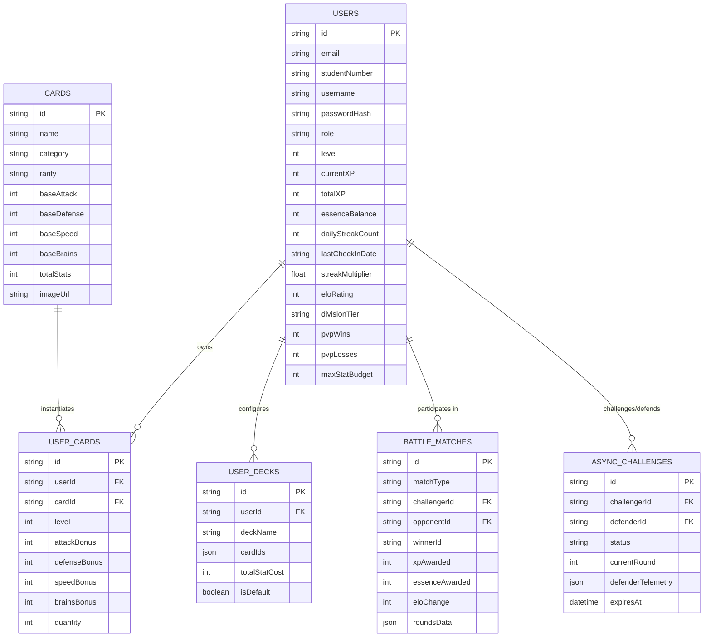

# Database Plan

This page covers the relational database architecture for Wits Quest: how student registrations, progressive XP leveling, Essence currency, card inventories, custom decks, match history, and async PvP defensive telemetry are structured and persisted. For the full column-by-column table specifications, see [Database Schema](database-schema.md).

## Entity Relationship Diagram

> Note: this diagram is written in Mermaid syntax. The default `mkdocs` theme in `mkdocs.yml` doesn't render Mermaid natively — see [UML overview](../uml/index.md#how-to-add-a-diagram) for how to enable it or export a static image instead.

## Student registration seeding workflow

When a new student registers (`POST /api/auth/register`):

1. **Insert into `users`** — creates the user profile with baseline level 1, 1000 Elo rating, a 300-point stat budget, 100 Essence shards, and `divisionTier = 'GOLD'`.
2. **Insert into `user_cards`** — assigns 5 starter landmark cards to the student's inventory.
3. **Insert into `user_decks`** — builds a starter 5-card deck from those cards.

## Division tier calculation

Ranked division tiers are computed dynamically from `user.eloRating`:

| Division | Elo Range |
| :--- | :--- |
| Bronze | 0 – 499 |
| Silver | 500 – 999 |
| Gold | 1000 – 1499 |
| Platinum | 1500 – 1799 |
| Diamond | 1800+ |

The [Feature Handover Guide](../development/technical-decisions.md) additionally ties division to Total XP bands for the campus leaderboard view — reconcile the two if leaderboard divisions and matchmaking divisions are meant to be the same value.
