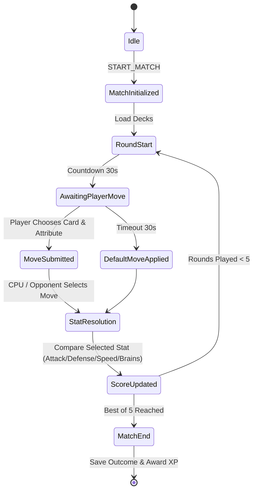

# Wits Quest - Battle Rules State Machine Diagram

```mermaid
stateDiagram-v2
    [*] --> Idle
    Idle --> MatchInitialized : START_MATCH
    MatchInitialized --> RoundStart : Load Decks
    RoundStart --> AwaitingPlayerMove : Countdown 30s
    AwaitingPlayerMove --> MoveSubmitted : Player Chooses Card & Attribute
    AwaitingPlayerMove --> DefaultMoveApplied : Timeout 30s
    MoveSubmitted --> StatResolution : CPU / Opponent Selects Move
    DefaultMoveApplied --> StatResolution
    StatResolution --> ScoreUpdated : Compare Selected Stat (Attack/Defense/Speed/Brains)
    ScoreUpdated --> RoundStart : Rounds Played < 5
    ScoreUpdated --> MatchEnd : Best of 5 Reached
    MatchEnd --> [*] : Save Outcome & Award XP
```
