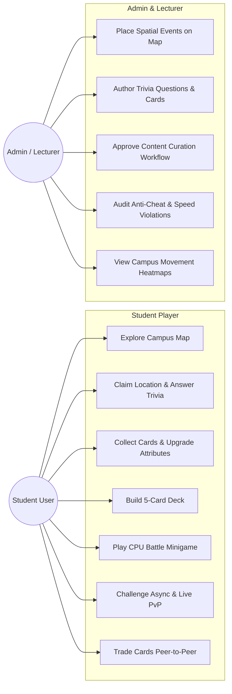

# Wits Quest - Use Case Diagram

```mermaid
graph LR
    subgraph Student Player
        UC1[Explore Campus Map]
        UC2[Claim Location & Answer Trivia]
        UC3[Collect Cards & Upgrade Attributes]
        UC4[Build 5-Card Deck]
        UC5[Play CPU Battle Minigame]
        UC6[Challenge Async & Live PvP]
        UC7[Trade Cards Peer-to-Peer]
    end

    subgraph Admin & Lecturer
        UC8[Place Spatial Events on Map]
        UC9[Author Trivia Questions & Cards]
        UC10[Approve Content Curation Workflow]
        UC11[Audit Anti-Cheat & Speed Violations]
        UC12[View Campus Movement Heatmaps]
    end

    Player((Student User)) --> UC1
    Player --> UC2
    Player --> UC3
    Player --> UC4
    Player --> UC5
    Player --> UC6
    Player --> UC7

    Admin((Admin / Lecturer)) --> UC8
    Admin --> UC9
    Admin --> UC10
    Admin --> UC11
    Admin --> UC12
```
