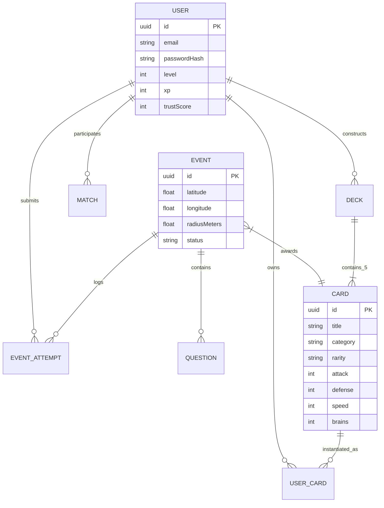

# Wits Quest - Entity Relationship Diagram (ERD)

```mermaid
erDiagram
    USER ||--o{ USER_CARD : owns
    USER ||--o{ DECK : constructs
    USER ||--o{ EVENT_ATTEMPT : submits
    USER ||--o{ MATCH : participates

    EVENT ||--o{ QUESTION : contains
    EVENT ||--o{ EVENT_ATTEMPT : logs
    EVENT }|--|| CARD : awards

    CARD ||--o{ USER_CARD : instantiated_as
    DECK ||--|{ CARD : contains_5

    USER {
        uuid id PK
        string email
        string passwordHash
        int level
        int xp
        int trustScore
    }

    EVENT {
        uuid id PK
        float latitude
        float longitude
        float radiusMeters
        string status
    }

    CARD {
        uuid id PK
        string title
        string category
        string rarity
        int attack
        int defense
        int speed
        int brains
    }
```
