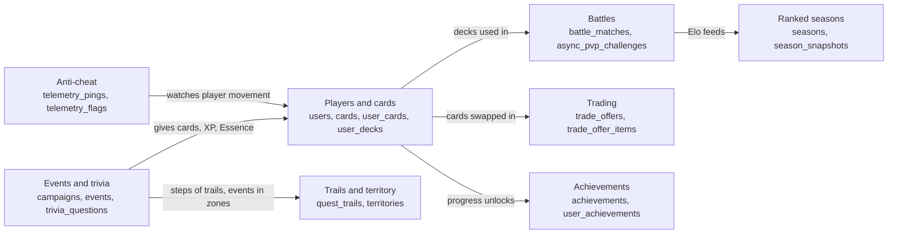

# Database Plan

How the Wits Quest database is designed, how it changes over time, and how data gets into it. Every table and column is listed on [Database Schema](database-schema.md), and the [ERD](../uml/04_erd_database_schema.md) shows how they connect.

---

## Design choices

| Choice | Why |
| :--- | :--- |
| **PostgreSQL on Supabase** | One service gives us the database, player logins (Supabase Auth) and card image storage. Game data is relational: players own cards, cards sit in decks, events give cards. |
| **Logins live in Supabase Auth** | `users.id` is the Supabase Auth account id. We never store passwords. |
| **No ORM** | The backend uses the Supabase client directly. Column names match the JSON the backend sends, so most are `camelCase` in quotes (`"eloRating"`). Newer tables (anti-cheat, achievements, seasons, territory, trading) use `snake_case`. |
| **Only the backend touches the database** | All game rules (location checks, answers, battle results, rewards) run on the server, so the database must not be reachable from the app. See [Security](#security). |
| **Lists stored as JSON** | Things that are always read and written together, like a deck's 5 card ids or a battle's rounds, are kept in one `jsonb` column instead of extra tables. |
| **Unique pairs stop double rewards** | A player can complete an event, answer a question, finish a trail or unlock an achievement only once, because the database refuses a second row for the same pair. |
| **Risky changes run as database functions** | The Forge, trades and territory capture change several rows at once. They run as one locked step inside the database, so a double tap can't spend the same cards or Essence twice. |
| **Content has a status** | Cards, events, trivia and trails move through `draft` → `review` → `published` → `retired`. Players only see `published` content. |

## How the tables fit together

## What happens when a player signs up

After a new player creates an account with Supabase Auth, the app calls `POST /api/auth/complete-signup`, which:

1. **Adds a row to `users`:** level 1, Elo 1000 (Gold), 100 Essence and a deck budget of 2000.
2. **Adds 5 starter cards to `user_cards`.**
3. **Saves those 5 cards as the player's default deck in `user_decks`.**

## Divisions

The server works out a player's division from their Elo after every ranked match and saves it in `users.divisionTier`.

| Division | Elo |
| :--- | :--- |
| Bronze | 0 – 499 |
| Silver | 500 – 999 |
| Gold | 1000 – 1499 |
| Platinum | 1500 – 1999 |
| Diamond | 2000+ |

!!! note
    The app's ranked screen still treats 1800 as the start of Diamond (`frontend/src/utils/elo.ts`), while the server uses 2000 (`backend/src/services/applyMatchResult.ts`). The server's value is the one that is saved.

## Security

- The backend connects with Supabase's **service-role key**, which only lives on the server (Render).
- The app gets Supabase's **public key** only so players can log in. That key can't read or write any table or call any function.
- **Row-level security is on for every table**, with no rules that let anyone else in.
- Secret columns never leave the server: `trivia_questions.correctAnswer` and `events.qr_secret`.

## Changes to the database

The full database is in `docs/database/schema.sql` in the source repo, and a copy is kept here: [schema.sql](schema.sql). Running it on an empty Supabase project builds every table except the two trading tables, which come from the `trading` migration below.

Changes made after the database went live are **migrations**: SQL files in `docs/database/migrations/`, named by date. Each one is run once in the Supabase SQL editor, in date order, and is safe to run again. `schema.sql` is always updated to match.

| Date | Migration | What it changed |
| :--- | :--- | :--- |
| 21 Sep 2026 | `anti-cheat-analytics` | GPS accuracy on pings, `telemetry_flags`, `achievements` and `user_achievements` with the first 6 achievements |
| 27 Sep 2026 | `trading` | `trade_offers`, `trade_offer_items` and the trade functions |
| 28 Sep 2026 | `ranked-seasons-fixes` | Players in a past season's leaderboard can now be deleted; adds the first season |
| 29 Sep 2026 | `curation-review-and-campaigns` | The `review` step for cards, events and trivia, `campaigns`, and automatic event placement |
| 29 Sep 2026 | `admin-achievements` | Achievements become rules that admins can create (`rule_type`, `target_value`) |
| 29 Sep 2026 | `qr-checkin-and-trust-tiers` | QR check-in secrets on events, `trust_tier_history`, and answer times for the impossible-travel check |
| 29 Sep 2026 | `territory-trails-forge` | `territories`, the quest trail tables and the Forge functions |
| 29 Sep 2026 | `lock-down-direct-access` | Removes all access from the public key and switches on row-level security everywhere |
| 30 Sep 2026 | `deck-budget-2000` | Raises every player's deck budget to 2000 after cards were rebalanced |
| 30 Sep 2026 | `territory-influence` | `territory_influence`: zones go to the player with the most influence, not the last capture |

## Getting data into the database

| Script (in `backend/`) | What it loads | Where it's used |
| :--- | :--- | :--- |
| `src/db/seedProduction.ts` | The real campus content: 30+ cards, 20+ events and 40+ trivia questions | The live database |
| `src/db/seed.ts` | The avatars, 7 test players with starter cards and decks, and sample territories and trails | Development and testing |

Both scripts are safe to run more than once: they update rows that already exist instead of adding copies. The production script never overwrites the starter cards (`card-008` to `card-012`) that every player already owns.
