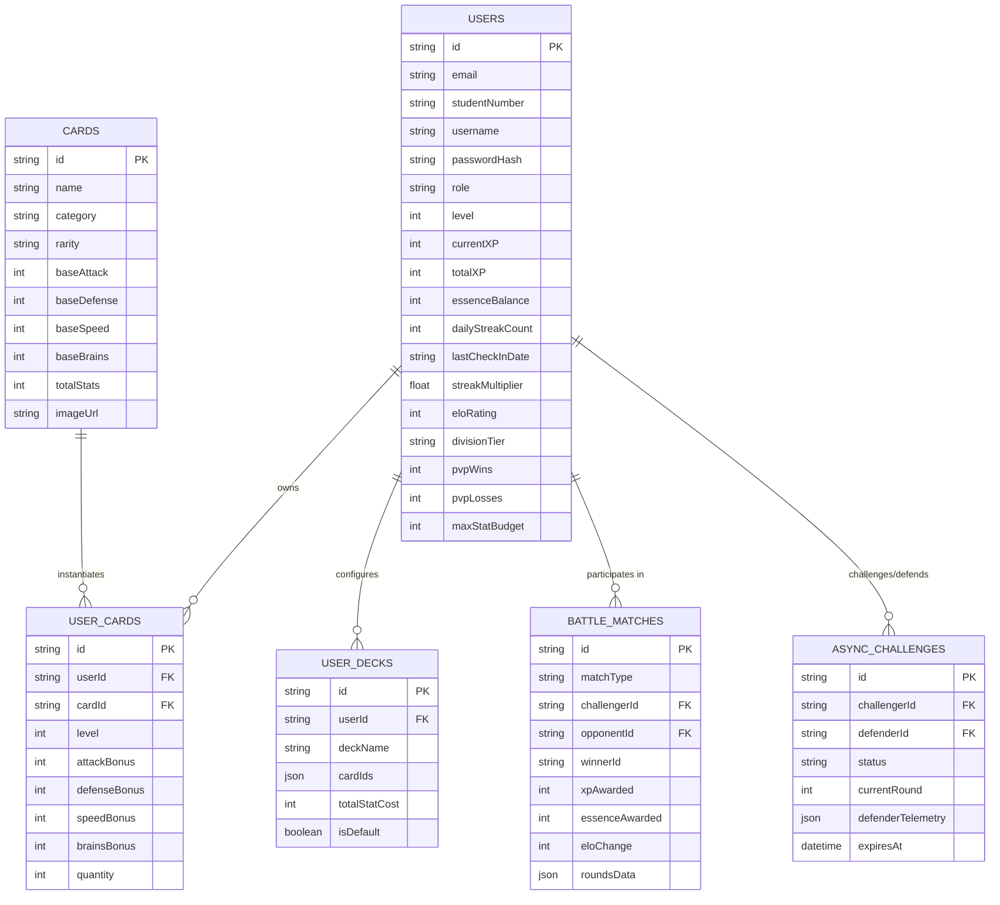

# Database Plan

This page covers the relational database architecture for Wits Quest: how student registrations, progressive XP leveling, Essence currency, card inventories, custom decks, match history, and async PvP defensive telemetry are structured and persisted. For the full column-by-column table specifications, see [Database Schema](database-schema.md).

## Entity Relationship Diagram

## Student registration seeding workflow

After a new player signs up with Supabase Auth, the app calls `POST /api/auth/complete-signup`, which:

1. **Insert into `users`** — creates the player's profile: level 1, Elo 1000, 100 Essence and a deck stat budget of 2000.
2. **Insert into `user_cards`** — assigns 5 starter landmark cards to the student's inventory.
3. **Insert into `user_decks`** — builds a starter 5-card deck from those cards.

## Division tier calculation

Ranked division tiers are computed dynamically from `user.eloRating`:

| Division | Elo Range   |
| :------- | :---------- |
| Bronze   | 0 – 499     |
| Silver   | 500 – 999   |
| Gold     | 1000 – 1499 |
| Platinum | 1500 – 1799 |
| Diamond  | 1800+       |

