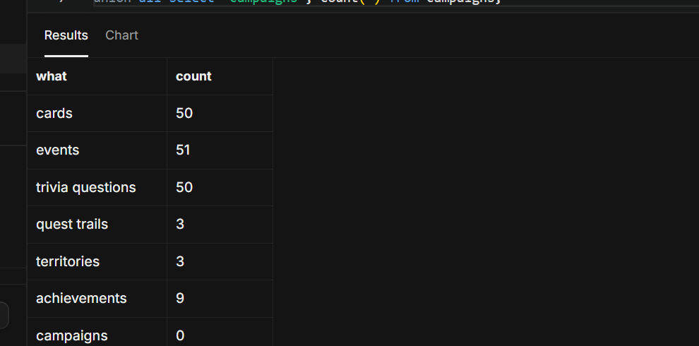
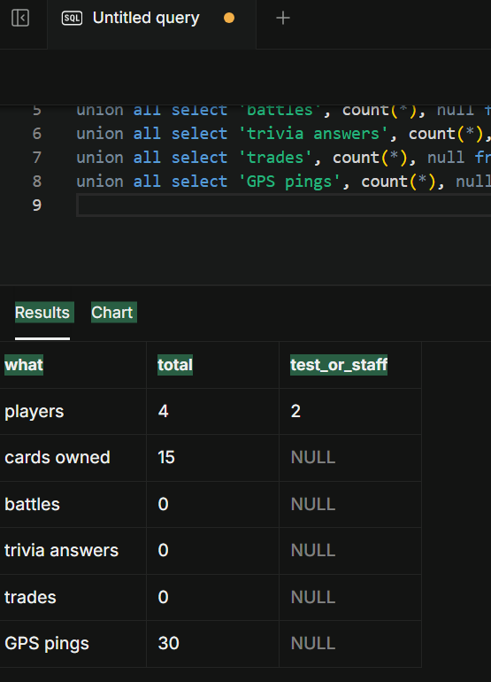
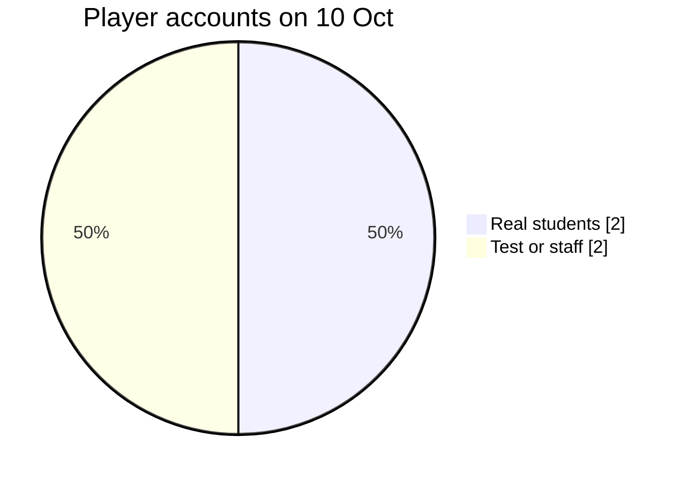

# Production Data

Yes, Wits Quest has a live production database, and this page shows what's in it and how much of it is test data. The counts were taken from the live Supabase database on **10 October 2026**, after the Sprint 4 clean-up.

- **Where it runs:** Supabase project `kbazdskiqglyxsdvopsa` (`https://kbazdskiqglyxsdvopsa.supabase.co`). More is on [Deployment](../development/deployment.md#database).
- **Who can reach it:** only the API, with the service-role key, plus players signing in through Supabase Auth. Nobody else can read the data.

---

## Game content (all real)

This is the content players see. All of it is real Wits content written for the game, not test data.

| Content | Live count | Where it came from |
| :--- | ---: | :--- |
| Cards | **50** | The starter cards, Wits campus cards from the production seed (`backend/src/db/productionContent.ts`), plus cards made by admins in the console |
| Campus events | **51** | Events from the production seed, plus events placed by admins in the console |
| Trivia questions | **50** | Questions from the production seed, plus questions written by admins |
| Quest trails | **3** | Made in the admin console |
| Territories | **3** | Campus zones for territory control |
| Achievements | **9** | Achievement rules that players can unlock |
| Campaigns | **0** | None scheduled at the time of counting |



## Player data

| Data | Live count | Test data in it |
| :--- | ---: | :--- |
| Player accounts | **4** | **2** are test or staff accounts; 2 are real students |
| Cards owned by players | **15** | Each test account starts with 5 cards so it can battle straight away |
| Finished battles | **0** | |
| Trivia answers | **0** | |
| Trades | **0** | |
| GPS pings (anti-cheat) | **30** | |





!!! note "Why the player numbers are small"
    In Sprint 4 the live database was cleaned so that it holds only real data at submission: the test accounts, battles and answers from development and user testing were deleted. The user-testing rounds (10 players, see [User Feedback](../project/user-feedback.md)) ran before the clean-up, so their accounts and games are no longer in the live data. The content was kept.

---

## How we keep test data out of production

| Kind of test data | How it's handled |
| :--- | :--- |
| **Automated tests** | The 946 tests never touch the live database. Backend tests use an in-memory stand-in or mocks for Supabase, and frontend tests mock the API ([Test Results](../development/test-report.md#3-automated-tests-and-coverage)) |
| **Test accounts** | Exactly two, `Tester_One` and `Tester_Two` (student numbers 2999001 and 2999002), made by `npm run seed:test-players` so the team and the load test can try PvP. They are easy to spot and remove |
| **Leftover test rows** | `backend/src/scripts/cleanupTestData.ts` finds rows whose usernames or ids start with `test_`, `dummy_`, `mock_`, `seed_` or `admin_test`. It only lists them unless run with `--confirm`, and it deletes the user's Auth account so all their data goes with it |
| **Load testing** | The load test only reads data (GET requests), plus one sign-in as the test player, so it adds nothing to the database |

## Checking the numbers yourself

Run this in the Supabase SQL editor:

```sql
select 'cards' as what, count(*) from cards
union all select 'events', count(*) from events
union all select 'trivia questions', count(*) from trivia_questions
union all select 'players', count(*) from users
union all select 'test players', count(*) from users where "studentNumber" like '2999%';
```
