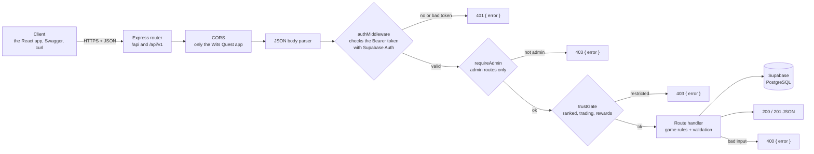
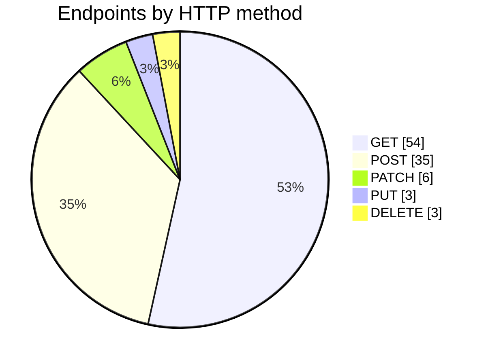

# API Architecture

The Wits Quest API is a **REST API**: resources are identified by URLs, HTTP methods say what to do with them, and requests and responses are JSON. Live battles are the one part that isn't REST; they use Socket.IO WebSockets on the same server (see [below](#the-one-exception-live-battles)).

- **Base URL:** `https://wits-quest.onrender.com/api/v1` (`/api` also works, for older clients)
- **Format:** JSON in and out (`Content-Type: application/json`)
- **Login:** `Authorization: Bearer <Supabase access token>`
- **Try it:** [Swagger UI](swagger.md) · **Every endpoint:** [Endpoint Catalogue](api-endpoints.md)

---

## How a request flows



The API is built in **layers**, and each layer has one job:

| Layer | Files | Job |
| :--- | :--- | :--- |
| Server | `backend/src/server.ts` | Starts Express and Socket.IO, mounts every router under `/api` and `/api/v1`, logs slow requests (over 500 ms), and returns a JSON 404 for unknown paths |
| Middleware | `middleware/auth.ts`, `requireAdmin.ts`, `trustGate.ts` | Who is calling, whether they're an admin, and whether the anti-cheat trust level allows the action |
| Routes | `routes/*.ts` (one file per area: `battle`, `trades`, `ranked`, `trails`, `territory`, `telemetry` and so on) | Check the input, apply the game rules, and decide the response |
| Data | `db/supabaseClient.ts` | Talks to PostgreSQL through the Supabase SDK, with the service-role key |

---

## REST principles, and how we follow them

| Principle | What it means | How Wits Quest does it |
| :--- | :--- | :--- |
| **Client–server** | The client and server are separate and only talk over HTTP | The React app (on Vercel) and the API (on Render) are separate programs, deployed separately. Anyone can call the API without the app, for example from Swagger or curl |
| **Stateless** | Each request carries everything the server needs; the server keeps no session | Every request sends its own `Bearer` token, which is checked on each call. There's no server-side session, so any request can be handled on its own |
| **Resource-based URLs** | URLs name things (nouns); the method says what to do | `/cards`, `/events/{id}`, `/trades/{id}/accept`, `/users/leaderboard`. Plural nouns, with ids in the path |
| **Uniform interface** | Standard methods, status codes and formats everywhere | The same five HTTP methods, the same status codes, JSON everywhere, and one error shape: `{ "error": "message" }` |
| **Layered system** | The client can't tell what sits behind the API | The app never talks to the database. Everything goes through the API, which applies the rules before reading or writing data |
| **Cacheable** | Responses that don't change can be reused | Walking routes are cached for an hour on the server. The app keeps the card catalogue on the phone, so it isn't fetched again and again |
| **Versioned** | Clients can depend on a stable base URL | Every route is served under `/api/v1`. The older `/api` prefix still works so nothing breaks |

Two more rules are our own:

- **The server decides.** Anything that affects fairness (location, trivia answers, battle results, rewards) is checked on the server and never trusted from the app.
- **Validate every input.** Bad or missing fields get a `400` with a message saying what's wrong, before anything touches the database.

---

## HTTP methods we use

The API has **101 endpoints**, and they use five HTTP methods:

| Method | Meaning | How many | Examples |
| :--- | :--- | ---: | :--- |
| `GET` | Read something; never changes data | 54 | `GET /cards` (the catalogue), `GET /events` (campus events), `GET /users/leaderboard` |
| `POST` | Create something, or do an action | 35 | `POST /trivia/answer` (answer a question), `POST /trades` (offer a trade), `POST /battle/cpu/start` |
| `PUT` | Replace a whole thing | 3 | `PUT /users/{id}` (update your profile), `PUT /events/{id}` (edit an event) |
| `PATCH` | Change part of a thing | 6 | `PATCH /events/{id}/status` (draft → published), `PATCH /achievements/{id}/deactivate` |
| `DELETE` | Remove a thing | 3 | `DELETE /auth/me` (delete your account), `DELETE /campaigns/{id}` |



`GET` requests are safe to repeat. `PUT` and `DELETE` give the same result however many times they are sent. `POST` is used for actions that aren't simple create or update operations, such as answering trivia or playing a battle round.

---

## Status codes

The routes use these codes (counted in `backend/src/routes`):

| Code | Meaning | When we send it |
| :--- | :--- | :--- |
| `200 OK` | It worked | Most reads and updates |
| `201 Created` | Something new was made | A new trade, event, card or challenge |
| `400 Bad Request` | The input is wrong | A missing field, a stat that doesn't exist, coordinates out of range |
| `401 Unauthorized` | Not logged in | Missing or expired token |
| `403 Forbidden` | Logged in but not allowed | A player calling an admin endpoint; an anti-cheat restriction |
| `404 Not Found` | That thing doesn't exist | An unknown card, event or path |
| `409 Conflict` | It clashes with the current state | "It's not your turn", "That card has already been played", a question already answered |
| `410 Gone` | It existed but has expired | An expired challenge |
| `429 Too Many Requests` | Slow down | Repeated requests too quickly |
| `500 Internal Server Error` | Our fault | An unexpected error. The message is generic and the details only go to the server log |
| `502 Bad Gateway` | An outside service failed | OpenRouteService and the FOSSGIS router both failed |
| `503 Service Unavailable` | A dependency isn't ready | The routing key isn't set up |

Every error has the same shape:

```json
{ "error": "It's not your turn to pick." }
```

---

## Security

- **Login:** Supabase Auth issues the token, and the API checks it with Supabase on every request. The API never sees a password.
- **Roles:** admin endpoints check the `ADMIN` role (`requireAdmin`).
- **Anti-cheat:** `trustGate` limits ranked, trading and rewards for accounts with a low trust score. It never bans automatically, and if the check itself fails, the request is allowed through.
- **CORS:** browsers may only call the API from the Wits Quest app's own address.
- **Secrets:** the Supabase service-role key and the OpenRouteService key live only on the server, in Render's environment settings.

---

## The one exception: live battles

Live PvP, the ranked queue and spectating need both players to see each move straight away, which request–response REST can't do well. They use **Socket.IO** on the same server. The client sends events such as `lobby:challenge`, `set_active_card` and `respond_turn`, and the server pushes the result to both players. If a player drops out, they have 60 seconds to reconnect. The full flow is on [Live PvP Walkthrough](live-pvp-walkthrough.md).
