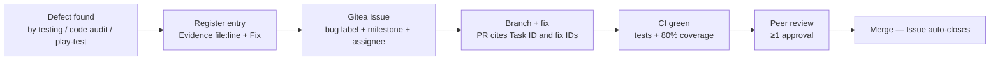

# Bug Tracking

How defects are found, recorded, prioritised, and verified-fixed across the three repositories. Written to satisfy the brief's bug-tracking requirement for Milestone 2.

---

## Where bugs live

Wits Quest uses a **two-layer tracking system**:

| Layer | Location | Purpose |
| :--- | :--- | :--- |
| **Gitea Issues** | Each repo on `sdp.ms.wits.ac.za` | The operational tracker — assignment, discussion, milestones, and automated closing via PR keywords |
| **Master fix register** | [Fix Register](fix-register.md) | The analytical catalogue — every defect with line-level evidence, the required fix, and a stable ID (`F##`) that survives issue archiving |

Gitea Issues were chosen over Gitea Projects (kanban) as the work tracker — the full reasoning, including the rejected alternatives (Trello, Notion, Jira, spreadsheets), is [Decision D-01](decisions-log.md#d-01-issues-over-projects-for-work-tracking). In short: native commit/PR linking (`closes #42`, `fixes #10`), per-task discussion threads, milestone grouping, and no organisation-level linking overhead across the 3-repo split.

---

## The fix register

Every defect in the codebase carries a **stable traceability ID** with a fixed format:

| ID prefix | Meaning |
| :--- | :--- |
| `F##` | A fix — something implemented that is broken, insecure, or inconsistent (F1–F53 catalogued so far) |
| `B-#` | A bug reported through play-testing without a register entry yet |
| `I-#` | An outstanding feature gap against the course brief (e.g. `I-3` async PvP) |

Each register entry follows a strict **Evidence / Fix** pattern, so a fix can be verified against the exact code that was broken:

```markdown
**F7. Real credentials committed in deployment/RENDER_DEPLOYMENT.md.**

- **Evidence**: Lines 46-50 contain a plaintext Gmail app password and a JWT secret
  as example values.
- **Fix**: Rotate the credentials immediately, strip the values from the document,
  and keep secrets only in environment variables / dashboard settings.
```

Evidence always cites `file:line` in the current working tree, which is what makes the register auditable rather than anecdotal.

### Register taxonomy (53 entries)

| Category | IDs | Examples |
| :--- | :--- | :--- |
| Game-integrity & server-authority | F1–F6 | No server-side location check on trivia (F1), client-side battle resolution (F2), repeat-answer farming (F6) |
| Security & access-control | F7–F12 | Committed credentials (F7), unauthenticated route shadowing (F4), allow-all CORS (F10) |
| Routing & navigation | F13–F17 | Screens not reachable from the app shell |
| Static screens → live data | F18–F25 | Hardcoded leaderboard (F18), mock PvP data (F24) |
| Backend correctness & consistency | F26–F34 | Column-name mismatch vs schema (F29), stat-budget scaling (F41) |
| Anti-cheat | F35–F37 | Velocity-check gaps |
| Progression & economy | F38–F41 | Hardcoded streak values (F28) |
| Offline | F42–F43 | Offline queue never enqueues (F42) |
| CI/CD & repository hygiene | F44–F48 | Backend undeployed (F47) |
| Documentation | F49–F53 | Docs/code drift |

---

## Priority ladder

From the [Master Guide V2](../sprints/master-guide-v2.md), each sprint carries a **P0 > P1 > P2** ladder so the drop-order is pre-agreed instead of improvised when time runs short:

| Priority | Meaning (Sprint 2 window) |
| :--- | :--- |
| **P0** | Must land by 11 Sep for Milestone 2 to be demonstrable — server-authority and credential-hygiene fixes |
| **P1** | Must land by 15 Sep (the Milestone 2 deadline) |
| **P2** | Stretch of the window; hard deadline 22 Sep |

A bug's severity and its priority interact: a **high-severity** defect (security breach, data corruption, game-integrity hole) can only sit below P0 when a documented workaround exists.

---

## Workflow



Conventions:

- **Issue labels**: `bug`, `feature`, `docs`, `infrastructure` (per D-01)
- **Milestones**: Sprint 1 / Sprint 2 / Sprint 3 — the issue closes only inside its milestone
- **PR discipline**: every PR references its Task ID and fix-register IDs (`F##`) — this is a hard clause of the [Definition of Done](../project/methodology.md#definition-of-done), giving two-way traceability from code to catalogue
- **Verification**: a fix counts as closed only when CI is green (typecheck, lint, tests, 80% coverage gate) and, for gameplay-facing fixes, verified on a real device on campus — plus the feature walkthrough documents in `implementation-plans/` and `battle-ai/` record what was actually tested
- **Blocking rule**: zero known high-severity blockers are allowed open at any milestone gate

---

## Highest-severity items — current status

Verified against the Sprint 2 code as of 2026-09-14:

| ID | Defect | Status |
| :--- | :--- | :--- |
| **F7** | Real Gmail app password + JWT secret committed in a deployment doc | ✅ Scrubbed from the document — credential rotation still advised (values were public) |
| **F1, F36** | Trivia location gate is client-side only | ⚠ Open — defeats the game's core premise ("trust nothing from the client") |
| **F6** | Correct answers re-award cards/XP/Essence on every submission | ✅ Fixed — `user_trivia_attempts` / `event_attempts` tables reject duplicate attempts (400) and completed events (409) |
| **F4** | Authoring routes unauthenticated via route shadowing | ✅ Fixed — shadowing inline routes removed from `server.ts` |
| **F5** | No ADMIN role guard on authoring endpoints | ⚠ Open — any authenticated student can author events/cards by calling the API directly |
| **F2** | CPU battle outcomes are client-declared | ⚠ Open — `/api/battle/record` persists the client-claimed winner |
| **F47** | Backend never deployed — live frontend has no API to talk to | ⚠ Open per the register — Render deployment configured (`render.yaml`, `/api/health` probe), live verification pending |
| **F9** | OTP codes held in process memory | ✅ Resolved by the Supabase Auth migration — Supabase owns OTP delivery; no credentials in our database |

Resolved Sprint 2 highlights — async PvP hardcoded mock data (F14), the unreachable multiplayer screens (F13/F17), the password-hash leak on `GET /api/users`, the best-of-5 match-length bug, the hardcoded leaderboard (F18), and the trivia answer-leak on `GET /api/events/:id/trivia` — were verified fixed in the code and documented in the `battle-ai/` and `implementation-plans/` walkthroughs.
