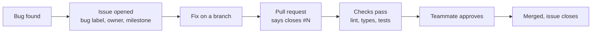

# Bug Tracking

How we find, record, fix and close bugs.

---

## Where bugs are tracked

Every bug is a **Gitea Issue** in the [source repo](https://sdp.ms.wits.ac.za/big-o/Wits-Quest/issues) with the `bug` label. Each issue has:

- an **owner** (the person fixing it),
- a **sprint milestone**,
- a **severity**: high (security hole, lost data, cheating possible), medium (feature broken but there's a workaround) or low (cosmetic),
- a description with steps to reproduce.

We chose Issues over a separate board because issues link directly to the commits and pull requests that fix them ([Decision D-01](decisions-log.md#d-01-gitea-issues-for-tracking-work)).

## Where bugs come from

- **Testing:** a failing automated test or a manual test on a phone.
- **Code review:** a teammate spots a problem in a pull request.
- **Players:** reports from the [User Feedback](../project/user-feedback.md) form.
- **The tutor:** issues raised in [Stakeholder Reviews](../project/stakeholder-reviews.md).

## How a bug gets fixed

```mermaid
graph LR
    A[Bug found] --> B[Issue opened<br/>bug label, owner, milestone]
    B --> C[Fix on a branch]
    C --> D[Pull request<br/>says closes #N]
    D --> E[Checks pass<br/>lint, types, tests]
    E --> F[Teammate approves]
    F --> G[Merged, issue closes]
```

## Rules

- **High-severity bugs come first.** No high-severity bug may be open at a milestone.
- **A fix needs proof.** Checks must pass, and game bugs are re-tested on a real phone.
- **Add a test where possible,** so the same bug can't come back unnoticed.
- **The pull request names the issue** (`closes #N`), so Gitea closes it on merge and the fix can be traced.

## Examples of bugs we fixed

| Bug | Fix |
| :--- | :--- |
| Trivia could be answered from anywhere, because only the app checked distance | The server now checks the player's position and the event's time window ([Sprint 3](../project/sprint-features.md#sprint-3-fair-play-and-depth)) |
| CPU battle results were decided by the app | Battles now run on the server, which decides each round and the rewards |
| A correct answer could be submitted again and again for more rewards | Each player can answer each event once; repeats are rejected |
| Admin endpoints could be called by any logged-in player | Admin-only endpoints now check the ADMIN role |
| Real credentials were in a deployment document | Removed; all secrets now live only in the hosting dashboards |
| Old accounts had a deck budget of 300 after cards were rebalanced, so they couldn't battle | Every account was moved to the new 2000 budget |
