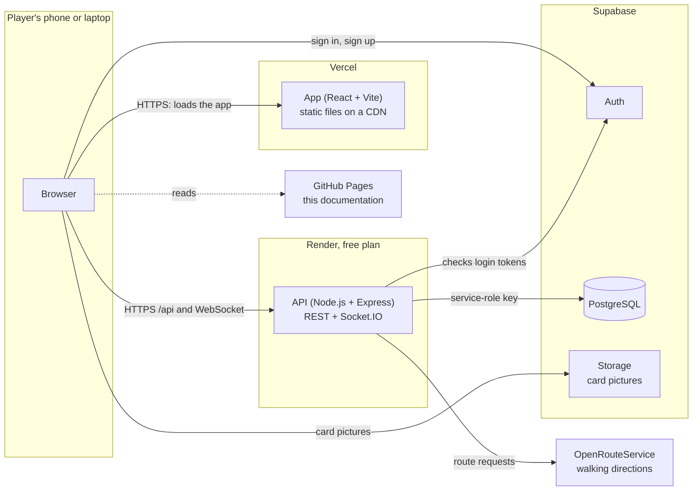
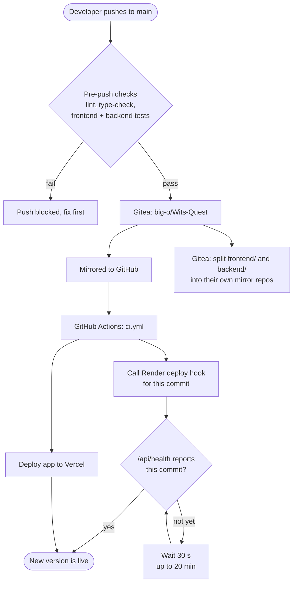
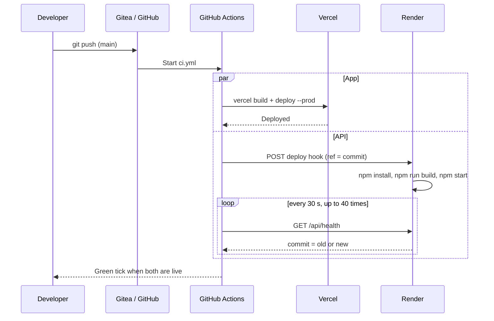

# Deployment

Where each part of Wits Quest is hosted and how it gets there.

---

## What runs where

| Part | Hosted on | Address |
| :--- | :--- | :--- |
| **App** (React) | Vercel | [wits-quest.vercel.app](https://wits-quest.vercel.app) |
| **API** (Node.js + Express + Socket.IO) | Render (free plan) | [wits-quest.onrender.com/api/health](https://wits-quest.onrender.com/api/health) |
| **Database, login and file storage** | Supabase (PostgreSQL) | Managed by Supabase |
| **Documentation** (this site) | GitHub Pages | [nkadimengkgothatso.github.io/-wits-quest](https://nkadimengkgothatso.github.io/-wits-quest/) |

## Deployment diagram

What runs where, and how the parts talk to each other.

The app never talks to the database directly. It signs players in with Supabase Auth and sends everything else to the API, which checks the login token before it reads or writes data.

## How a change goes live

Every push to `main` in the source repo runs `.github/workflows/ci.yml`, which:

1. **Deploys the app to Vercel** with the Vercel command-line tool.
2. **Starts a Render deploy** for the API through Render's deploy hook, pinned to that exact commit.
3. **Waits until the API is live** by calling `/api/health` until it reports the new commit (up to 20 minutes).

Tests run before the push, in the pre-push hook on the developer's machine (see [Git Workflow](git-workflow.md#automatic-checks)).

The health check is how we know which version is live: `/api/health` returns the deployed commit, for example [wits-quest.onrender.com/api/health](https://wits-quest.onrender.com/api/health).

### Other pipelines

| Pipeline | Where | When | What it does |
| :--- | :--- | :--- | :--- |
| Deploy (`.github/workflows/ci.yml`) | GitHub Actions | Every push to `main`, or by hand | Deploys the app to Vercel and the API to Render, then waits for the API to go live |
| CI checks (`.gitea/workflows/ci.yml`) | Gitea runners | By hand only, because the university runners are slow | Lint and Prettier on changed files, type-check, frontend and backend tests with coverage, production builds |
| Mirror sync (`.gitea/workflows/sync-mirrors.yml`) | Gitea runners | Every push to `main` | Copies `frontend/` and `backend/` into the separate `Wits-Quest-frontend` and `Wits-Quest-backend` repos |
| Docs (`deploy-docs.yml`, this repo) | GitHub Actions | Every push to `main` | Builds this site with MkDocs and publishes it to GitHub Pages |

This documentation site deploys separately: every push to `main` in the docs repo builds the site with MkDocs and publishes it to GitHub Pages (`.github/workflows/deploy-docs.yml`).

## Rolling back

| Part | How |
| :--- | :--- |
| App | In the Vercel dashboard, open **Deployments**, pick the last good one and click **Promote to Production**. |
| API | In the Render dashboard, open **Events**, pick the last good deploy and click **Rollback**. Or run the deploy workflow by hand after reverting the commit on `main`. |
| Database | Migrations aren't undone automatically. Write a new SQL file that reverses the change. |

## API settings (Render)

Set in `render.yaml`:

| Setting | Value |
| :--- | :--- |
| Root folder | `backend` |
| Build | `npm install && npm run build` |
| Start | `npm start` |
| Health check | `/api/health` |
| Auto-deploy | Off (GitHub Actions triggers deploys instead) |

Secrets are entered in the Render dashboard only, never in the code:

| Variable | What it's for |
| :--- | :--- |
| `SUPABASE_URL`, `SUPABASE_KEY` | Connects to the database and checks login tokens (service-role key) |
| `OPENROUTESERVICE_API_KEY` | Walking directions. Without it the map draws a straight line instead |
| `CORS_ORIGINS` | Extra app addresses allowed to call the API (optional) |
| `NODE_ENV` | `production` |

## App settings (Vercel)

| Variable | What it's for |
| :--- | :--- |
| `VITE_API_URL` | Where the API lives (`https://wits-quest.onrender.com`) |
| `VITE_SUPABASE_URL`, `VITE_SUPABASE_ANON_KEY` | Lets the app sign players in with Supabase Auth (public anon key only) |

## Database changes

Changes to the database are SQL files in the source repo (`docs/database/migrations/`), named by date. They are run once in the Supabase SQL editor, in date order. See [Database Schema](../database/database-schema.md).

## Rules

- Only `main` deploys. Work-in-progress branches never go live.
- Secrets live only in the Vercel, Render and Supabase dashboards.
- Feature freeze for the final submission is **4 October**.

## Known issues

- `deployment/docker-compose.yml` points to a `deployment/Dockerfile` that doesn't exist, and to Redis and a local PostGIS database the app no longer uses. It isn't part of the real deployment.
- The Gitea CI job names say "80%+ Coverage Gate" for both code bases, but the backend's real gate is 60% (`backend/vitest.config.ts`).
- The deploy workflow doesn't run the tests itself. It relies on the pre-push hook, so a push made with `--no-verify` could deploy untested code.

!!! note "Cold starts"
    Render's free plan sleeps after a period with no traffic, so the first request can take up to a minute. After that, the API responds normally.
