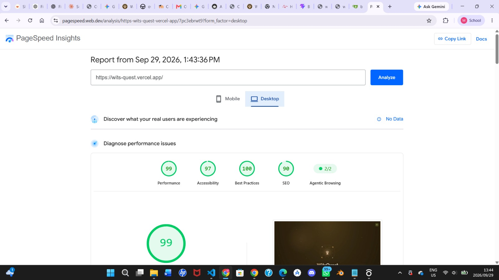
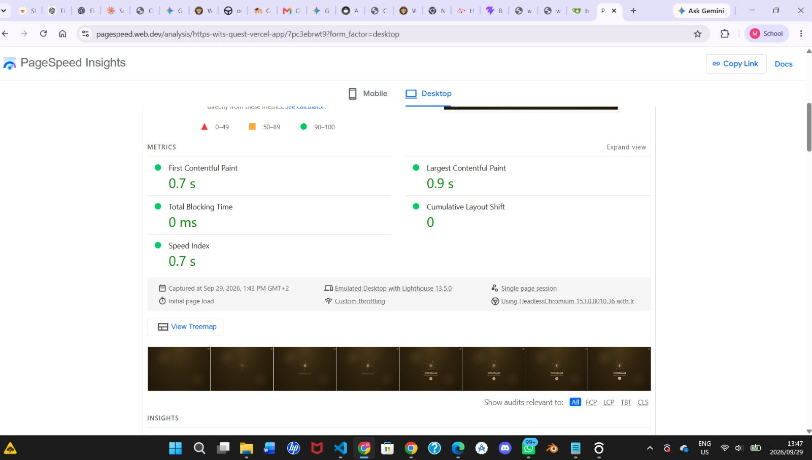
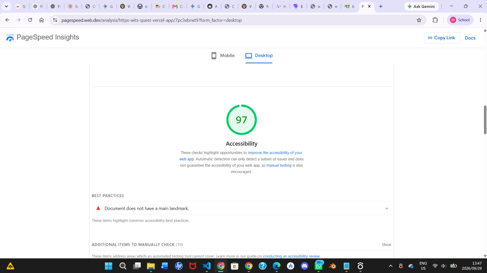
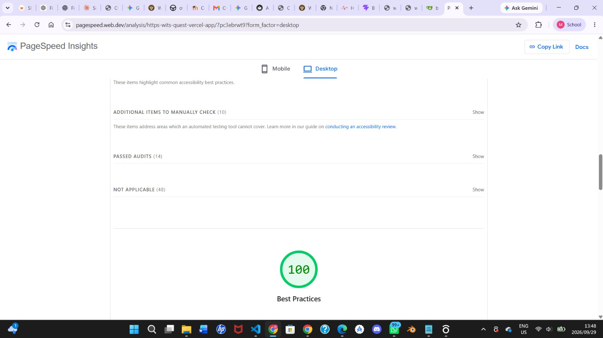

# Performance

How fast the app and API are, how we measure it, and what we did to keep them fast.

---

## App: PageSpeed Insights (29 September 2026)

We tested the live app ([wits-quest.vercel.app](https://wits-quest.vercel.app)) with Google PageSpeed Insights (Lighthouse), desktop mode.



| Category | Score |
| :--- | :--- |
| Performance | **99** |
| Accessibility | **97** |
| Best Practices | **100** |
| SEO | **90** |



| Metric | Result | What it means |
| :--- | :--- | :--- |
| First Contentful Paint | 0.7 s | Time until something appears on screen |
| Largest Contentful Paint | 0.9 s | Time until the main content appears |
| Total Blocking Time | 0 ms | How long the page is frozen and can't respond |
| Cumulative Layout Shift | 0 | How much the page jumps around while loading |
| Speed Index | 0.7 s | How quickly the page fills in |

All five are in Google's "good" range. These are lab results from one run, so they vary a little each time.

### Accessibility finding



One issue was flagged: the page has no `<main>` landmark, so screen-reader users can't jump straight to the main content. The fix is to wrap the main content in a `<main>` element. The tutor also found that text boxes are hard to see in dark mode ([Stakeholder Reviews](../project/stakeholder-reviews.md)), which automated checks don't catch.



### Still to do

- Add the `<main>` landmark and re-run the audit.
- Record a **mobile** run. Most players use phones, and the mobile test simulates a slower phone and network.

---

## Documentation site: Lighthouse (29 September 2026)

| Page | Performance | Accessibility | Best Practices | SEO | Notes |
| :--- | :--- | :--- | :--- | :--- | :--- |
| Home | 76 | 93 | 96 | 100 | Mobile test from South Africa. Loading 3.3 s, main content 4.4 s, no blocking, no layout shift |

The page does no heavy work (0 ms blocking time). The slower load comes from network distance to GitHub Pages under the simulated mobile connection.

---

## API

| What | How we check it |
| :--- | :--- |
| First request | Render's free plan sleeps when idle, so the first request can take up to a minute. After that, responses are fast. |
| Slow requests | The server logs any request that takes longer than 500 ms, with its route and time, so we can find and fix slow queries. |
| Crashes | Render's logs. An overdue async round used to crash the server; that was fixed on 30 Sep. |

---

## What keeps it fast

- **The server holds the game state.** During battles, only small updates go over the socket, not the whole match.
- **Offline queue.** Without signal, answers are saved on the phone and sent later, so the app doesn't freeze.
- **Bounded queries.** Analytics only read recent data (for example the last few days of GPS pings) instead of whole tables.
- **Cached routes.** Walking directions are cached on the phone, so the same route isn't requested twice.

## AI usage attribution

Per the course AI policy, the following AI assistance is declared for this page and its measurements:

| Item | Declaration |
| --- | --- |
| Tool | Qoder AI coding agent (IDE-integrated agent) |
| Model | *GLM, trained by Z.ai* — update this field to match the model shown in the Qoder model selector when the log is finalized |
| Purpose | Editing/structuring this performance documentation; running the Lighthouse audits against the deployed site; committing and deploying the results |
| Not AI-generated | The Lighthouse measurements themselves are tool-generated audit output of the real site; the test/coverage figures come from the project's own Vitest/CI runs |
| Responsibility | All content above was reviewed by the team before submission; the team remains responsible for its accuracy |

## How to repeat the measurements

```bash
cd frontend && npm run build      # build size and time
curl -o /dev/null -s -w "first byte: %{time_starttransfer}s  total: %{time_total}s\n" \
  https://wits-quest.onrender.com/api/health
```

For the app scores, open [PageSpeed Insights](https://pagespeed.web.dev/) and enter `https://wits-quest.vercel.app`.
