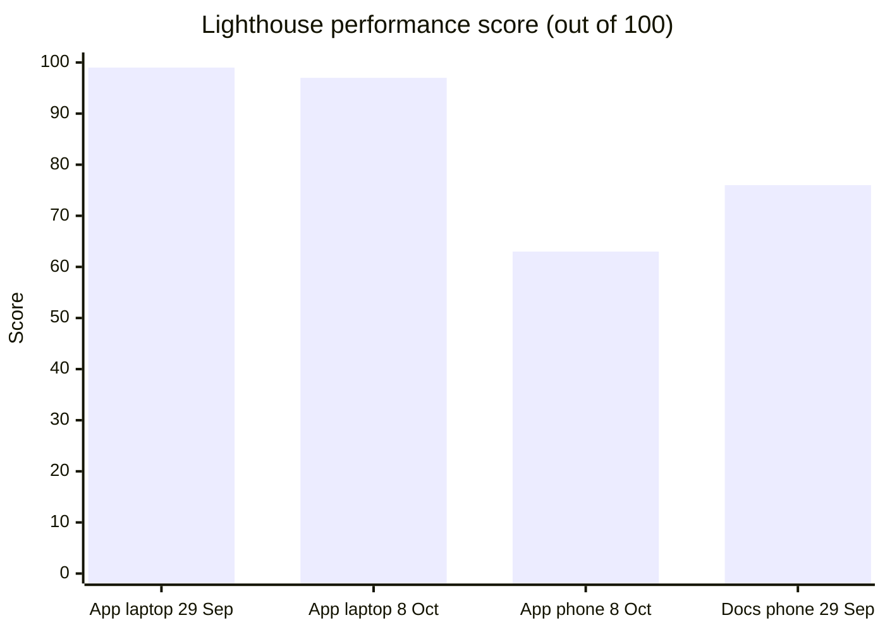
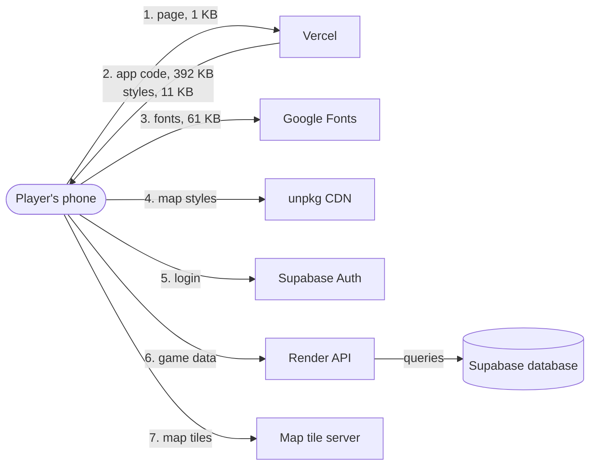
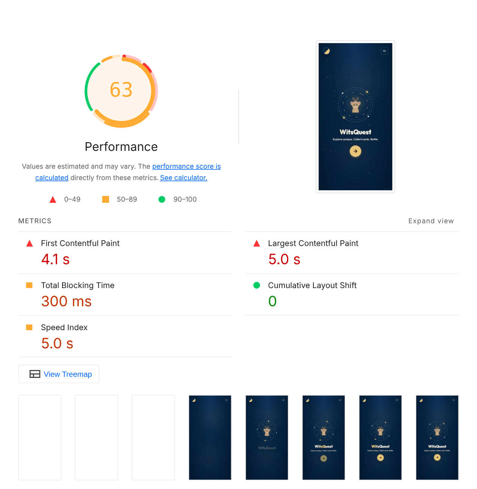
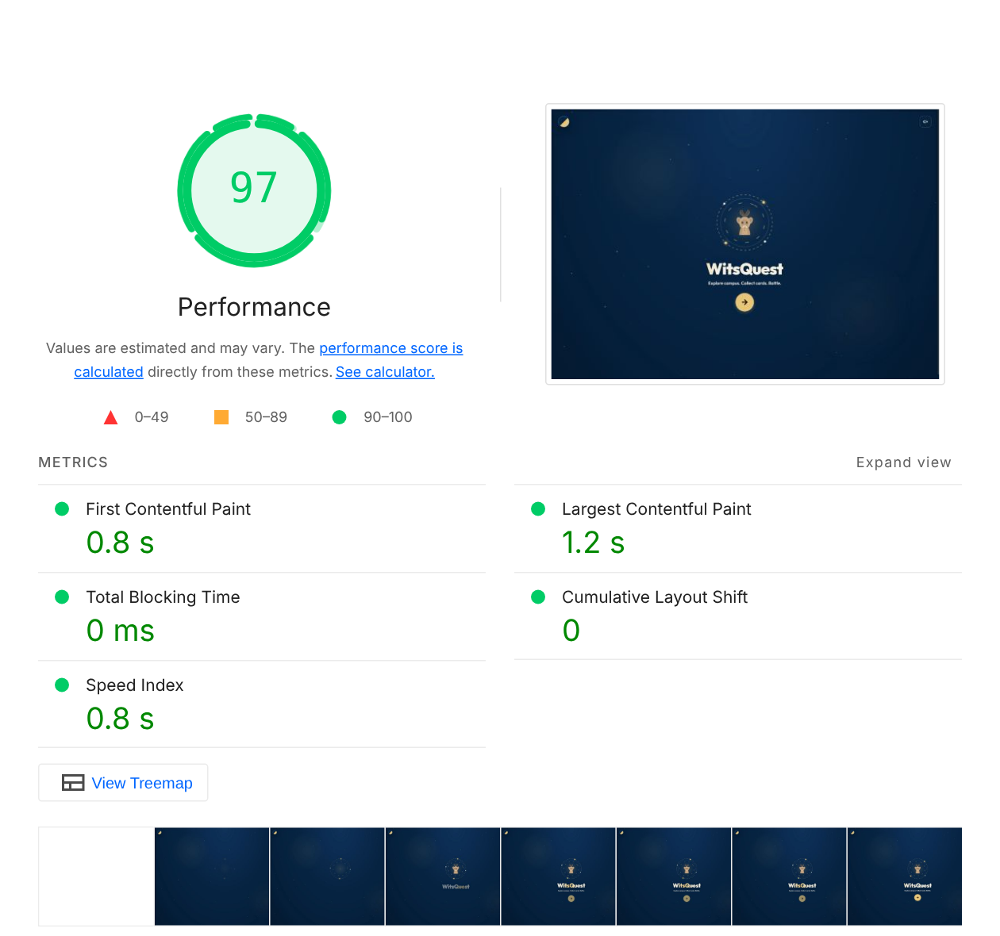
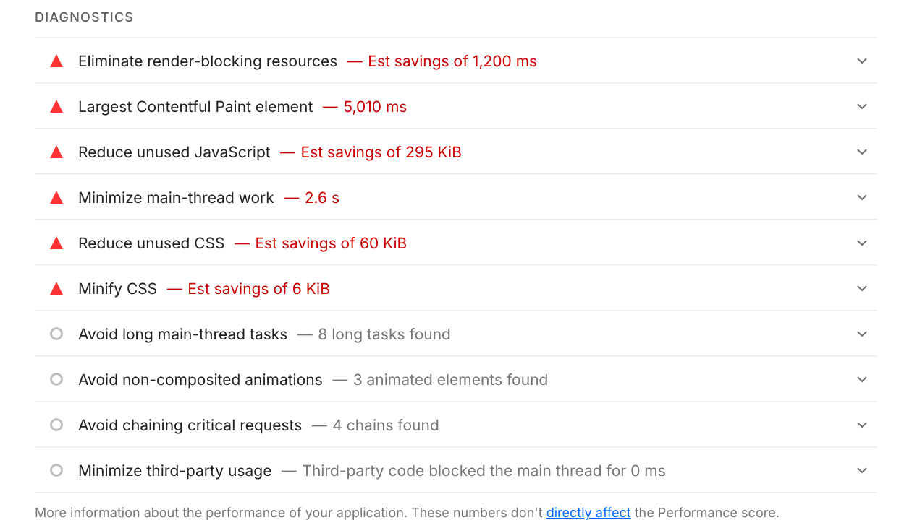
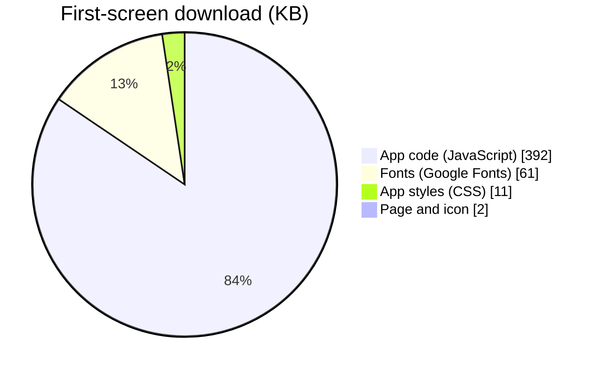
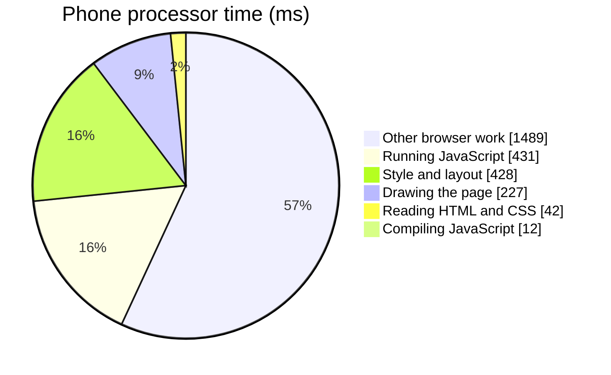
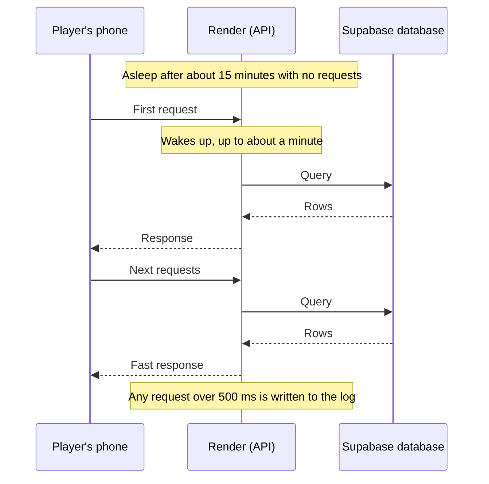

# Performance

How fast the app and API are, how we measure it, and what we did to keep them fast.

---

## Summary



| What we measured | Result | Verdict |
| :--- | :--- | :--- |
| App on a laptop | 97 to 99 performance, everything in Google's "good" range | Fast |
| App on a mid-range phone with a slow connection | 63 performance, main content after 5 seconds | Needs work: the app loads as one large file |
| Accessibility | 100 on the latest build (was 97) | The missing `<main>` landmark is fixed |
| API | Fast once awake, but the first request after a quiet spell can take up to a minute | Limit of Render's free plan |

## How a page load works

Where the time goes when a player opens the app. The numbers are from the 8 Oct mobile test.



Steps 1 to 4 decide how fast the first screen appears. The app code (step 2) is the biggest part: one 1.4 MB file, or 392 KB compressed, that holds every screen, including the admin console. A phone has to download and run all of it before anything shows. Step 6 is where Render's free plan can add up to a minute if the API has been asleep.

---

## App: latest build, Lighthouse (8 October 2026)

We built the latest code on `main` (the version that is live) and tested it with Lighthouse 12.6, once as a phone and once as a laptop. The phone test pretends to be a mid-range phone on a slow 4G connection (4× slower processor, about 1.6 Mbps), which is close to many students' phones on campus Wi-Fi.

!!! note "How this test was run"
    PageSpeed Insights had hit its daily limit, so we ran Lighthouse ourselves on the production build served locally (`vite preview`). The app code and file sizes are exactly what Vercel serves. The login and API calls had no real connection in this test, which only affects the Best Practices score (errors in the console).

| Category | Mobile | Desktop | Live app, desktop (29 Sep) |
| :--- | :---: | :---: | :---: |
| Performance | **63** | **97** | 99 |
| Accessibility | **100** | **100** | 97 |
| Best Practices | **96** | **96** | 100 |
| SEO | **82** | **82** | 90 |

| Metric | Mobile | Desktop | Google's "good" |
| :--- | :--- | :--- | :--- |
| First Contentful Paint | 4.1 s | 0.8 s | under 1.8 s |
| Largest Contentful Paint | 5.0 s | 1.2 s | under 2.5 s |
| Total Blocking Time | 300 ms | 0 ms | under 200 ms |
| Cumulative Layout Shift | 0 | 0 | under 0.1 |
| Speed Index | 5.0 s | 0.8 s | under 3.4 s |

### Screenshots

=== "Mobile"

    

    

    *The filmstrip shows the screen stays blank for the first three frames while the app code downloads.*

=== "Desktop"

    

    

=== "Mobile diagnostics"

    

### What the phone downloads



### Where the phone's processor time goes



### What to fix, in order

| Finding | Effect | Fix |
| :--- | :--- | :--- |
| One large JavaScript file (1.4 MB, 392 KB compressed). Lighthouse says 295 KB of it isn't used on the first screen | Main cause of the 4 to 5 second load on phones | Load screens only when they're opened (`React.lazy`), starting with the admin console, battles and the map |
| Fonts and map styles block the first paint (about 1.2 s) | The screen stays blank while they load | Load fewer font weights (the app asks for 6 weights of Outfit), and load the map styles only on the map screen |
| No meta description | Lower SEO score (82) | Add a `<meta name="description">` to `index.html` |
| 8 long tasks on the main thread | Taps can feel slow while the app starts | Splitting the code (first fix) also fixes most of this |

---

## Live app: PageSpeed Insights (29 September 2026)

We tested the live app ([wits-quest.vercel.app](https://wits-quest.vercel.app)) with Google PageSpeed Insights (Lighthouse), desktop mode.


| Category | Score |
| :--- | :--- |
| Performance | **99** |
| Accessibility | **97** |
| Best Practices | **100** |
| SEO | **90** |


| Metric | Result | What it means |
| :--- | :--- | :--- |
| First Contentful Paint | 0.7 s | Time until something appears on screen |
| Largest Contentful Paint | 0.9 s | Time until the main content appears |
| Total Blocking Time | 0 ms | How long the page is frozen and can't respond |
| Cumulative Layout Shift | 0 | How much the page jumps around while loading |
| Speed Index | 0.7 s | How quickly the page fills in |

All five are in Google's "good" range. These are lab results from one run, so they vary a little each time.

### Accessibility finding


One issue was flagged: the page has no `<main>` landmark, so screen-reader users can't jump straight to the main content. The fix is to wrap the main content in a `<main>` element. The tutor also found that text boxes are hard to see in dark mode ([Stakeholder Reviews](../project/stakeholder-reviews.md)), which automated checks don't catch.


### Since then

- The `<main>` landmark has been added. The 8 Oct build scores 100 for accessibility.
- A **mobile** run was recorded on 8 Oct (see above).

---

## Documentation site: Lighthouse (29 September 2026)

| Page | Performance | Accessibility | Best Practices | SEO | Notes |
| :--- | :--- | :--- | :--- | :--- | :--- |
| Home | 76 | 93 | 96 | 100 | Mobile test from South Africa. Loading 3.3 s, main content 4.4 s, no blocking, no layout shift |

The page does no heavy work (0 ms blocking time). The slower load comes from network distance to GitHub Pages under the simulated mobile connection.

---

## API

| What | How we check it |
| :--- | :--- |
| First request | Render's free plan sleeps when idle, so the first request can take up to a minute. After that, responses are fast. |
| Slow requests | The server logs any request that takes longer than 500 ms, with its route and time, so we can find and fix slow queries. |
| Crashes | Render's logs. An overdue async round used to crash the server; that was fixed on 30 Sep. |



---

## What keeps it fast

- **The server holds the game state.** During battles, only small updates go over the socket, not the whole match.
- **Offline queue.** Without signal, answers are saved on the phone and sent later, so the app doesn't freeze.
- **Bounded queries.** Analytics only read recent data (for example the last few days of GPS pings) instead of whole tables.
- **Cached routes.** Walking directions are cached on the phone, so the same route isn't requested twice.

## AI usage attribution

Per the course AI policy, the following AI assistance is declared for this page and its measurements:

| Item | Declaration |
| --- | --- |
| Tool | Qoder AI coding agent (IDE-integrated agent) |
| Model | *GLM, trained by Z.ai* — update this field to match the model shown in the Qoder model selector when the log is finalized |
| Purpose | Editing/structuring this performance documentation; running the Lighthouse audits against the deployed site; committing and deploying the results |
| Not AI-generated | The Lighthouse measurements themselves are tool-generated audit output of the real site; the test/coverage figures come from the project's own Vitest/CI runs |
| Responsibility | All content above was reviewed by the team before submission; the team remains responsible for its accuracy |

## How to repeat the measurements

```bash
cd frontend && npm run build      # build size and time
curl -o /dev/null -s -w "first byte: %{time_starttransfer}s  total: %{time_total}s\n" \
  https://wits-quest.onrender.com/api/health
```

For the app scores, open [PageSpeed Insights](https://pagespeed.web.dev/) and enter `https://wits-quest.vercel.app`, once for **Mobile** and once for **Desktop**.

To run Lighthouse yourself on the latest build (this is how the 8 Oct results were made):

```bash
cd frontend && npm run build && npx vite preview --port 4173
# in a second terminal
npx lighthouse http://localhost:4173/ --view                    # mobile
npx lighthouse http://localhost:4173/ --preset=desktop --view   # desktop
```
