# Test Results at a Glance

All the latest results from Milestone 4 are on this page: load testing, Lighthouse, automated tests and coverage. They were measured on **9 and 10 October 2026** against the live app and on the code at commit `82d10ec`.

[:material-file-pdf-box: Download the full report (PDF, 20 pages)](../reports/performance-and-coverage-report.pdf){ .md-button .md-button--primary }

---

## Headline numbers

| Measure | Result |
| :--- | :--- |
| API requests in the load test | **2,976, with 0 failed** |
| Lighthouse accessibility, 19 screens and themes | **92 to 100** |
| Lighthouse performance on a phone (Login / Map) | **49 / 67** |
| Automated tests | **946, all passing** (628 backend, 318 frontend) |
| Backend line coverage | **81.75%** |
| Frontend line coverage | **92.18%** on the gated files, **52.34%** across all code |

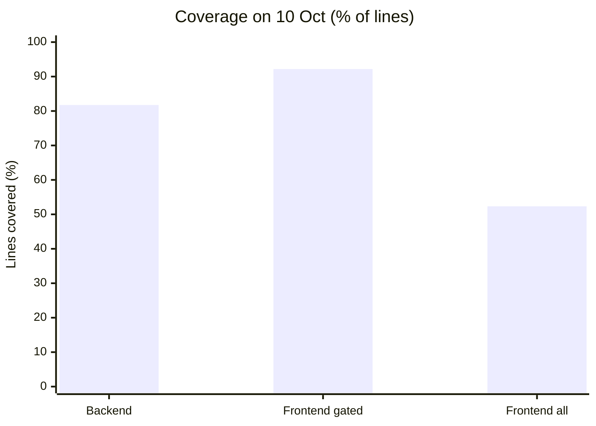

**Tools used:** Chrome 154, Lighthouse 12.2.1, autocannon 7.15.0, and Vitest 1.6 with V8 coverage. Every number comes from the files the test scripts saved in `scripts/performance/` in the source repo.

---

## 1. API load test

Eight runs against the live API (`wits-quest.onrender.com`) on 9 Oct, at 21:55 GMT. Each run had a number of simultaneous users sending requests back to back:

- 10 users for 20 seconds per endpoint, then two bursts of 30 users for 15 seconds.
- Only read requests (GET), plus one sign-in as the seeded test player for the signed-in endpoint.

| Endpoint | Users | Requests | Per second | Median | 97.5% | 99% | Slowest | Failed |
| :--- | ---: | ---: | ---: | ---: | ---: | ---: | ---: | ---: |
| Health check `/api/health` | 10 | 529 | 26.5 | 350 ms | 518 ms | 1035 ms | 1130 ms | 0 |
| Card catalogue `/api/cards` | 10 | 317 | 15.9 | 587 ms | 915 ms | 1176 ms | 1336 ms | 0 |
| Campus events `/api/events` | 10 | 321 | 16.1 | 593 ms | 865 ms | 927 ms | 1003 ms | 0 |
| Leaderboard `/api/users/leaderboard` | 10 | 317 | 15.9 | 606 ms | 821 ms | 1042 ms | 1357 ms | 0 |
| Territories `/api/territories` | 10 | 153 | 7.7 | 1203 ms | 1906 ms | 1931 ms | 1985 ms | 0 |
| Tournaments (signed in) `/api/tournaments` | 10 | 142 | 7.1 | 1320 ms | 1697 ms | 1703 ms | 1721 ms | 0 |
| Burst: card catalogue | 30 | 598 | 39.9 | 714 ms | 1157 ms | 1311 ms | 1736 ms | 0 |
| Burst: leaderboard | 30 | 599 | 39.9 | 707 ms | 1109 ms | 1296 ms | 1457 ms | 0 |

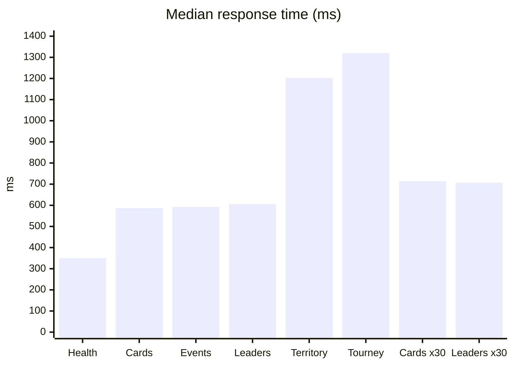

What the results show:

- **No failures.** All 2,976 requests succeeded, with no errors and no time-outs. The server kept working with 30 users at once.
- **Typical response times** were about 0.35 s for the health check and 0.6 s for cards, events and the leaderboard. Territories and tournaments were the slowest, at about 1.2 to 1.3 s, because each one reads the database several times.
- **Distance adds time to every request.** A request reaches Cloudflare in Johannesburg in about 23 ms, but the server is on Render's free plan in Oregon, US. Even the health check's first byte takes about 0.5 s. A region nearer South Africa would cut every response.
- **Bursts scale well.** With 30 users, throughput rose to about 40 requests a second, and the median only went from about 0.6 s to 0.7 s.
- **The first request:** a single health check on a fresh connection took 596 ms while the server was awake. After about 15 idle minutes, Render's free plan puts the server to sleep, and the next request can wait up to a minute. A scheduled ping to `/api/health` keeps it awake during marking.

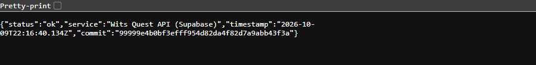

---

## 2. Lighthouse

These runs used Lighthouse 12 on the live app with its phone profile (an emulated Moto G Power on slow 4G, at 4x CPU slowdown), signed in as the test player, on 9 Oct at 22:07 GMT.

- Login and the Map are full page loads, so Lighthouse can give them a speed score.
- The other screens were opened from the bottom bar, as a player would, and checked as they stood.
- Map, Cards and Battle were checked again in all four themes, to test colour contrast.

| Screen | How | Performance | Accessibility | Best practices | SEO |
| :--- | :--- | :---: | :---: | :---: | :---: |
| Login (first visit) | page load | 49 | 100 | 100 | 90 |
| Map (signed in) | page load | 67 | 92 | 96 | 91 |
| Cards | from the bar | — | 100 | 100 | 80 |
| Quests | from the bar | — | 100 | 100 | 75 |
| Battle | from the bar | — | 100 | 100 | 75 |
| Ranks | from the bar | — | 100 | 100 | 75 |
| Me | from the bar | — | 100 | 88 | 75 |
| Map, each of the 4 themes | from the bar | — | 96 | 88 | 80 |
| Cards, each of the 4 themes | from the bar | — | 100 | 100 | 80 |
| Battle, each of the 4 themes | from the bar | — | 100 | 100 | 75 |

### Speed on a phone

| Page load | First paint | Largest paint | Blocking time | Layout shift | Speed Index |
| :--- | ---: | ---: | ---: | ---: | ---: |
| Login (first visit) | 10.0 s | 10.5 s | 320 ms | 0.001 | 10.0 s |
| Map (signed in) | 1.0 s | 3.1 s | 1,390 ms | 0 | 3.6 s |

**Why the first visit is slow:** the whole app is one 1.55 MB JavaScript file (431 KB compressed). It includes every screen, the admin console, the map library and the QR scanner. On slow 4G, the phone has to download and run all of it, and wait for the Google Fonts stylesheet, before the login page appears. Code splitting (loading each screen only when it's opened) would help the first visit the most. The Map's 1.4 s of blocking time comes from the map library and its markers starting up.

=== "Summary of every step"

    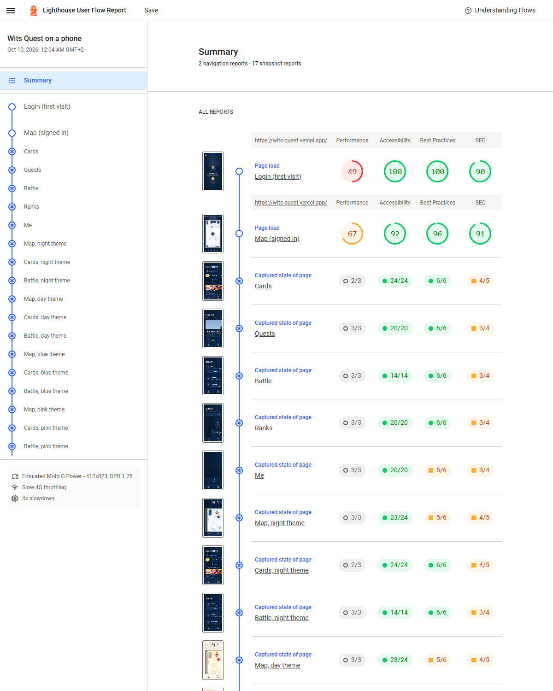

=== "Login"

    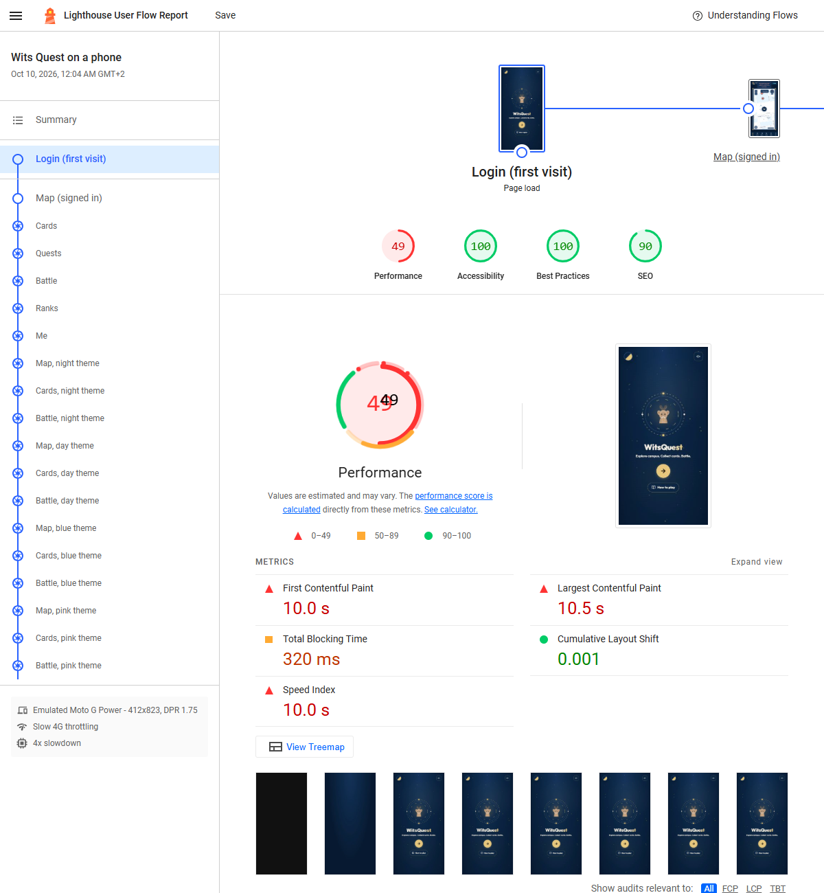

=== "Map"

    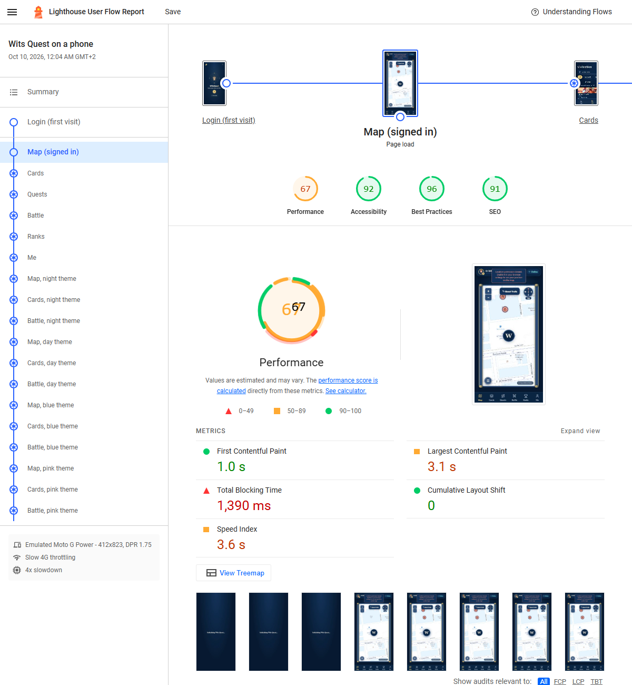

=== "Map accessibility"

    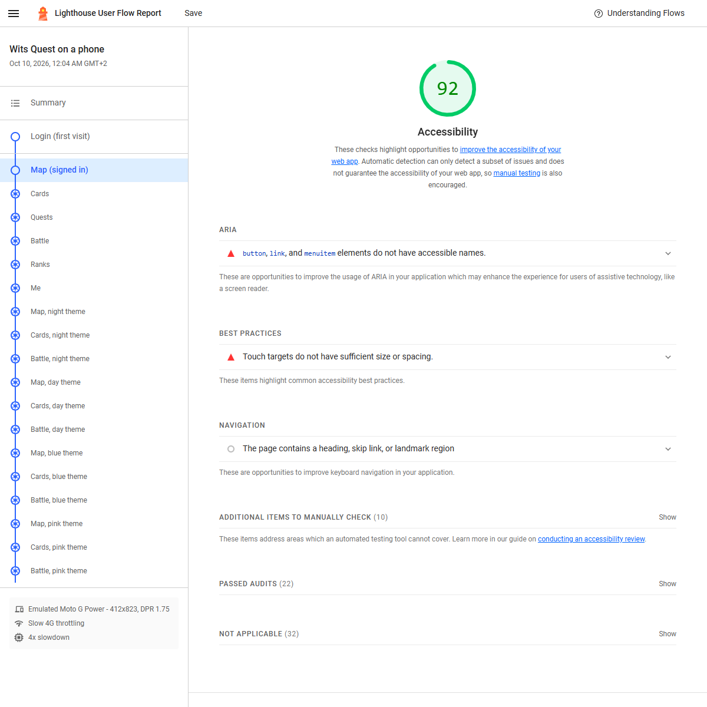

=== "Cards, Daylight theme"

    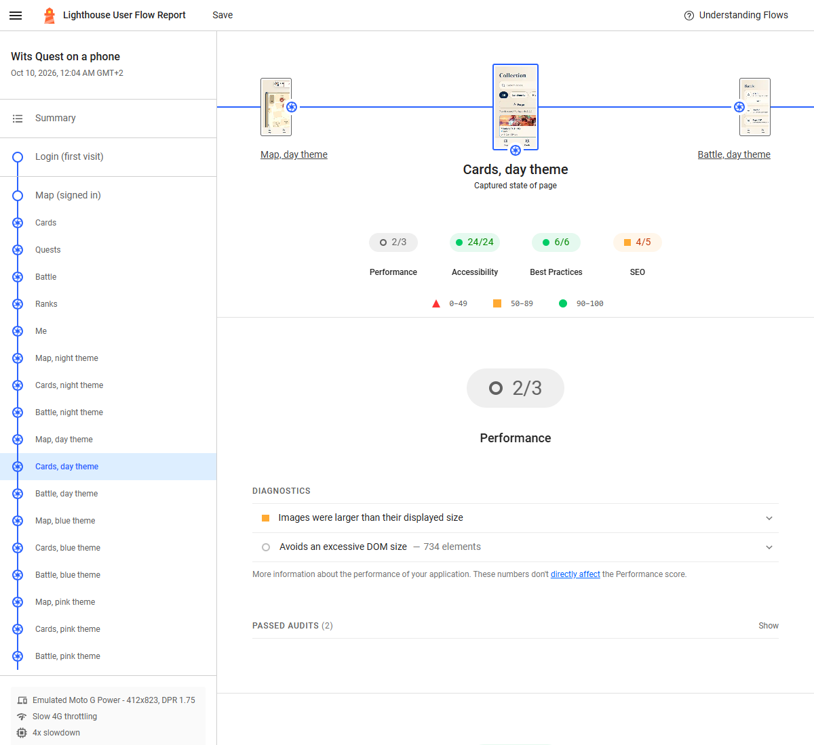

### Every check that failed, and the fix

| Category | Check | Where | What's wrong |
| :--- | :--- | :--- | :--- |
| Accessibility | Buttons and links need names | 5 of 19 screens | The event markers on the map can be tapped but have no name for screen readers (Leaflet draws them as plain elements) |
| Accessibility | Touch target size | Map | The live player marker is a small tap target |
| Accessibility | Visible label matches the name | Map, Me | The compass button is named "Turn on the live compass" but shows "Tap"; the display-name button is named "Edit display name" but shows the name |
| Best practices | Source maps | Login, Map | The production build has no source maps, so errors in the minified code are harder to trace |
| Best practices | Image resolution | Map | OpenStreetMap tiles come in one size, so they look stretched on dense phone screens |
| Best practices | Legible font sizes | 5 of 19 screens | Some text is under 12 px, such as the map credit (10 px) and parts of Me |
| SEO | Meta description | Every screen | `index.html` has no description for search results |

**Accessibility in short:** Login, Cards, Quests, Battle, Ranks and Me score 100, and Cards and Battle score 100 in all four themes. Text contrast passes everywhere. The Map scores 92 to 96 because of its markers and the compass button's label.

---

## 3. Automated tests and coverage

Both test suites ran on commit `82d10ec` with V8 coverage. They never touch the live database: the backend tests use an in-memory stand-in or mocks for Supabase, and the frontend tests mock the API.

| Suite | Test files | Tests | Result |
| :--- | ---: | ---: | :--- |
| Backend (Vitest, Supertest, real Socket.IO clients) | 44 | 628 | All passed |
| Frontend (Vitest, React Testing Library, jsdom) | 44 | 318 | All passed |

| Measured over | Lines | Statements | Functions | Branches | Lines covered | Notes |
| :--- | ---: | ---: | ---: | ---: | :--- | :--- |
| Backend | 81.75% | 81.75% | 92.27% | 76.98% | 12,670 of 15,497 | Seed data and old report files left out (see below) |
| Frontend, the gated files | 92.18% | 92.18% | 82.22% | 82.19% | 1,770 of 1,920 | The 9 files the frontend gate measures |
| Frontend, all code | 52.34% | 52.34% | 52.32% | 76.92% | 19,905 of 38,027 | Every source file except tests and previews |

!!! note "How to read these numbers"
    - **Backend:** the figure leaves out the production seed data and its loader, `src/db/productionContent.ts` and `seedProduction.ts` (about 860 lines). It also leaves out any old HTML report in `backend/coverage/`, just as `seed.ts` and `src/scripts/` were already left out. Counting them, backend coverage is 74%.
    - **Frontend:** the gate measures 9 files: the battle engine, the CPU opponent, the deck and card services, and some components. Across all of the frontend's code, coverage is 52.34%. The map and admin screens are the least tested.

### Least-covered files (100 lines or more)

| Backend file | Lines covered | Frontend file | Lines covered |
| :--- | :--- | :--- | :--- |
| `routes/adminAchievements.ts` | 31.0% of 171 | `components/BattleHistoryModal.tsx` | 0.0% of 270 |
| `routes/telemetry.ts` | 31.1% of 1032 | `components/StudentOpponentDrawer.tsx` | 0.0% of 571 |
| `routes/battle.ts` | 37.3% of 351 | `components/WitsLogo.tsx` | 0.0% of 150 |
| `routes/ranked.ts` | 60.5% of 152 | `screens/QuestTrails.tsx` | 5.9% of 306 |
| `utils/achievements.ts` | 62.0% of 221 | `screens/Appearance.tsx` | 6.1% of 179 |
| `routes/asyncBattle.ts` | 65.3% of 949 | `screens/admin/AdminContent.tsx` | 6.4% of 2026 |

### Test run output

```text
BACKEND
 Test Files 44 passed (44)
      Tests 628 passed (628)
   Duration 17.33s
Statements   : 81.75% ( 12670/15497 )
Branches     : 76.98% ( 2238/2907 )
Functions    : 92.27% ( 239/259 )
Lines        : 81.75% ( 12670/15497 )

FRONTEND (the gated files)
 Test Files 44 passed (44)
      Tests 318 passed (318)
   Duration 39.08s
Statements   : 92.18% ( 1770/1920 )
Branches     : 82.19% ( 217/264 )
Functions    : 82.22% ( 37/45 )
Lines        : 92.18% ( 1770/1920 )

FRONTEND (all code)
Statements   : 52.34% ( 19905/38027 )
Branches     : 76.92% ( 2257/2934 )
Functions    : 52.32% ( 451/862 )
Lines        : 52.34% ( 19905/38027 )
```

=== "Backend, by folder"

    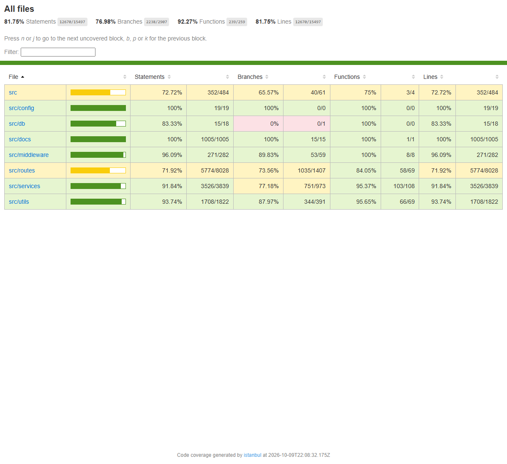

=== "Backend routes"

    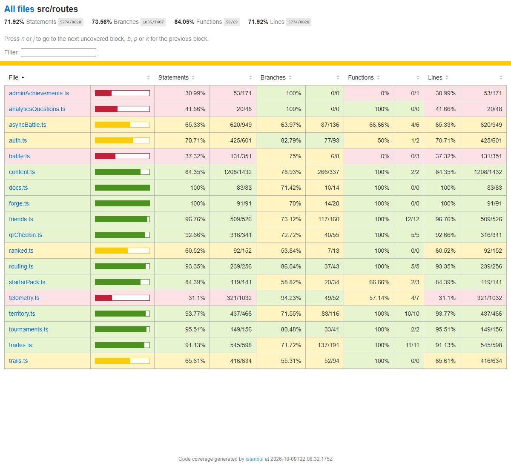

=== "Frontend, gated files"

    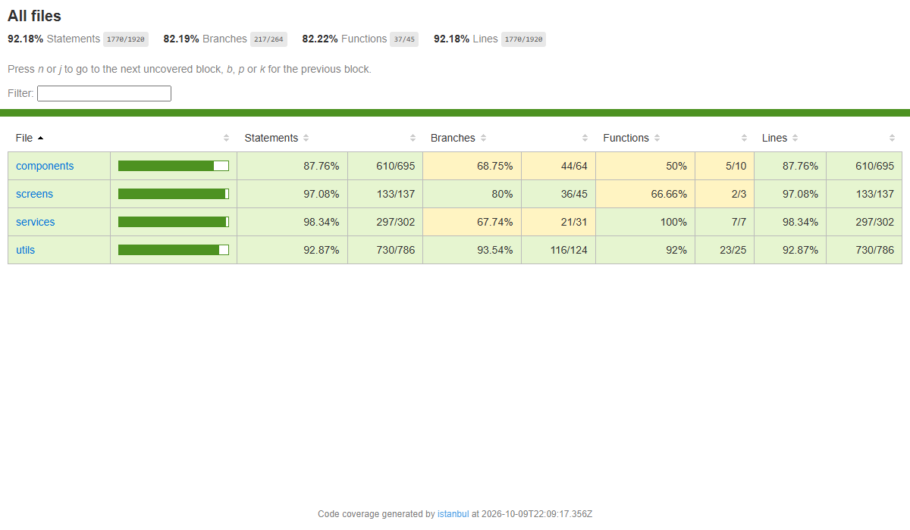

=== "Frontend, all code"

    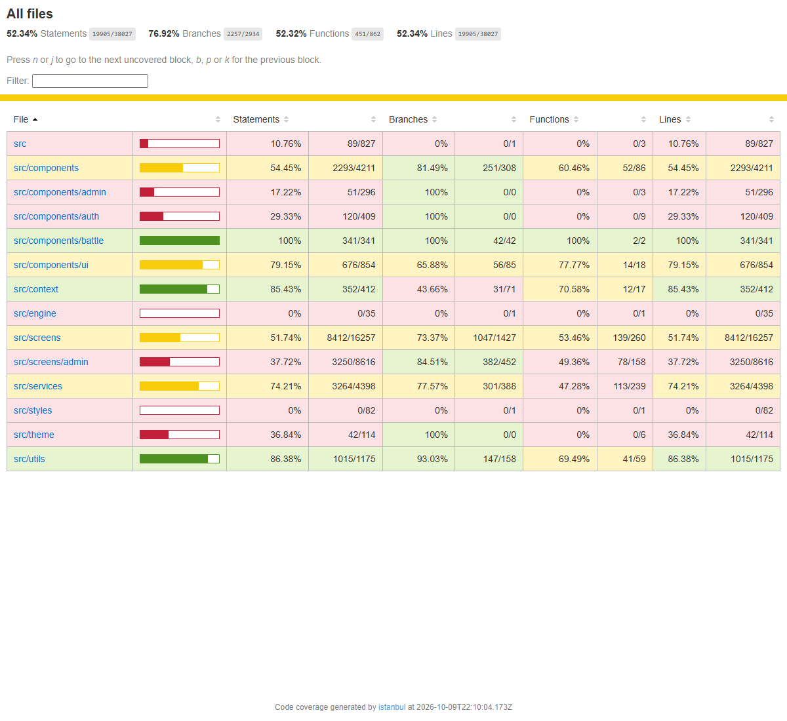

=== "Frontend screens"

    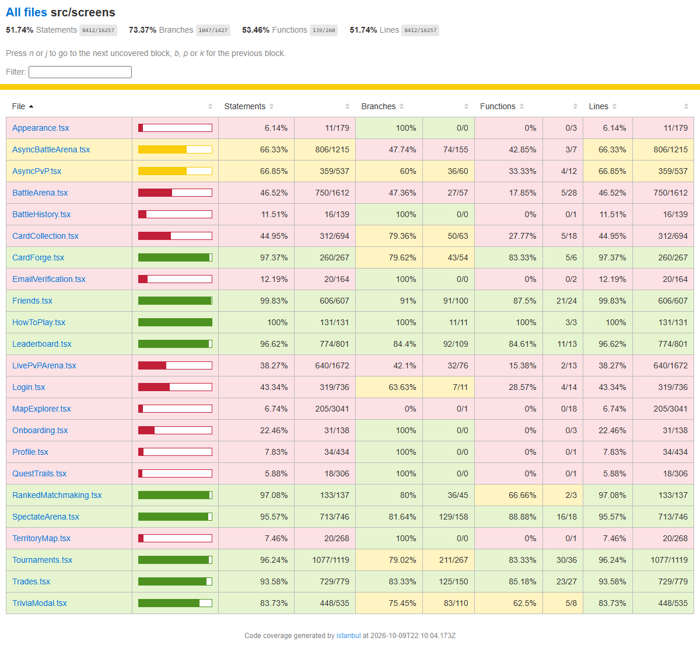

---

## 4. What isn't tested, and what's next

| Not covered | What we do instead |
| :--- | :--- |
| End-to-end tests in a real browser | Checked by hand in Chrome at phone and laptop sizes; there's no automated suite (such as Playwright) yet |
| Map drawing and real GPS | jsdom can't lay out the map, so these are checked by hand, and on campus for GPS |
| The first request after the server sleeps | This is how Render's free plan works; a keep-awake ping is the fix |
| Load testing in CI | The load test is run by hand against the live API |

**Next steps, most useful first:**

1. **Speed:** load screens only when they're opened (code splitting), so the first visit doesn't download the admin console and the map. Load fonts without blocking the first paint.
2. **Accessibility:** name the map's event markers and make them reachable by keyboard. Make the player marker easier to tap. Match the compass and display-name button names to what they show.
3. **SEO and best practices:** add a meta description, ship source maps, and keep map text at 12 px or more.
4. **Server:** keep the API awake during marking, and consider a region nearer South Africa.
5. **Coverage:** add tests for the map and admin screens, and for `routes/telemetry.ts`, the backend's biggest gap.

## Repeating these tests

From the source repo:

```bash
cd scripts/performance && npm install
npm run load          # the load test     -> results/load-test.json
npm run lighthouse    # Lighthouse        -> results/lighthouse.json, reports/lighthouse.html
# the coverage runs (see scripts/performance/README.md) -> reports/coverage-*
npm run report        # the PDF report    -> docs/reports/performance-and-coverage-report.pdf
```

Earlier results are on [Automated Testing](testing.md) (8 Oct) and [Performance](performance.md) (29 Sep and 8 Oct).
