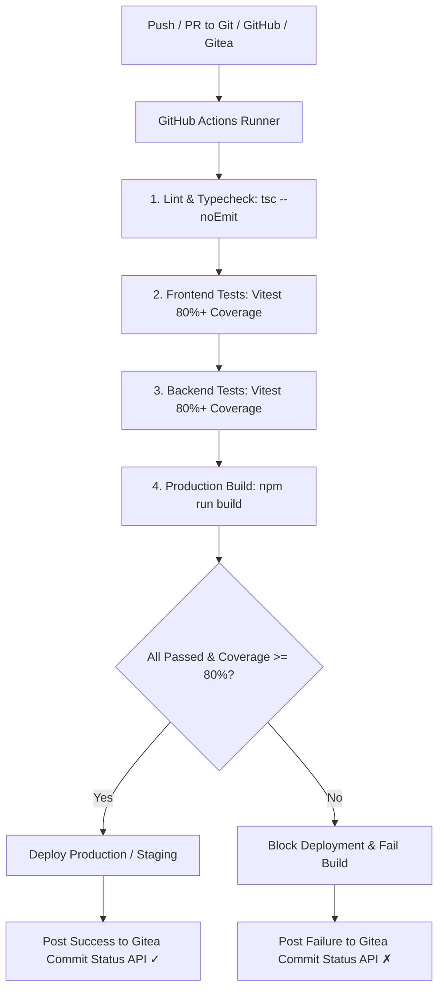

# Full-Application Testing & Gitea CI/CD Pipeline Plan

This document outlines the end-to-end plan for full test coverage across Wits Quest (Frontend & Backend) and configuring a GitHub/Gitea CI/CD pipeline with an 80%+ test coverage gate.

---

## 1. Overview & Objectives

- **Full Application Test Suite**:
  - Achieve **80%+ code coverage** across lines, functions, statements, and branches on both `frontend` and `backend`.
  - Comprehensive unit, integration, and UI component tests covering all user flows, admin management, battle mechanics, landmark geolocation, anti-cheat detection, and Supabase data operations.
- **CI/CD Pipeline with GitHub & Gitea Reflection**:
  - Run all tests, linting, typechecks, and coverage checks on free cloud runners via GitHub Actions.
  - Automatically report commit statuses, test results, and coverage metrics back to Gitea via the Gitea Commit Status REST API (`POST /api/v1/repos/:owner/:repo/statuses/:sha`).
  - Strict Deployment Gate: Deploys only when all tests pass and coverage is $\ge 80\%$.

---

## 2. Frontend Test Suite Architecture

### Setup & Configuration

- Vitest with `jsdom`, `@testing-library/react`, `@testing-library/jest-dom`, and `@testing-library/dom`.
- Global mocks for browser APIs (`fetch`, `localStorage`, `navigator.geolocation`, Leaflet map containers, canvas-confetti).

### Target Test Coverage Areas

1. **Authentication & Session**:
   - `AuthContext.test.tsx` & `Login.test.tsx`: Student vs Admin authentication, JWT handling, error states, role redirection.
2. **Battle Engine & AI**:
   - `battleEngine.test.ts`: Round resolution, stat match-ups (Attack vs Defense, Speed vs Brains), tie-breakers, XP/Essence rewards.
   - `battleAI.test.ts`: Predictive card selection, counter-card choice against user hand.
   - `BattleArena.test.tsx`: Interactive combat loop, round timers, victory/defeat modal display.
3. **Campus Landmarks & Trivia**:
   - `MapExplorer.test.tsx`: Geolocation radar, 25m radius geofence detection, interactive landmark markers.
   - `TriviaModal.test.tsx`: Multiple-choice selection, text keyword matching, rewards granting (XP/cards), cooldown handling.
4. **Card Collection & Deck Builder**:
   - `CardCollection.test.tsx`: Category & rarity filtering, locked vs unlocked cards, card detail dialog.
   - `DeckBuilder.test.tsx` & `deckService.test.ts`: 5-card deck constraint, stat budget limit ($300$), legendary cap ($1$), server persistence.
5. **Leaderboard & Profile**:
   - `Leaderboard.test.tsx`: Division tiers (Bronze $\rightarrow$ Diamond), Elo sorting, active status indicators.
   - `Profile.test.tsx`: Avatar customization, daily streak multiplier, stats summary.
6. **Admin Portals**:
   - `AdminContent.test.tsx`: Card authoring, trivia creation, image upload handling.
   - `AdminEvents.test.tsx`: Event creation, active status toggles, date validation.
   - `AdminAntiCheat.test.tsx`: Telemetry audit log display, violation flagging, account suspension actions.
7. **Service Layer**:
   - `apiClient.test.ts`, `inventoryService.test.ts`, `offlineQueue.test.ts`.

---

## 3. Backend Test Suite Architecture

### Setup & Configuration

- Vitest + Supertest with Node.js 20 environment.
- Supabase client integration testing and mocked database fixtures.

### Target Test Coverage Areas

1. **Authentication Routes** (`/api/auth/*`):
   - Register validation (Wits student email regex `\d{7}@students.wits.ac.za`, admin `@wits.ac.za`).
   - Bcrypt password hashing, JWT creation & `authMiddleware` verification.
   - Account suspension interceptor (anti-cheat policy enforcement).
2. **User & Inventory Routes** (`/api/users/*`):
   - User profile queries, stat updates, and inventory card queries.
3. **Deck Management Routes** (`/api/player/deck`, `/api/users/:id/decks`):
   - Server-side validation of 5-card count, stat budget, and legendary card limit.
   - Supabase `user_decks` upsert and retrieval.
4. **Content, Events & Trivia Routes** (`/api/cards`, `/api/events`, `/api/trivia`, `/api/events/:id/answer`):
   - Card catalogue queries and creation.
   - Campus events CRUD.
   - Server-side trivia answer verification, XP & Essence rewards, and card distribution into `user_cards`.
5. **Anti-Cheat & Telemetry Routes** (`/api/mock/telemetry/*`):
   - Ingestion of student GPS coordinates.
   - Haversine velocity calculations ($>15\text{ m/s}$ threshold triggers teleportation/speeding violation).
   - Audit log querying and admin action execution (`flagged` / `suspended`).
6. **Real-time Battle WebSockets**:
   - Socket.io connection, room matchmaking, live stat emit, and round resolution events.

---

## 4. CI/CD Pipeline & Gitea Integration

### Workflow Architecture (`.github/workflows/ci.yml` & `.gitea/workflows/ci.yml`)



### Gitea Status Reflection Mechanism

- The workflow concludes with an HTTP call to Gitea's Commit Status API:
  ```bash
  POST https://<gitea-domain>/api/v1/repos/<owner>/<repo>/statuses/<commit_sha>
  Header: Authorization: token <GITEA_TOKEN>
  Body: {
    "state": "success" | "failure",
    "target_url": "https://github.com/<owner>/<repo>/actions/runs/<run_id>",
    "description": "Coverage: 84% | All tests passed",
    "context": "ci/github-actions"
  }
  ```
- Result: Gitea's web UI displays live green checkmarks or red X badges next to commits and pull requests.

---

## 5. Verification Plan

1. **Frontend Tests**: Run `npm test` inside `frontend/` $\rightarrow$ verify all test suites pass and code coverage $\ge 80\%$.
2. **Backend Tests**: Run `npm test` inside `backend/` $\rightarrow$ verify all API and socket test suites pass and code coverage $\ge 80\%$.
3. **Builds**: Run `npm run build` on both frontend and backend $\rightarrow$ 0 TypeScript / bundling errors.
4. **CI Configuration**: Validate `.github/workflows/ci.yml` and `.gitea/workflows/ci.yml` syntax.
