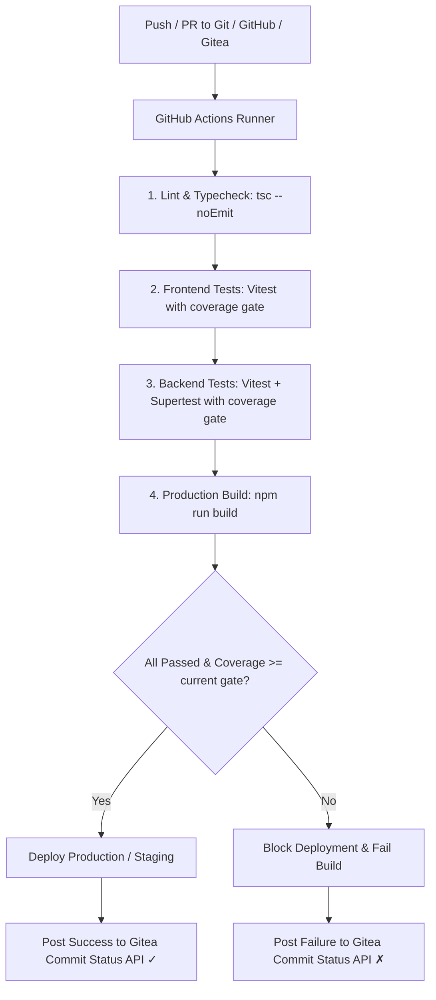

# Full-Application Testing & Gitea CI/CD Pipeline Plan

This document outlines the end-to-end plan for full test coverage across Wits Quest (Frontend & Backend) and configuring a GitHub/Gitea CI/CD pipeline with a staged test coverage gate (**60% now, rising to 80% for the final submission**).

---

## 1. Overview & Objectives

- **Full Application Test Suite**:
  - Meet the **coverage gate** across lines, functions, statements, and branches on both `frontend` and `backend`: **60% minimum** (the rubric's advanced band) during Sprint 3, **raised to 80%** for the final submission.
  - Comprehensive unit, integration, and UI component tests covering all user flows, admin management, battle mechanics, landmark geolocation, anti-cheat detection, and Supabase data operations.
  - **Every new feature ships with tests**: API tests (Supertest) for backend endpoints and UI tests (React Testing Library) for frontend behaviour, written in the same PR as the feature.
- **CI/CD Pipeline with GitHub & Gitea Reflection**:
  - Run all tests, linting, typechecks, and coverage checks on free cloud runners via GitHub Actions.
  - CI reports coverage for **both code bases** and fails the build if either falls below the current gate.
  - Automatically report commit statuses, test results, and coverage metrics back to Gitea via the Gitea Commit Status REST API (`POST /api/v1/repos/:owner/:repo/statuses/:sha`).
  - Strict Deployment Gate: Deploys only when all tests pass and coverage meets the current gate.

### Coverage gate schedule

| Stage | Gate (statements, branches, functions, lines) | Applies to |
| :--- | :--- | :--- |
| Sprint 3 (current) | **60%** | Frontend and backend, enforced in CI |
| Final submission | **80%** | Frontend and backend, enforced in CI |

The frontend already exceeds the final 80% target on all four metrics (see [Sprint 3 status](#6-sprint-3-status)); the backend figures are recorded on the Test Results page once its suite is run.

---

## 2. Frontend Test Suite Architecture

### Setup & Configuration

- Vitest with `jsdom`, `@testing-library/react`, `@testing-library/jest-dom`, and `@testing-library/dom`, with V8 coverage (`vitest run --coverage`).
- Global mocks for browser APIs (`fetch`, `localStorage`, `navigator.geolocation`, Leaflet map containers, canvas-confetti).

### Target Test Coverage Areas

1. **Authentication & Session**:
   - `AuthContext.test.tsx` & `Login.test.tsx`: Student vs Admin authentication, JWT handling, error states, role redirection.
2. **Battle Engine & AI**:
   - `battleEngine.test.ts`: Round resolution, stat match-ups (Attack vs Defense, Speed vs Brains), tie-breakers, XP/Essence rewards.
   - `battleAI.test.ts`: Predictive card selection, counter-card choice against user hand.
   - `BattleArena.test.tsx`: Interactive combat loop, round timers, victory/defeat modal display.
3. **Campus Landmarks & Trivia**:
   - `MapExplorer.test.tsx`: Geolocation radar, 25m radius geofence detection, interactive landmark markers.
   - `TriviaModal.test.tsx`: Multiple-choice selection, text keyword matching, rewards granting (XP/cards), cooldown handling.
4. **Card Collection & Deck Builder**:
   - `CardCollection.test.tsx`: Category & rarity filtering, locked vs unlocked cards, card detail dialog.
   - `DeckBuilder.test.tsx` & `deckService.test.ts`: 5-card deck constraint, stat budget limit ($300$), legendary cap ($1$), server persistence.
5. **Leaderboard & Profile**:
   - `Leaderboard.test.tsx`: Division tiers (Bronze $\rightarrow$ Diamond), Elo sorting, active status indicators.
   - `Profile.test.tsx`: Avatar customization, daily streak multiplier, stats summary.
6. **Admin Portals**:
   - `AdminContent.test.tsx`: Card authoring, trivia creation, image upload handling.
   - `AdminEvents.test.tsx`: Event creation, active status toggles, date validation.
   - `AdminAntiCheat.test.tsx`: Telemetry audit log display, violation flagging, account suspension actions.
7. **Service Layer**:
   - `apiClient.test.ts`, `inventoryService.test.ts`, `offlineQueue.test.ts`.

---

## 3. Backend Test Suite Architecture

### Setup & Configuration

- Vitest + Supertest with Node.js 20 environment.
- Supabase client integration testing and mocked database fixtures.

### Target Test Coverage Areas

1. **Authentication Routes** (`/api/auth/*`):
   - Register validation (Wits student email regex `\d{7}@students.wits.ac.za`, admin `@wits.ac.za`).
   - Bcrypt password hashing, JWT creation & `authMiddleware` verification.
   - Account suspension interceptor (anti-cheat policy enforcement).
2. **User & Inventory Routes** (`/api/users/*`):
   - User profile queries, stat updates, and inventory card queries.
3. **Deck Management Routes** (`/api/player/deck`, `/api/users/:id/decks`):
   - Server-side validation of 5-card count, stat budget, and legendary card limit.
   - Supabase `user_decks` upsert and retrieval.
4. **Content, Events & Trivia Routes** (`/api/cards`, `/api/events`, `/api/trivia`, `/api/events/:id/answer`):
   - Card catalogue queries and creation.
   - Campus events CRUD.
   - Server-side trivia answer verification, XP & Essence rewards, and card distribution into `user_cards`.
5. **Anti-Cheat & Telemetry Routes** (`/api/mock/telemetry/*`):
   - Ingestion of student GPS coordinates.
   - Haversine velocity calculations ($>15\text{ m/s}$ threshold triggers teleportation/speeding violation).
   - Audit log querying and admin action execution (`flagged` / `suspended`).
6. **Real-time Battle WebSockets**:
   - Socket.io connection, room matchmaking, live stat emit, and round resolution events.

---

## 4. CI/CD Pipeline & Gitea Integration

### Workflow Architecture (`.github/workflows/ci.yml` & `.gitea/workflows/ci.yml`)


```mermaid
graph TD
    A[Push / PR to Git / GitHub / Gitea] --> B[GitHub Actions Runner]
    B --> C[1. Lint & Typecheck: tsc --noEmit]
    C --> D[2. Frontend Tests: Vitest with coverage gate]
    D --> E[3. Backend Tests: Vitest + Supertest with coverage gate]
    E --> F[4. Production Build: npm run build]
    F --> G{All Passed & Coverage >= current gate?}
    G -- Yes --> H[Deploy Production / Staging]
    H --> I[Post Success to Gitea Commit Status API ✓]
    G -- No --> J[Block Deployment & Fail Build]
    J --> K[Post Failure to Gitea Commit Status API ✗]
```

The "current gate" is 60% in Sprint 3 and 80% for the final submission.

### Gitea Status Reflection Mechanism

- The workflow concludes with an HTTP call to Gitea's Commit Status API:
  ```bash
  POST https://<gitea-domain>/api/v1/repos/<owner>/<repo>/statuses/<commit_sha>
  Header: Authorization: token <GITEA_TOKEN>
  Body: {
    "state": "success" | "failure",
    "target_url": "https://github.com/<owner>/<repo>/actions/runs/<run_id>",
    "description": "Coverage: 89% | All tests passed",
    "context": "ci/github-actions"
  }
  ```
- Result: Gitea's web UI displays live green checkmarks or red X badges next to commits and pull requests.

---

## 5. Verification Plan

1. **Frontend Tests**: Run `npm test` inside `frontend/` $\rightarrow$ verify all test suites pass and code coverage meets the current gate (60% now, 80% final).
2. **Backend Tests**: Run `npm test` inside `backend/` $\rightarrow$ verify all API and socket test suites pass and code coverage meets the current gate.
3. **Builds**: Run `npm run build` on both frontend and backend $\rightarrow$ 0 TypeScript / bundling errors.
4. **CI Configuration**: Validate `.github/workflows/ci.yml` and `.gitea/workflows/ci.yml` syntax.
5. **Feature rule**: For every new feature PR, confirm it includes Supertest API tests (backend) and React Testing Library UI tests (frontend) before merge.

---

## 6. Sprint 3 status

### Frontend run (2026-09-29)

Command: `npm run test` in `frontend/` (`vitest run --coverage`, Vitest v1.6.1, V8 coverage).

| Metric | Result |
| :--- | :--- |
| Test files | **20 passed** (20) |
| Tests | **163 passed** (163) |
| Duration | 13.84 s |


*Terminal output of `npm run test` in `frontend/`: 20 files and 163 tests passing, with the V8 coverage report.*

**Overall coverage**

| Statements | Branches | Functions | Lines | Current gate (60%) | Final gate (80%) |
| :--- | :--- | :--- | :--- | :--- | :--- |
| **89.21%** | **83.03%** | **83.33%** | **89.21%** | ✅ Pass | ✅ Pass |

**Test files and tests per suite**

| Suite | Tests |
| :--- | :--- |
| `utils/battleEngine.test.ts` | 30 |
| `__tests__/elo.test.ts` | 17 |
| `__tests__/services.test.ts` | 17 |
| `__tests__/antiCheat.test.ts` | 15 |
| `screens/Leaderboard.test.tsx` | 14 |
| `utils/battleAI.test.ts` | 13 |
| `services/offlineQueue.test.ts` | 9 |
| `context/AuthContext.test.tsx` | 6 |
| `__tests__/cardCollection.test.tsx` | 6 |
| `__tests__/components.test.tsx` | 6 |
| `screens/TriviaModal.test.tsx` | 5 |
| `__tests__/battleAI.test.ts` | 5 |
| `__tests__/battleEngine.test.ts` | 5 |
| `screens/BattleArena.test.tsx` | 4 |
| `components/BottomNav.test.tsx` | 3 |
| `screens/AsyncBattleArena.test.tsx` | 2 |
| `screens/AsyncPvP.test.tsx` | 2 |
| `screens/BattleArena.deck.test.tsx` | 2 |
| `__tests__/index.test.ts` | 1 |
| `App.test.tsx` | 1 |

**Coverage by area**

| Area | Statements | Branches | Functions | Lines |
| :--- | :--- | :--- | :--- | :--- |
| `components` | 84.08% | 73.33% | 57.14% | 84.08% |
| `screens` | 79.91% | 65.21% | 33.33% | 79.91% |
| `services` | 98.34% | 67.74% | 100% | 98.34% |
| `utils` | 92.87% | 93.60% | 92% | 92.87% |

**Fully covered:** `antiCheat.ts` (100% on every metric), `deckService.ts` (100% statements, functions and lines), `battleAI.ts` (100% statements, functions and lines).

### Known gaps (reported honestly)

| File | Gap | Detail |
| :--- | :--- | :--- |
| `RankedMatchmaking.tsx` | 33.33% functions, 65.21% branches | Uncovered lines 16-17, 31-38, 121-160 |
| `TopBar.tsx` | 33.33% functions, 53.84% branches | Uncovered lines 40-46, 219-269 |
| `KuduMascot.tsx` | 50% functions | Uncovered lines 34, 40-45, 110, 192-205 |
| `cardCatalogService.ts` | 41.66% branches | Uncovered lines 146, 149-150, 158-159 |
| `battleEngine.ts` | 75% functions | Uncovered lines 239, 242, 280-285, 295-342 |

These fall below 80% at file or area level even though the global thresholds pass. They are the first targets for the final-submission push.

### Planned versus delivered

Section 2 lists the target suite. Several planned files (`Login`, `MapExplorer`, `DeckBuilder`, `Profile`, and the three `Admin*` tests) do not appear in the current run, while the delivered suite adds `antiCheat`, `elo`, `services`, `components`, `AsyncBattleArena`, `AsyncPvP`, `BattleArena.deck` and `BottomNav`. The coverage numbers meet the gate, but the plan's per-screen list is not yet fully delivered.

### Backend run

Backend results (test files, tests, coverage against the gate) are recorded on the Test Results & Coverage page once the `backend/` suite is run.
