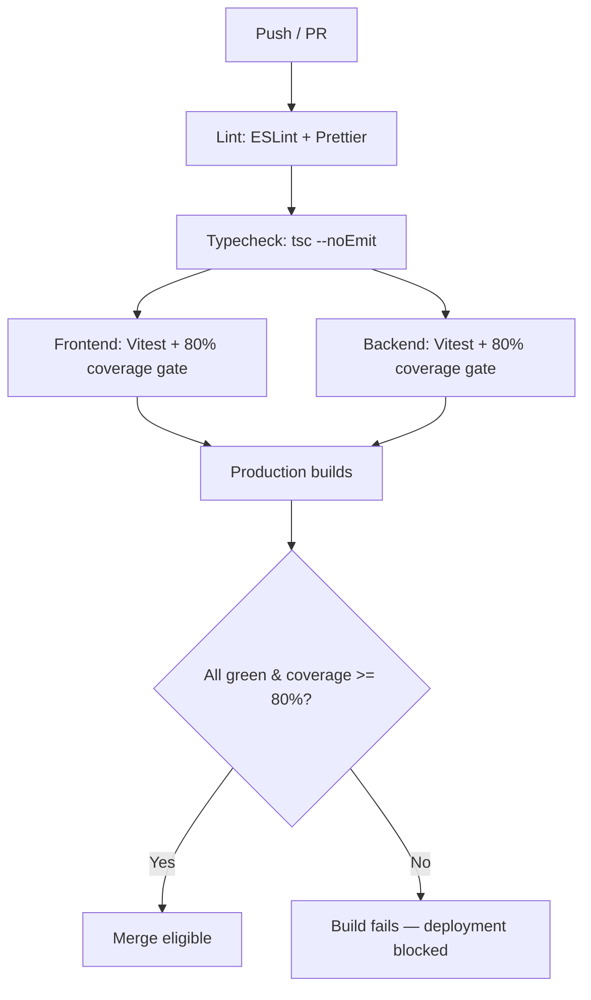

# Testing

How Wits Quest is tested across the frontend, backend, and CI pipeline — the strategy, the tooling, the coverage gate, and the current state of the suite. The full pipeline design lives in implementation-plans/testing_and_ci_cd_plan.md (mirrored as [testing-plan.md](testing-plan.md)); this page is the project-level summary.

---

## Testing strategy

The project uses a layered approach, with each layer targeting a different class of defect:

| Layer | Tooling | What it catches | Where it runs |
| :--- | :--- | :--- | :--- |
| **Unit** | Vitest | Pure-logic regressions — round resolution, stat quotas, AI decisions, state derivation | Every push (CI) |
| **Integration** | Vitest + Supertest | API contract breaks — route auth, validation, reward persistence against mocked Supabase fixtures | Every push (CI) |
| **Component** | Vitest + @testing-library/react (jsdom) | UI logic regressions — battle arena interaction, timers, modal flows | Every push (CI) |
| **Manual smoke** | Two real browser tabs / two real socket connections against the live backend + Supabase | Behaviour the unit layer deliberately doesn't reach — Socket.IO screens, full match lifecycles | Before merge of PvP features |
| **On-device field testing** | A real phone on campus | GPS accuracy, the 25 m geofence, offline queue, live battles on mobile data | Sprint 2 Definition of Done |

### The deliberate manual-testing boundary

Screens with heavy live interaction — `LivePvPArena.tsx` and `AsyncPvP.tsx` — are **excluded from the coverage `include` allowlist** in `vite.config.ts` by design. They are verified with real two-player sessions against the actual running backend and Supabase database instead (documented per-feature in the [Live PvP](live-pvp-walkthrough.md) and [Async PvP](async-pvp-walkthrough.md) walkthroughs). This is an explicit, recorded decision, not a coverage gap: socket-heavy UI forced into jsdom unit tests tends to test the mocks rather than the feature.

---

## Coverage areas

### Frontend

| Area | Representative suites | Verified behaviours |
| :--- | :--- | :--- |
| Battle engine | `battleEngine.test.ts` | Round resolution, attack-vs-defense mitigation, tie-breakers, per-stat quotas, hand replenishment, best-of-5/first-to-3 |
| Battle AI | `battleAI.test.ts` | Kudu card/stat selection, predictive counter-play |
| Async challenge state | `asyncChallengeState.test.ts` | Whose-turn derivation, per-side stat quotas from `roundsHistory`, expiry logic |
| Battle UI | `BattleArena.test.tsx` | Interactive combat loop, round timers, victory/defeat display |
| Server-side resolution | `battleResolution` (backend suite) | Round outcomes, invalid-pick rejection, no-repeat validation |
| Auth, map, trivia, decks, admin portals | Per the [testing plan](testing-plan.md) | Register/login flows, geofence detection, trivia grading, deck constraints (5 cards / 300 stat budget / 1 legendary), leaderboard tiers |

### Backend

| Area | Verified behaviours |
| :--- | :--- |
| Auth middleware | Supabase token verification (`supabase.auth.getUser`), request rejection with 401 on missing/invalid bearer tokens |
| Deck management | Server-side 5-card count, stat budget, and legendary-cap validation |
| Content, events & trivia | Authoring CRUD, answer verification, XP/Essence rewards, card distribution |
| Battle resolution | CPU/Live/Async share one resolution path — validated for stat values, card ownership, no-repeat rules |
| Anti-cheat & telemetry | GPS ping ingestion, Haversine velocity checks, audit actions |

---

## The 80% coverage gate

Both packages enforce a hard **≥80% coverage gate** on lines, functions, statements, and branches. The gate is not advisory — CI fails the build when coverage drops below the threshold, and a PR cannot satisfy the [Definition of Done](#definition-of-done) without it.

### Current status

Verified by running both suites locally on 2026-09-14 against the merged Sprint 2 code:

| Package | Tests | Coverage | Notes |
| :--- | :--- | :--- | :--- |
| **Frontend** | **132 / 132 passing** (19 files) | **95.19% statements · 82.85% branches · 92.1% functions · 95.19% lines** | All four 80% thresholds cleared; `battleEngine.ts` logic is exhaustively tested (round mechanics, quotas, replenishment) |
| **Backend** | **54 / 54 passing** (6 files) | Gate holds on the tested set | Includes `battleResolution.ts` (10 tests), `asyncChallengeState.ts` (18), `auth` middleware (3), plus route suites for leaderboard and decks |

One backend suite — `deckService.test.ts` — is **environment-gated, not failing logic**: importing it pulls in the Supabase client, which calls `process.exit(1)` when `SUPABASE_URL`/`SUPABASE_KEY` are absent, so it only runs where those environment variables (or a `.env`) are present. The other six suites run cleanly in a bare checkout.

Frontend suite details worth quoting in the presentation: 19 test files covering battle engine and AI, anti-cheat, auth context, battle/deck screens, leaderboard, trivia modal, card collection, and navigation — with the coverage allowlist design explained [below](#the-deliberate-manual-testing-boundary).

---

## CI pipeline

CI runs on the university's own Gitea instance (2 × `sdp-runner` act_runner v3.3.2), having been migrated from GitHub Actions earlier in Sprint 2 (see the [Gitea Actions migration plan](gitea-actions-migration-plan.md)).



Every PR must be green on all jobs before merge; the gate blocks deployment outright on failure.

### Definition of Done (testing-relevant clauses)

From the [Master Guide V2](../sprints/master-guide-v2.md):

1. Full test suite passing on the PR branch
2. `tsc --noEmit` clean
3. Vitest 80% coverage gates pass for both packages
4. Sprint 2 addition: the feature **works on a real phone on campus**

---

## How to run the suites

```bash
# Frontend — Vitest + jsdom + coverage
cd frontend
npm test

# Backend — Vitest + Supertest + coverage
cd backend
npm test

# Typecheck both packages
npm run -w frontend typecheck && npm run -w backend typecheck
```

Each feature branch records its verification in the repo's `implementation-plans/` and `battle-ai/` walkthrough documents — including the manual smoke-test steps taken, not just the unit suite state.

---

## Known limitations

- **Live PvP socket layer** has no automated suite — covered by manual two-connection smoke tests by design (see the [manual-testing boundary](#the-deliberate-manual-testing-boundary)).
- **Coverage allowlist** means the headline percentage measures the allowlisted set, not every file in the repo.
- Several API-level integrity gaps (client-trusted answer submission, unauthenticated authoring routes) are catalogued in the [fix register](fix-register.md) — tests will be extended as those are fixed so regressions can't reintroduce them.
