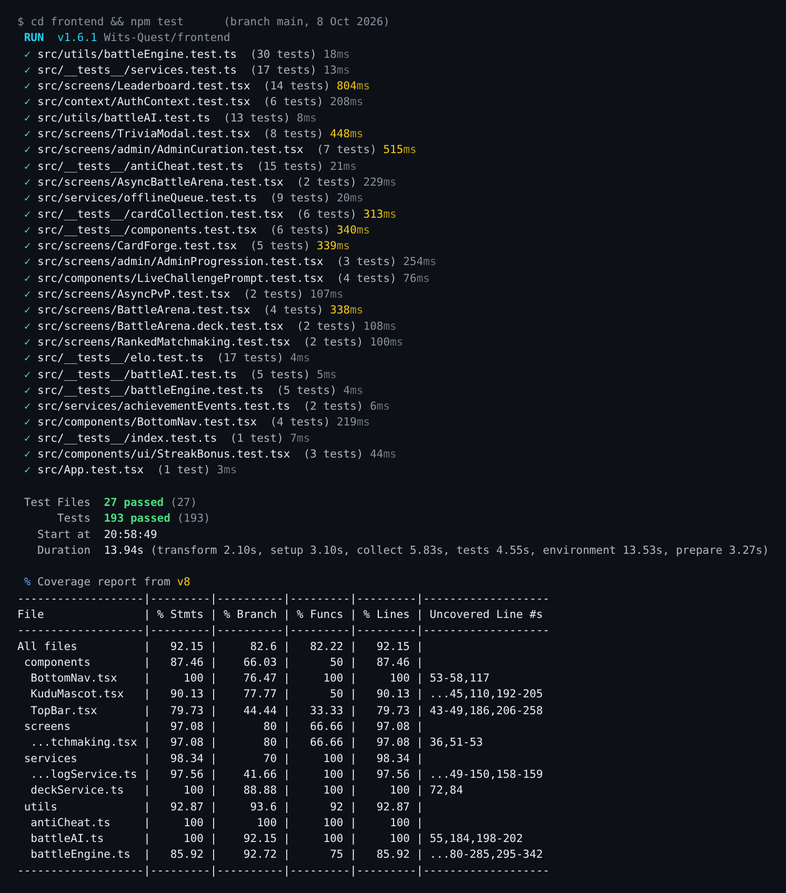
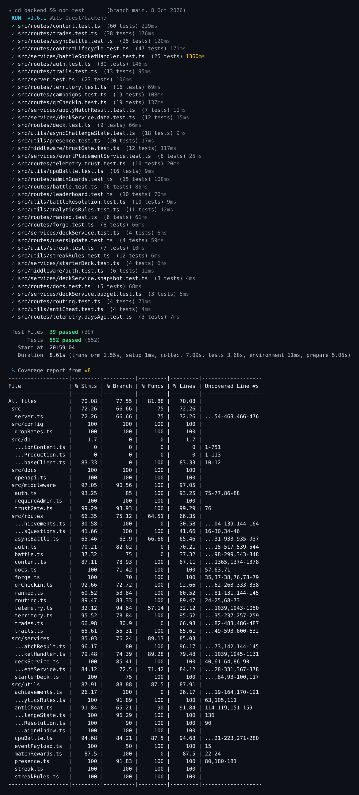

# Test Results & Coverage

What our automated tests cover, the latest results, and what we don't test automatically.

---

## Latest results (8 October 2026)

Run on 8 October 2026 against the latest code on `main` (last changed 1 October), which is the version deployed on Render and Vercel.

| Code base | Tools | Tests | Statements | Branches | Functions | Lines | Coverage gate |
| :--- | :--- | :--- | :--- | :--- | :--- | :--- | :--- |
| **Frontend** | Vitest + React Testing Library | 193 passing (27 files) | 92.15% | 82.60% | 82.22% | 92.15% | 80% ✅ |
| **Backend** | Vitest + Supertest | 552 passing (39 files) | 70.08% | 77.55% | 81.88% | 70.08% | 60% ✅ |

No tests failed or were skipped.

## Progress since the last run

| Code base | 29 Sep | 8 Oct | Change |
| :--- | :--- | :--- | :--- |
| Frontend tests | 163 (20 files) | 193 (27 files) | +30 tests, +7 files |
| Frontend statement coverage | 89.21% | 92.15% | +2.94 points |
| Backend tests | 452 (29 files) | 552 (39 files) | +100 tests, +10 files |
| Backend statement coverage | 63.91% | 70.08% | +6.17 points |

## Screenshots

=== "Frontend"

    

    *Frontend `npm test`: 27 files and 193 tests passing, and 92.15% statement coverage.*

=== "Backend"

    

    *Backend `npm test`: 39 files and 552 tests passing, and 70.08% statement coverage.*

=== "Frontend, 29 Sep (earlier run)"

    

    *Frontend `npm test` from 29 September: 20 files and 163 tests passing.*

The **coverage gate** is the minimum coverage set in each code base's test config. If coverage drops below it, the test run fails. The frontend gate is 80% (`frontend/vite.config.ts`). The backend gate is 60% (`backend/vitest.config.ts`). Backend coverage is now 70%, so the gate could be raised to 70%, and our goal is 80%.

---

## What the tests cover

### Backend (API tests and unit tests)

The API tests call real endpoints with Supertest, using a fake database so no real data changes. They check:

- **Login and permissions:** missing or bad tokens get `401`; players calling admin endpoints get `403`.
- **Trivia:** answers are marked on the server, the player comes from the login token (not the request body), an event can only be answered once, and a wrong answer still shows the right one.
- **Location:** the rules for whether a player was really at an event (distance, time, GPS accuracy) are tested in `presence.test.ts`; walking-speed and teleport checks in the anti-cheat tests.
- **Battles:** CPU, async and live battles follow the same server rules (valid cards, valid stats, no repeats); rewards are worked out on the server.
- **Decks:** 5 cards, cards you own, within the stat budget, at most 1 Legendary.
- **Content lifecycle:** draft → review → published → retired, and invalid moves are refused.
- **Trading, ranked seasons, trails, territory, campaigns and streaks.**
- **Also tested:** QR check-in, trust scores and the trust gate, admin-only route guards, automatic event placement, live battle socket events, starter decks for new players, the deck budget, and the Swagger docs routes.
- **Error cases:** database failures, expired trades and missing settings all return the right error code instead of crashing.

Largest backend test files: `content.test.ts` (60 tests), `contentLifecycle.test.ts` (47), `trades.test.ts` (38), `auth.test.ts` (30), `battleSocketHandler.test.ts` (25), `asyncBattle.test.ts` (25) and `server.test.ts` (23).

### Frontend (UI tests and unit tests)

- **Game logic:** battle engine (30 tests), computer opponent, Elo ratings, anti-cheat helpers.
- **Screens:** leaderboard, trivia pop-up, battle screens, async PvP, ranked matchmaking, card collection, Card Forge, bottom navigation, and the live challenge pop-up.
- **Admin console:** the content review board (Curation) and the achievements screen.
- **Progress:** the streak bonus badge and achievement unlock events.
- **Services:** API calls, the offline answer queue, login state.

---

## What we don't test automatically

| Not tested automatically | Why | How we check it instead |
| :--- | :--- | :--- |
| Live PvP screens and real socket connections | Fake sockets in a test only test the fakes | Two real players on two devices against the live server |
| Real GPS on a phone | Tests can't move a phone around campus | Walking to events on campus with a phone |
| OpenRouteService directions | It's an outside service | Tests use a fake response; the real one is checked by hand |
| Database seed scripts | They run once to load content | Checked by looking at the data in Supabase |

**Where backend coverage is lowest:** the database and seed files in `src/db` (about 2%), the achievement rules in `utils/achievements.ts` (26%) and `routes/adminAchievements.ts` (31%), `routes/telemetry.ts` (32%), `routes/battle.ts` (37%) and `routes/ranked.ts` (61%). These are the next targets for raising the backend gate to 80%.

---

## Run the tests yourself

```bash
cd frontend && npm test     # frontend tests with coverage
cd backend  && npm test     # backend tests with coverage
```

The backend tests use a fake database, but the code still checks that `SUPABASE_URL` and `SUPABASE_KEY` are set when it starts. Without a `backend/.env` file, set any dummy values first, for example `SUPABASE_URL=http://localhost SUPABASE_KEY=test npm test`. Otherwise 7 test files stop early with "Missing SUPABASE_URL or SUPABASE_KEY".

Tests sit next to the code they test (for example `routes/trades.ts` and `routes/trades.test.ts`).

How testing fits into our process, and our rules for tests, are on the [Testing Documentation](testing-documentation.md) page.
