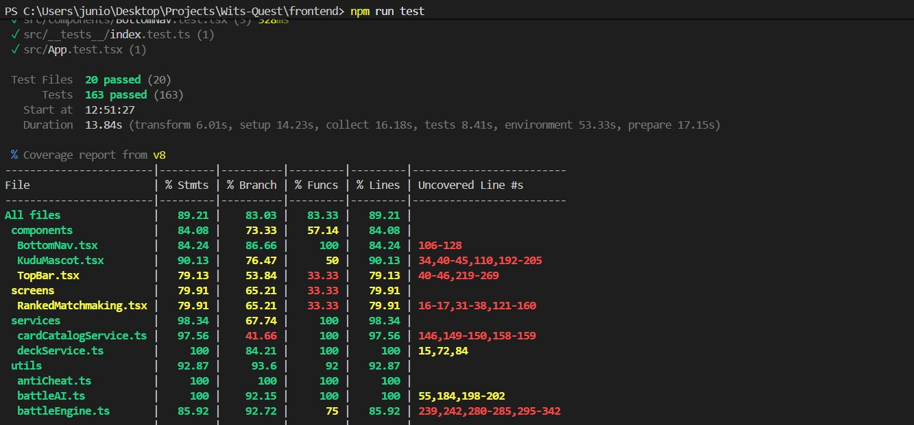

# Test Results & Coverage

What our automated tests cover, the latest results, and what we don't test automatically.

---

## Latest results (29 September 2026)

| Code base | Tools | Tests | Statements | Branches | Functions | Lines | Coverage gate |
| :--- | :--- | :--- | :--- | :--- | :--- | :--- | :--- |
| **Frontend** | Vitest + React Testing Library | 163 passing (20 files) | 89.21% | 83.03% | 83.33% | 89.21% | 80% ✅ |
| **Backend** | Vitest + Supertest | 452 passing (29 files) | 63.91% | 78.74% | 70.90% | 63.91% | 60% ✅ |



*Frontend `npm test` output: 20 files and 163 tests passing, with the coverage report.*

The **coverage gate** is the minimum coverage set in each code base's test config. If coverage drops below it, the test run fails. The frontend gate is 80% (`frontend/vite.config.ts`). The backend gate is 60% (`backend/vitest.config.ts`), and our goal is to raise it to 80%.

---

## What the tests cover

### Backend (API tests and unit tests)

The API tests call real endpoints with Supertest, using a fake database so no real data changes. They check:

- **Login and permissions:** missing or bad tokens get `401`; players calling admin endpoints get `403`.
- **Trivia:** answers are marked on the server, the player comes from the login token (not the request body), an event can only be answered once, and a wrong answer still shows the right one.
- **Location:** the rules for whether a player was really at an event (distance, time, GPS accuracy) are tested in `presence.test.ts`; walking-speed and teleport checks in the anti-cheat tests.
- **Battles:** CPU, async and live battles follow the same server rules (valid cards, valid stats, no repeats); rewards are worked out on the server.
- **Decks:** 5 cards, cards you own, within the stat budget, at most 1 Legendary.
- **Content lifecycle:** draft → review → published → retired, and invalid moves are refused.
- **Trading, ranked seasons, trails, territory, campaigns and streaks.**
- **Error cases:** database failures, expired trades and missing settings all return the right error code instead of crashing.

Largest backend test files: `content.test.ts` (60 tests), `contentLifecycle.test.ts` (46), `trades.test.ts` (38), `auth.test.ts` (30), `asyncBattle.test.ts` (24).

### Frontend (UI tests and unit tests)

- **Game logic:** battle engine (30 tests), computer opponent, Elo ratings, anti-cheat helpers.
- **Screens:** leaderboard, trivia pop-up, battle screens, async PvP, card collection, bottom navigation.
- **Services:** API calls, the offline answer queue, login state.

---

## What we don't test automatically

| Not tested automatically | Why | How we check it instead |
| :--- | :--- | :--- |
| Live PvP screens and real socket connections | Fake sockets in a test only test the fakes | Two real players on two devices against the live server |
| Real GPS on a phone | Tests can't move a phone around campus | Walking to events on campus with a phone |
| OpenRouteService directions | It's an outside service | Tests use a fake response; the real one is checked by hand |
| Database seed scripts | They run once to load content | Checked by looking at the data in Supabase |

**Where backend coverage is lowest:** the seed files (`db/productionContent.ts`, `db/seedProduction.ts`, about 860 lines at 0%), `routes/telemetry.ts` (18%), the achievements code (about 27 to 29%) and `routes/battle.ts` (39%). These are the next targets for raising the backend gate to 80%.

---

## Run the tests yourself

```bash
cd frontend && npm test     # frontend tests with coverage
cd backend  && npm test     # backend tests with coverage
```

Tests sit next to the code they test (for example `routes/trades.ts` and `routes/trades.test.ts`).

How testing fits into our process, and our rules for tests, are on the [Testing Documentation](testing-documentation.md) page.
