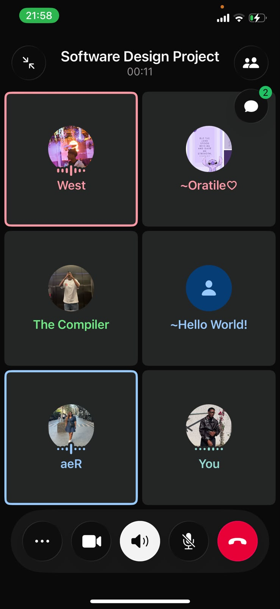
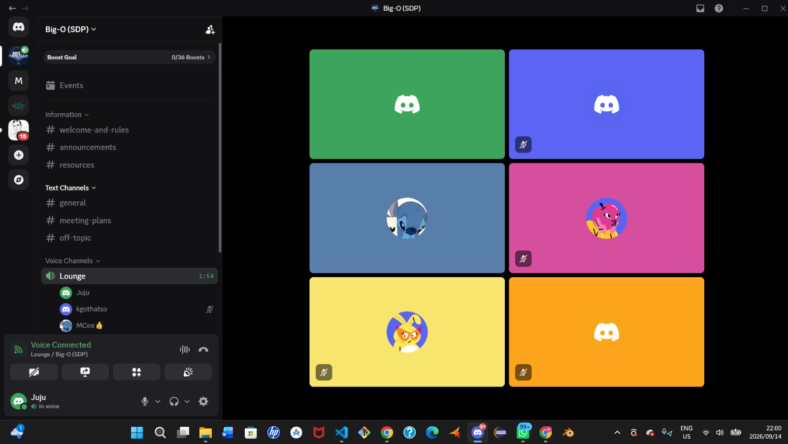

# Meeting Records

A log of **internal team meetings**, decisions, and action items throughout the project.

## How meetings are recorded

Every entry on this page follows the same fixed structure, in this order:

1. **Date & channel** — when and where (video call, Discord voice, in person)
2. **Attendees** — who was present
3. **Context / agenda** — what the meeting was for
4. **Decisions** — what was agreed
5. **Action items** — owner, task, due date

Entries are listed most recent first.

## Client & stakeholder sessions

Meetings with the tutor / client are recorded **separately** on the [Stakeholder Reviews](../project/stakeholder-reviews.md) page — with minutes **and a photo taken at the session** — per the tutor's instruction. They do not appear on this page.

---

## 2026-09-14 — Sprint 2 Final Sync (Milestone 2 Preparation)

**Channels:** Software Design Project video call + Big-O (SDP) Discord — Lounge voice channel

**Context:** Final full-team sync the night before the Milestone 2 deadline (2026-09-15). The team ran a video call to walk through Sprint 2 deliverables, then continued working together in the Discord Lounge voice channel.

**Focus areas:**

- Review of Sprint 2 deliverables ahead of the Milestone 2 deadline
- Documentation completion (API reference, testing, methodology, and rubric-alignment pages)
- Final verification of battle (CPU / Async PvP / Live PvP), map, and authentication features

---

## 2026-09-13 — Sprint 2: Documentation & Infrastructure Sync

**Channel:** Software Design Project Discord — General

**Context:** Ongoing team communication during Sprint 2, covering infrastructure changes and documentation setup.

**Key discussion points:**

- Lint configurations completed (ESLint + Prettier)
- Migration of GitHub Actions to Gitea Actions completed
- Repository separation (frontend / backend / docs) completed
- Documentation repository established as a dedicated repo

**Decisions made:**

| Decision | Rationale |
| :--- | :--- |
| Separate docs repo | Docs changes don't need the code CI pipeline; independent MkDocs deployment |
| Gitea Actions for CI/CD | Keeps CI within the university Gitea instance |
| 3-repo split confirmed | Frontend, backend, and docs each deploy independently |

**See also:** [Decisions Log](../development/decisions-log.md) for full rationale.

---

## 2026-08-20 — Team Sync & Progress Check

**Attendees:** MCee, Juju, Kgothatso, Nontokozo, Oratile, Rea

**Agenda:**

- Sprint 2 progress update from each member
- Task allocation and card/event mechanics discussion
- Authentication, CI/CD pipeline, and testing status

**Decisions:**

- Cards should only work at one event per player — flagged after first use (other players can still collect at the same location, but the same player cannot get it at another event)
- Map UI cleanup and "near me" functionality assigned to Junior

**Action items:**

| Owner | Task | Due |
| :--- | :--- | :--- |
| Junior | Clean out map UI and complete "near me" functionality | TBD |
| Rea | Implement card-per-event flagging system | TBD |
| Kgothatso | Auth system (email verification, login, registration) | 2026-08-22 |
| Clayton | Game strategies, previous game history, CD pipeline, tests | TBD |
| Others | Test and polish individual deliverables | Ongoing |

---

## 2026-08-17 — Sprint Planning & Document Review

**Attendees:** MCee, Juju, Kgothatso, Nontokozo, Oratile, Rea

**Agenda:**

- Sprint planning and task distribution
- Document review and walkthrough
- Progress check on individual deliverables

**Decisions:**

- Tasks distributed among team members for Sprint 2

**Action items:**

| Owner | Task | Due |
| :--- | :--- | :--- |
| All members | Complete assigned Sprint 2 tasks | 2026-08-22 |

---

## 2026-08-13 — Sprint 1 Close-Out

**Attendees:** MCee, Juju, Kgothatso, Nontokozo, Oratile, Rea

**Context:** Sprint 1 close-out. The team debriefed the tutor's Sprint 1 review (recorded in full on the [Stakeholder Reviews](../project/stakeholder-reviews.md) page) and triaged the feedback into the Sprint 2 plan.

**Decisions:**

- Sprint 2 to include: automated code-quality checks (ESLint + Prettier), the three-repo separation, slimmer READMEs, and documentation of every tracked decision (Issues-vs-Projects, git standards, tech-stack rationale)
- Authentication to be reviewed against the security feedback — leading to the Supabase Auth migration

**Action items:**

| Owner | Task | Due |
| :--- | :--- | :--- |
| All members | Carry the tutor's feedback points into Sprint 2 task selection | Sprint 2 planning (2026-08-17) |

---

## 2026-08-06 — Team Meeting

*Meeting notes pending.*
