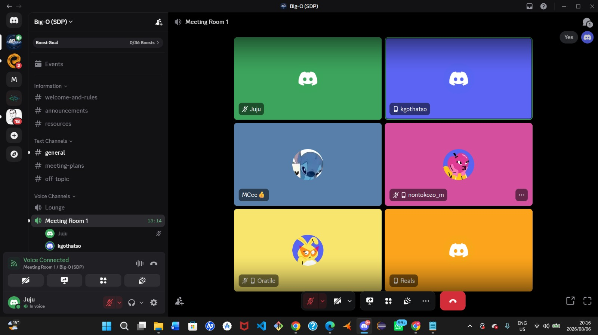
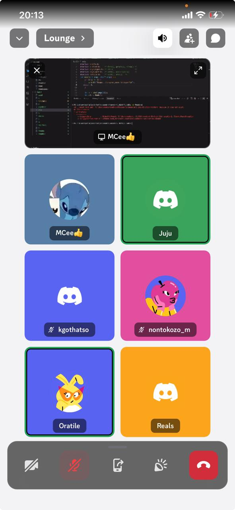

# Meeting Records

Team stand-ups are held over Discord (`Big-O (SDP)` server, Meeting Room 1 / Lounge voice channel). Each entry below logs what was covered, with a screenshot of the call for attendance reference.

---

## 2026-08-06 — Kickoff: Task Allocation & Project Scope

**Attendees**: Juju, kgothatso, MCee, nontokozo_m, Oratile, Reals



**Agenda**:

- Walk through the full project brief and confirm shared understanding of the game concept
- Assign domain ownership across the team
- Set target dates for early deliverables

**Discussion & Decisions**:

- Discussed the project end-to-end — the core loop, the Basic/Intermediate/Advanced requirement tiers, and how the pieces fit together (see [Requirements](../project/requirements.md))
- Agreed on task allocations, splitting the six feature domains (map/geolocation, battle engine, database/auth, admin console, progression/economy, anti-cheat/matchmaking) across the team — see [Scope § Team Domain Ownership](../project/scope.md#team-domain-ownership)
- Set due dates for the project's key milestones

**Action items**:

- [ ] Each member to begin work on their assigned domain
- [ ] Confirm due dates are reflected in the team's shared schedule/board

---

## 2026-08-13 — Progress Review & Blockers

**Attendees**: MCee, Juju, kgothatso, nontokozo_m, Oratile, Reals



**Agenda**:

- Check progress against the domains assigned on 6 August
- Surface blockers before they slow the rest of the team down

**Discussion & Decisions**:

- Went round the team reviewing how far each domain had progressed since kickoff
- Identified current blockages holding people up

**Action items**:

- [ ] Document specific blockers raised in this meeting here once confirmed
- [ ] Follow up with whoever owns each blocker to unblock before the next check-in

---

<!-- Copy the template below for each new meeting, most recent first. -->

## Template

```markdown
## YYYY-MM-DD — Meeting Title

**Attendees**: 

**Agenda**:
- 

**Discussion & Decisions**:
- 

**Action items**:
- [ ] Owner — task — due date
```
