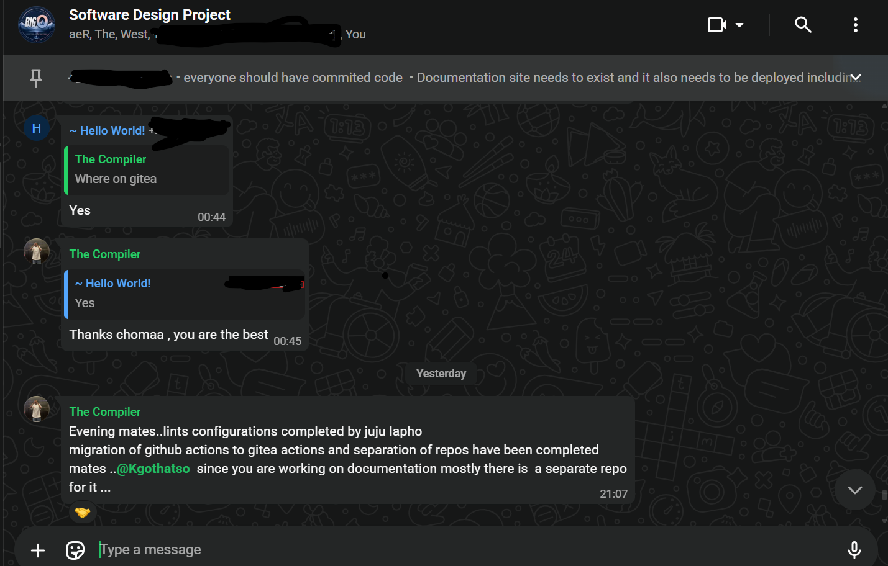

# Meeting Records

A log of team meetings, decisions, and action items throughout the project.

---

## 2026-09-13 — Sprint 2: Documentation & Infrastructure Sync

**Channel:** Software Design Project Discord — General

**Context:** Ongoing team communication during Sprint 2, covering infrastructure changes and documentation setup.

**Key discussion points:**

- Lint configurations completed (ESLint + Prettier)
- Migration of GitHub Actions to Gitea Actions completed
- Repository separation (frontend / backend / docs) completed
- Documentation repository established as a dedicated repo

**Decisions made:**

| Decision | Rationale |
| :--- | :--- |
| Separate docs repo | Docs changes don't need the code CI pipeline; independent MkDocs deployment |
| Gitea Actions for CI/CD | Keeps CI within the university Gitea instance |
| 3-repo split confirmed | Frontend, backend, and docs each deploy independently |

**See also:** [Decisions Log](../development/decisions-log.md) for full rationale.

---

## 2026-08-20 — Team Sync & Progress Check

**Attendees:** MCee, Juju, Kgothatso, Nontokozo, Oratile, Rea

**Agenda:**

- Sprint 2 progress update from each member
- Task allocation and card/event mechanics discussion
- Authentication, CI/CD pipeline, and testing status

**Decisions:**

- Cards should only work at one event per player — flagged after first use (other players can still collect at the same location, but the same player cannot get it at another event)
- Map UI cleanup and "near me" functionality assigned to Junior

**Action items:**

| Owner | Task | Due |
| :--- | :--- | :--- |
| Junior | Clean out map UI and complete "near me" functionality | TBD |
| Rea | Implement card-per-event flagging system | TBD |
| Kgothatso | Auth system (email verification, login, registration) | 2026-08-22 |
| Clayton | Game strategies, previous game history, CD pipeline, tests | TBD |
| Others | Test and polish individual deliverables | Ongoing |

---

## 2026-08-17 — Sprint Planning & Document Review

**Attendees:** MCee, Juju, Kgothatso, Nontokozo, Oratile, Rea

**Agenda:**

- Sprint planning and task distribution
- Document review and walkthrough
- Progress check on individual deliverables

**Decisions:**

- Tasks distributed among team members for Sprint 2

**Action items:**

| Owner | Task | Due |
| :--- | :--- | :--- |
| All members | Complete assigned Sprint 2 tasks | 2026-08-22 |

---

## 2026-08-13 — Team Meeting

*Meeting notes pending.*

---

## 2026-08-06 — Team Meeting

*Meeting notes pending.*
