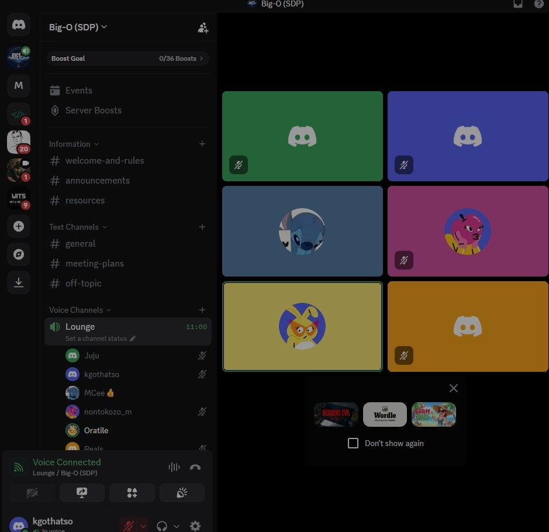
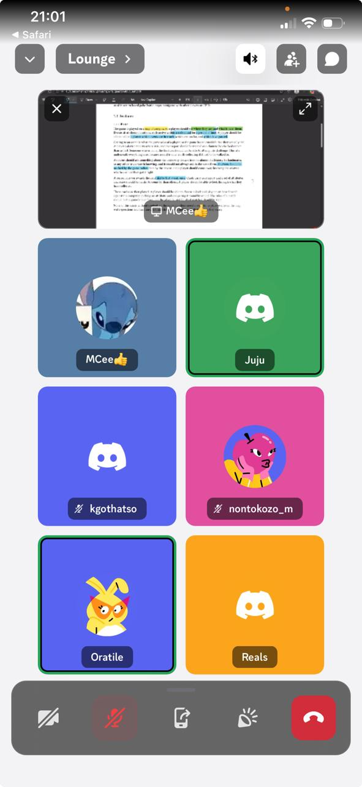

# Meeting Records

## 2026-08-06 — Team Meeting

**Attendees**:

**Agenda**:
-

**Decisions**:
-

**Action items**:

- [ ] Owner — task — due date

## 2026-08-17 — Sprint Planning & Document Review

**Attendees**: MCee, Juju, Kgothatso, Nontokozo, Oratile, Rea

**Agenda**:

- Sprint planning and task distribution
- Document review and walkthrough
- Progress check on individual deliverables

**Decisions**:

- Tasks distributed among team members for Sprint 2

**Action items**:

- [ ] All members — Complete assigned Sprint 2 tasks — 2026-08-22

## 2026-08-20 — Team Sync & Progress Check

**Attendees**: MCee, Juju, Kgothatso, Nontokozo, Oratile, Rea

**Agenda**:

- Sprint 2 progress update from each member
- Task allocation and card/event mechanics discussion
- Authentication, CI/CD pipeline, and testing status

**Decisions**:

- Cards should only work at one event per player — flagged after first use (other players can still collect at the same location, but the same player cannot get it at another event)
- Map UI cleanup and "near me" functionality assigned to Junior

**Action items**:

- [ ] Junior — Clean out map UI and complete "near me" functionality — TBD
- [ ] Rea — Implement card-per-event flagging system (card flagged after first use per player) — TBD
- [ ] Kgothatso — Auth system (email verification, login, registration) — 2026-08-22
- [ ] Clayton — Game strategies, previous game history, CD pipeline, tests — TBD
- [ ] Others — Test and polish individual deliverables — Ongoing

## 2026-08-13 — Team Meeting

**Attendees**:

**Agenda**:
-

**Decisions**:
-

**Action items**:

- [ ] Owner — task — due date
