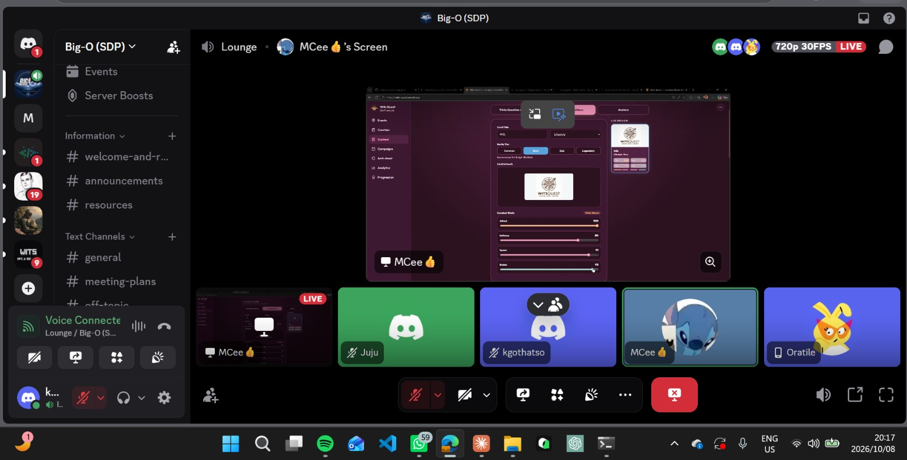
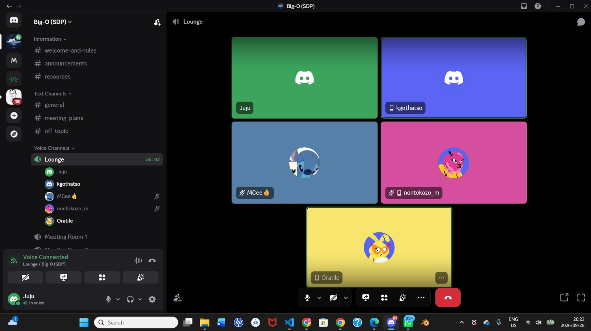
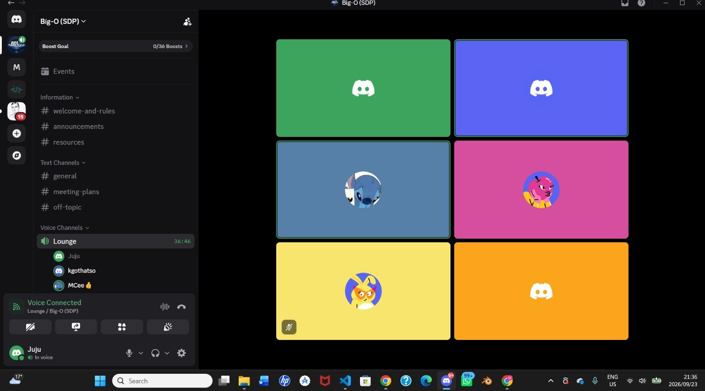
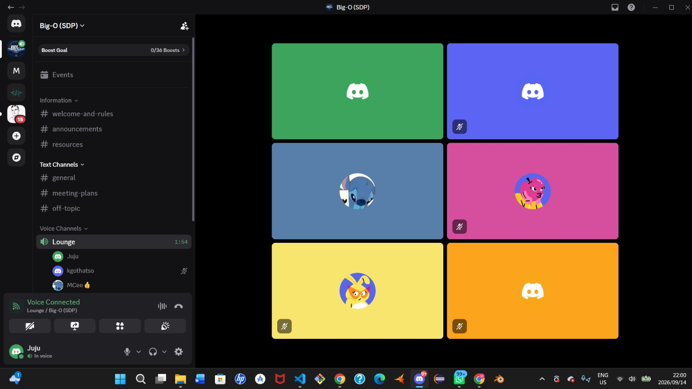
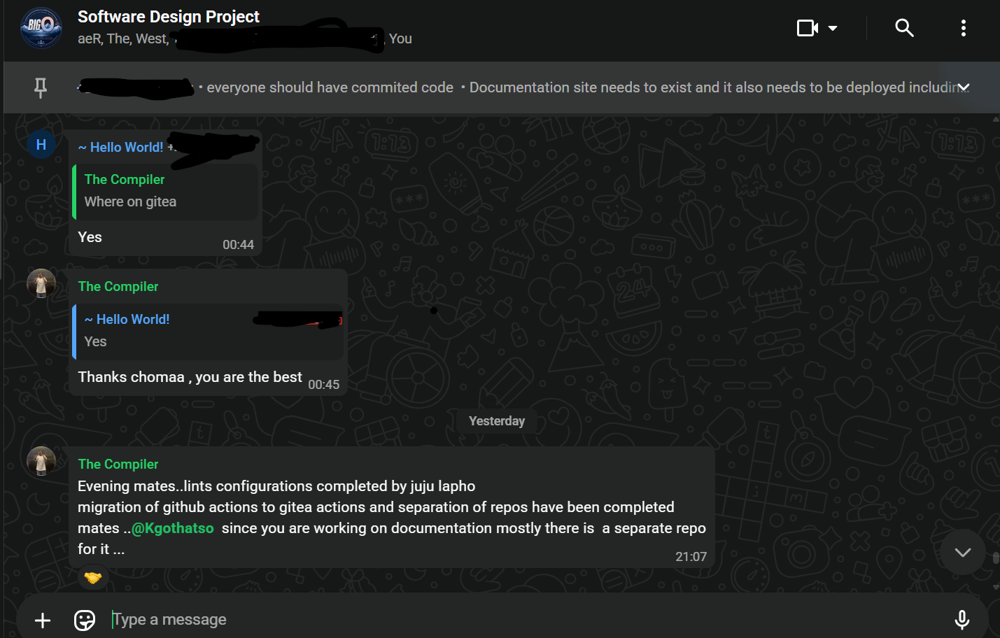
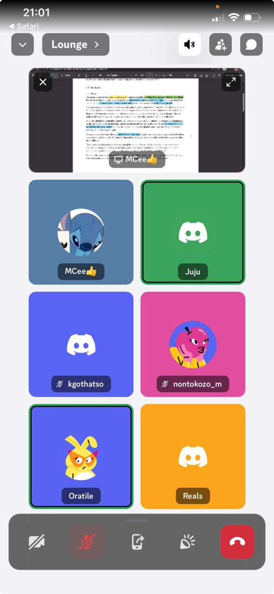
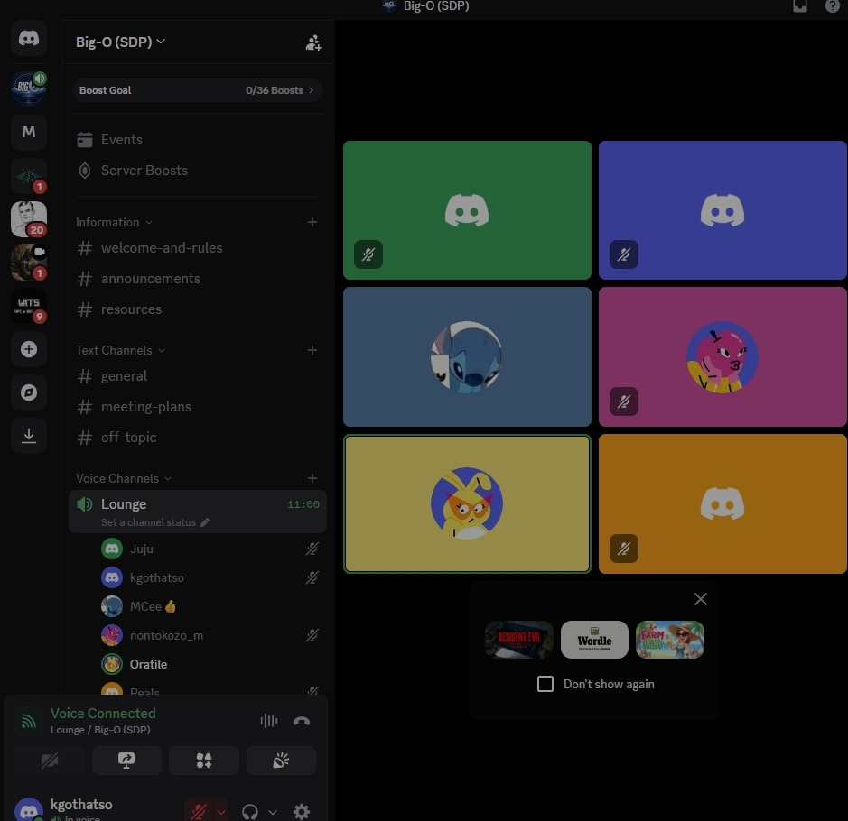
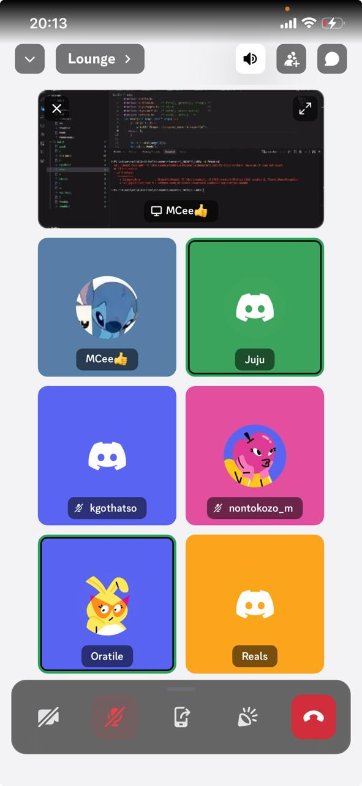
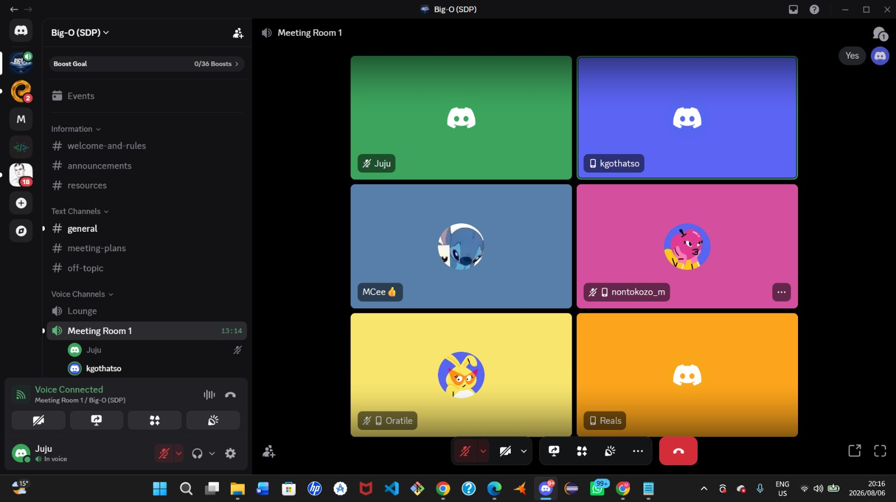

# Meeting Records

A log of **internal team meetings**, decisions, and action items throughout the project.

## How meetings are recorded

Every entry on this page follows the same fixed structure, in this order:

1. **Date & channel** — when and where (video call, Discord voice, in person)
2. **Attendees** — who was present
3. **Context / agenda** — what the meeting was for
4. **Decisions** — what was agreed
5. **Action items** — owner, task, due date

Entries are listed most recent first.

## Client & stakeholder sessions

Meetings with the tutor / client are recorded **separately** on the [Stakeholder Reviews](../project/stakeholder-reviews.md) page — with minutes **and a photo taken at the session** — per the tutor's instruction. They do not appear on this page.

---

## 2026-10-08 — Overall App Testing

**Channel:** Big-O (SDP) Discord — Lounge voice channel

**Attendees:** Mahlatse, Junior, Kgothatso, Oratile

**Context:** The team went through the whole app together to find what still needs fixing before submission. Mahlatse shared their screen and walked through the app, including the admin console's card editor.

**Decisions:**

| Decision | Detail |
| :--- | :--- |
| Card pictures | Some cards still have no picture. This needs fixing. |
| Clean the live app | Remove test data so only the default/starter cards, events and other real content are left. |
| Campus testing | Anyone on campus tomorrow tests the app on their phone: create events and walk around campus. |
| Map markers | Show each player's avatar on the map page instead of a number. |
| Ideas to look at | Sound effects in battle mode, a theme for the game, and a tournament mode. |

**Action items:**

| Owner | Task | Due |
| :--- | :--- | :--- |
| Team | Add pictures to every card that's missing one | Before submission |
| Team | Clean the live database, keeping only the default content | Before submission |
| Anyone on campus | Test on phones: create events and walk around campus | 2026-10-09 |
| Team | Change the number on the map page to the player's avatar | Before submission |
| Team | Look into battle sounds, a game theme and a tournament mode | TBD |

---

## 2026-09-28 — Final Client Meeting Prep & PR Process

**Channel:** Big-O (SDP) Discord — Lounge voice channel

**Attendees:** Mahlatse, Junior, Kgothatso, Nontokozo, Oratile

**Context:** Preparation for the final client meeting and a reminder of how the team should handle testing and pull requests.

**Decisions:**

| Decision | Detail |
| :--- | :--- |
| Final client meeting | 2026-09-29 at 11:00 on Google Meet. This is the last meeting with the client. |
| Test locally before opening a PR | Confirm every feature works locally first. The runners are slow, so they should not be the only test. |
| Project review | Ask the extra tutor, Zayd, to review the project and give feedback. |
| Availability | Mahlatse is available from 12:00. |

**Action items:**

| Owner | Task | Due |
| :--- | :--- | :--- |
| Team | Prepare for the final client meeting | 2026-09-29, 11:00 |
| Team | Have the Google Meet link ready | 2026-09-29, 11:00 |
| All members | Test all implemented features locally | Before each PR |
| All members | Only open a PR after local functionality is confirmed | Ongoing |
| Team | Coordinate with Mahlatse from 12:00 | 2026-09-29 |
| Team | Request a project review from Zayd | TBD |

---

## 2026-09-23 — Sprint 3 Task Review & Client Meeting Schedule

**Channel:** Big-O (SDP) Discord — Lounge voice channel

**Attendees:** Mahlatse, Junior, Kgothatso, Nontokozo, Oratile, Rea

**Context:** Review of the tasks assigned for the current sprint, including the endpoint documentation, and agreement on the client meeting dates.

**Decisions:**

| Decision | Detail |
| :--- | :--- |
| Client meeting dates | Friday during lunch time (agreed with the client), then Monday and Tuesday. |
| Documentation | Oratile and Kgothatso work on the documentation, including the endpoint documentation. |
| Sprint deadline | All sprint work, including the endpoint documentation, is due next Sunday. |
| Next internal meetings | Monday and Thursday. |

**Also discussed:** Oratile asked for the sound issue to be fixed, and Nontokozo asked whether SASCO won.

**Action items:**

| Owner | Task | Due |
| :--- | :--- | :--- |
| Oratile & Kgothatso | Work on the documentation, including the endpoints | Next Sunday |
| Rea | Fix the sound issue | TBD |
| Team | Complete assigned sprint tasks | Next Sunday |
| Team | Attend the Monday and Thursday meetings | Ongoing |

---

## 2026-09-14 — Sprint 2 Final Sync (Milestone 2 Preparation)

**Channels:** Software Design Project video call + Big-O (SDP) Discord — Lounge voice channel

**Context:** Final full-team sync the night before the Milestone 2 deadline (2026-09-15). The team ran a video call to walk through Sprint 2 deliverables, then continued working together in the Discord Lounge voice channel.

**Focus areas:**

- Review of Sprint 2 deliverables ahead of the Milestone 2 deadline
- Documentation completion (API reference, testing, methodology, and rubric-alignment pages)
- Final verification of battle (CPU / Async PvP / Live PvP), map, and authentication features

---

## 2026-09-13 — Sprint 2: Documentation & Infrastructure Sync

**Channel:** Software Design Project Discord — General

**Context:** Ongoing team communication during Sprint 2, covering infrastructure changes and documentation setup.

**Key discussion points:**

- Lint configurations completed (ESLint + Prettier)
- Migration of GitHub Actions to Gitea Actions completed
- Repository separation (frontend / backend / docs) completed
- Documentation repository established as a dedicated repo

**Decisions made:**

| Decision | Rationale |
| :--- | :--- |
| Separate docs repo | Docs changes don't need the code CI pipeline; independent MkDocs deployment |
| Gitea Actions for CI/CD | Keeps CI within the university Gitea instance |
| 3-repo split confirmed | Frontend, backend, and docs each deploy independently |

**See also:** [Decisions Log](../development/decisions-log.md) for full rationale.

---

## 2026-08-20 — Team Sync & Progress Check

**Attendees:** Mahlatse, Junior, Kgothatso, Nontokozo, Oratile, Rea

**Agenda:**

- Sprint 2 progress update from each member
- Task allocation and card/event mechanics discussion
- Authentication, CI/CD pipeline, and testing status

**Decisions:**

- Cards should only work at one event per player — flagged after first use (other players can still collect at the same location, but the same player cannot get it at another event)
- Map UI cleanup and "near me" functionality assigned to Junior

**Action items:**

| Owner | Task | Due |
| :--- | :--- | :--- |
| Junior | Clean out map UI and complete "near me" functionality | TBD |
| Rea | Implement card-per-event flagging system | TBD |
| Kgothatso | Auth system (email verification, login, registration) | 2026-08-22 |
| Clayton | Game strategies, previous game history, CD pipeline, tests | TBD |
| Others | Test and polish individual deliverables | Ongoing |

---

## 2026-08-17 — Sprint Planning & Document Review

**Attendees:** Mahlatse, Junior, Kgothatso, Nontokozo, Oratile, Rea

**Agenda:**

- Sprint planning and task distribution
- Document review and walkthrough
- Progress check on individual deliverables

**Decisions:**

- Tasks distributed among team members for Sprint 2

**Action items:**

| Owner | Task | Due |
| :--- | :--- | :--- |
| All members | Complete assigned Sprint 2 tasks | 2026-08-22 |
---

## 2026-08-13 — Sprint 1 Close-Out

**Attendees:** Mahlatse, Junior, Kgothatso, Nontokozo, Oratile, Rea

**Context:** Sprint 1 close-out. The team debriefed the tutor's Sprint 1 review (recorded in full on the [Stakeholder Reviews](../project/stakeholder-reviews.md) page) and triaged the feedback into the Sprint 2 plan.

**Decisions:**

- Sprint 2 to include: automated code-quality checks (ESLint + Prettier), the three-repo separation, slimmer READMEs, and documentation of every tracked decision (Issues-vs-Projects, git standards, tech-stack rationale)
- Authentication to be reviewed against the security feedback — leading to the Supabase Auth migration

**Action items:**

| Owner | Task | Due |
| :--- | :--- | :--- |
| All members | Carry the tutor's feedback points into Sprint 2 task selection | Sprint 2 planning (2026-08-17) |

---

## 2026-08-06 — Team Meeting

*Meeting notes pending.*
