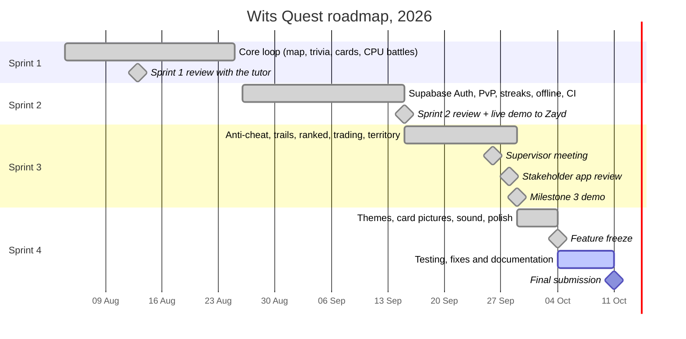
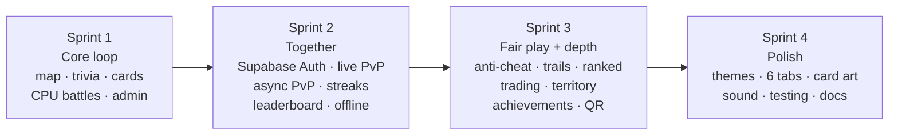

# Roadmap

The project from start to submission, with each milestone and what was delivered. What's planned after submission is at the end.

---

## Timeline

## Milestones

| Date | Milestone | Delivered | Evidence |
| :--- | :--- | :--- | :--- |
| **13 Aug** | Sprint 1 review | Campus map, geofenced trivia, card collection, CPU battles, authoring console | [Sprint 1 review](../project/stakeholder-reviews.md#sprint-1-review-2026-08-13) |
| **15 Sep** | Sprint 2 review and live demo | Secure login, server-checked battles, live and async PvP, offline answers, deployed app, docs site | [Sprint 2 review](../project/stakeholder-reviews.md#sprint-2-review-2026-09-15) |
| **29 Sep** | Milestone 3 | Every Intermediate feature, plus anti-cheat, trails, ranked, trading, territory and achievements | [Features by Sprint](../project/sprint-features.md#sprint-3-fair-play-and-depth) |
| **4 Oct** | Feature freeze | Four themes, the six-tab layout, card pictures, sound | [Sprint 4 Plan](../sprints/SPRINT4_PLAN.md) |
| **8 to 10 Oct** | Full testing | 946 tests passing, load test with 0 failures, Lighthouse on 19 screens | [Test Results at a Glance](../development/test-report.md) |
| **11 Oct** | Final submission | The live app, API and documentation | [Home](../index.md) |

## Features delivered per sprint

The full list of who built what is on [Features by Sprint](../project/sprint-features.md).

## After submission

Ideas we would build next, from user feedback, stakeholder reviews and our own testing:

| Idea | Where it came from |
| :--- | :--- |
| Code splitting so the first visit loads faster on phones | [Lighthouse](../development/test-report.md#2-lighthouse): phone performance 49 on the first visit |
| Name the map markers for screen readers and make them keyboard-reachable | Lighthouse accessibility checks on the Map |
| Move the API to a region nearer South Africa and keep it awake | [Load test](../development/test-report.md#1-api-load-test): about 0.5 s of each response is distance |
| End-to-end browser tests (Playwright) | [What isn't tested](../development/test-report.md#4-what-isnt-tested-and-whats-next) |
| More trivia questions and replayable events | [User Feedback](../project/user-feedback.md): players run out of trivia |
| A larger-text option | User feedback |
