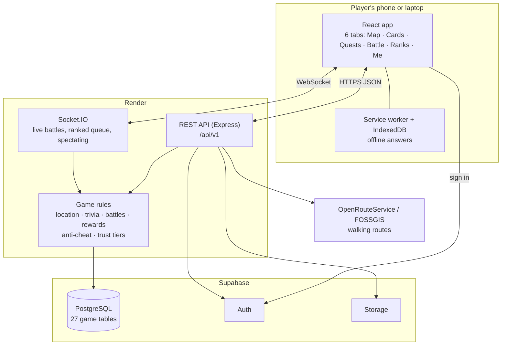

# System Design

How Wits Quest is put together: the parts, how they talk to each other, and where the detailed diagrams are. This page is the overview. The detailed UML diagrams are in the pages listed under it in the sidebar.

---

## The parts

| Part | Job | Detail |
| :--- | :--- | :--- |
| **React app** | Shows the game. Signs players in with Supabase Auth and calls the API with their token | [Development Architecture](../development/architecture.md) |
| **REST API** | Applies every game rule and reads and writes the database | [API Architecture](../development/api-architecture.md) |
| **Socket.IO** | Live battles, where both players need to see each move at once | [Live PvP](../development/live-pvp-walkthrough.md) |
| **PostgreSQL** | All game data: players, cards, decks, events, battles, trades, telemetry | [Database Schema](../database/database-schema.md), [ERD](../uml/04_erd_database_schema.md) |
| **Supabase Auth** | Accounts, passwords and email verification | [Technical Decisions](../development/technical-decisions.md) |
| **Walking routes** | Directions to the next event | [API Quick Start](../development/api-quickstart.md#external-api-walking-directions) |

## Design principles

1. **The server decides.** The phone only asks; the server checks location, answers, battle moves and rewards. A player who edits the app still can't cheat.
2. **Location is a claim, not a fact.** Every GPS report is checked against distance, time and speed before it counts.
3. **Proportionate anti-cheat.** Suspicious play lowers a trust score and limits features step by step. Nobody is banned automatically.
4. **Works offline where it matters.** Trivia answers made without signal are kept on the phone and sent later.
5. **One area per person.** Each member owns an area end to end, so the code is split the same way the team is.

## Diagrams

| Diagram | What it shows |
| :--- | :--- |
| [System Architecture](../uml/01_system_architecture.md) | The deployed parts and how they connect |
| [Development Architecture](../development/architecture.md) | How the code is organised, and the key rules in it |
| [Use Case Diagram](../uml/03_use_case_diagram.md) | What players, admins and outside systems can do |
| [Class Diagram](../uml/05_class_diagram.md) | The main types in the code and how they relate |
| [Sequence Diagrams](../uml/06_sequence_diagrams.md) | Step by step: answering trivia, a CPU battle, a live battle and more |
| [Activity Diagrams](../uml/07_activity_diagrams.md) | The flow of the main player journeys |
| [State Diagrams](../uml/02_battle_state_machine.md) | The states a battle moves through |
| [ERD](../uml/04_erd_database_schema.md) and [Database Diagram](../database/database-diagram.md) | Every table and how they link |
| [Deployment](../development/deployment.md) | Where each part is hosted and how changes go live |

The screens and visual design are on [UI Design](ui-design.md).
