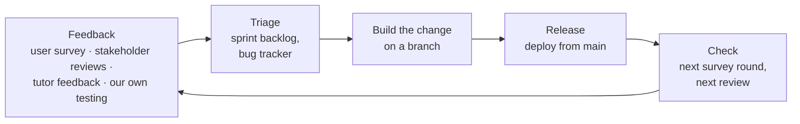

# Improvement

How we used feedback from players, our stakeholder and the tutors to improve Wits Quest. Each row says who asked, what we changed, and where the evidence is. The raw feedback is on [User Feedback](user-feedback.md) and [Stakeholder Reviews](stakeholder-reviews.md).

---

## The feedback loop

| Source | Rounds | Points raised |
| :--- | :--- | :--- |
| **Player survey** (21 questions) | Sprint 2 and Sprint 3, 10 players | Sign-up problems, how to play, map, trivia, battles, sound |
| **Stakeholder reviews** | 13 Aug, 15 Sep, 26 Sep, 28 Sep | Code quality, repos, security, methodology, dark mode, sound, how-to-play tips, history search |
| **Tutor feedback** (Zayd) | 15 Sep live demo | Friend system, avatars instead of names on the map |
| **Our own testing** | 8 Oct full-app test, Lighthouse, load test | Database clean-up, avatars on the map, speed and accessibility fixes |

---

## Did it work? Scores before and after

Average player scores (1 to 5) in the Sprint 2 survey, then in the Sprint 3 survey after the changes:

```mermaid
xychart-beta
    title "Player survey: Sprint 2 (first bar) and Sprint 3 (second bar)"
    x-axis ["Sign-up", "Map", "Battle fun", "Fairness", "Rewards", "Visuals", "Recommend"]
    y-axis "Average score" 0 --> 5
    bar [2.8, 2.8, 3.0, 3.0, 3.2, 3.4, 3.4]
    bar [3.0, 4.2, 3.2, 3.4, 4.2, 4.8, 4.0]
```

| Question | Sprint 2 | Sprint 3 | Change |
| :--- | :---: | :---: | :---: |
| Map navigation | 2.8 | 4.2 | **+1.4** |
| Visual design and theme | 3.4 | 4.8 | **+1.4** |
| Reward motivation | 3.2 | 4.2 | **+1.0** |
| Likelihood to recommend | 3.4 | 4.0 | +0.6 |
| Battle fairness | 3.0 | 3.4 | +0.4 |
| Battle fun | 3.0 | 3.2 | +0.2 |
| Sign-up ease | 2.8 | 3.0 | +0.2 |

Trivia unlocking "every time" went from **0%** of players in Sprint 2 to **40%** in Sprint 3. Each round had about five different players, so these numbers show a direction, not proof.

---

## Feedback from players

| Players said | What we changed | Status | Evidence |
| :--- | :--- | :--- | :--- |
| "Give instructions on how to play" (both rounds) | A three-step walkthrough with Kudu on first sign-in: explore, answer to collect, build a deck and battle | ✅ Done (Sprint 4) | [Walkthrough](#screens) below; `Onboarding.tsx` |
| Verification codes rejected, resend not working (8 of 10) | Sign-up checks the email and password before sending, with clear messages; verification moved to Supabase Auth's 6-digit email code | ✅ Improved | [User Experience](../ux/user-experience.md#how-errors-are-handled) |
| Hard to find your way on the map (2.8 / 5) | Walking directions to the next event, with a backup router and a cache; trail stops flagged on the map | ✅ Done; score rose to 4.2 | [API Quick Start](../development/api-quickstart.md#external-api-walking-directions) |
| Trivia didn't unlock reliably | The server checks distance with a fair radius, and a QR code at each event works when GPS is weak | ✅ Done (Sprint 3) | "Every time" rose from 0% to 40% |
| Visual design (3.4 / 5) | Full redesign with four themes, six tabs, card pictures and icons | ✅ Done (Sprint 4); score rose to 4.8 | [Accessibility](../ux/accessibility.md), [UI Design](../planning/ui-design.md) |
| Sound in battles | Sound effects for the main moments, with an on/off switch | 🔄 Sprint 4 (Oratile) | [Sprint 4 Plan](../sprints/SPRINT4_PLAN.md) |
| Location visible to everyone (privacy) | Players only appear in the live lobby when they switch on "available"; avatars on the map instead of names are planned | 🔄 Reviewed | [Data & Privacy](../database/data-privacy.md) |
| Run out of trivia after one play | More real content: 50 cards, 51 events and 50 questions are live | ✅ Done | [Production Data](../database/production-data.md) |

## Feedback from our stakeholder and tutors

| Who and when | Feedback | What we changed | Status |
| :--- | :--- | :--- | :--- |
| Stakeholder, 13 Aug | No code-quality checks | ESLint, Prettier, husky and coverage gates | ✅ Verified on 15 Sep ([Code Quality](../tools/code-quality.md)) |
| Stakeholder, 13 Aug | Needs three repos, not one | Separate frontend, backend and documentation repos, kept in sync automatically | ✅ Verified on 15 Sep |
| Stakeholder, 13 Aug | README too long | READMEs cut to what the app is and how to run it; detail moved to this site | ✅ Verified on 15 Sep |
| Stakeholder, 13 Aug | Explain Issues vs Projects | [Project Tracker](../tools/project-tracker.md) and Decision D-01 | ✅ Verified on 15 Sep |
| Stakeholder, 13 Aug | Document the Git methodology | [Git Methodology](../development/git-workflow.md) | ✅ Verified on 15 Sep |
| Stakeholder, 13 Aug | Document the project methodology and roadmap | [Project Methodology](methodology.md), [Roadmap](../planning/roadmap.md) | ✅ Verified on 15 Sep |
| Stakeholder, 13 Aug | Don't store password hashes; use an industry standard | Moved to Supabase Auth; our code never touches a password | ✅ Verified on 15 Sep |
| Stakeholder, 13 Aug | Explain the tech stack with our own reasons | [Tech Stack](tech-stack.md), [Technical Decisions](../development/technical-decisions.md) | ✅ Verified on 15 Sep |
| Stakeholder, 13 Aug | Structured meeting records, stakeholder minutes kept separate | [Team Meetings](../meetings/index.md), [Stakeholder Reviews](stakeholder-reviews.md) | ✅ Verified on 15 Sep |
| Zayd, 15 Sep | Show avatars on the map instead of names | Avatars on map markers | 🔄 Sprint 4, confirmed at the 8 Oct meeting |
| Zayd, 15 Sep | Add a friend system | Recent opponents, friend requests, a friends list with quick challenge | 🔄 Sprint 4 (Junior and Mahlatse) |
| Stakeholder, 28 Sep | Text boxes unreadable in dark mode | Every colour now comes from theme tokens with tested contrast; text contrast passes Lighthouse in all four themes | ✅ Done ([Accessibility](../ux/accessibility.md)) |
| Stakeholder, 28 Sep | Explain how the game works at the start | The Kudu walkthrough on first sign-in | ✅ Done |
| Stakeholder, 28 Sep | Sound for battle buttons, wins and losses | Sound effects with an on/off switch | 🔄 Sprint 4 (Oratile) |
| Stakeholder, 28 Sep | Filter and search on the history page | Planned for battle history | 🔄 Backlog |

## From our own testing

| Found by | Problem | Change |
| :--- | :--- | :--- |
| 8 Oct team test | Test data left in the live app | Live database cleaned; only real content kept ([Production Data](../database/production-data.md)) |
| 8 Oct team test | Numbers on the map are confusing | Avatars instead of numbers |
| Lighthouse, 10 Oct | First visit slow on phones (49) | Code splitting planned ([Test Results](../development/test-report.md#4-what-isnt-tested-and-whats-next)) |
| Lighthouse, 10 Oct | Map markers have no screen-reader names | Fix planned ([Accessibility](../ux/accessibility.md#what-we-still-want-to-fix)) |
| Load test, 9 Oct | About 0.5 s of every API response is distance to Oregon | Keep-awake ping during marking; a closer region later |

---

## Screens

Screenshots of the changes in the app.

The walkthrough and the four themes are shown on [Accessibility](../ux/accessibility.md) and [User Experience](../ux/user-experience.md).
