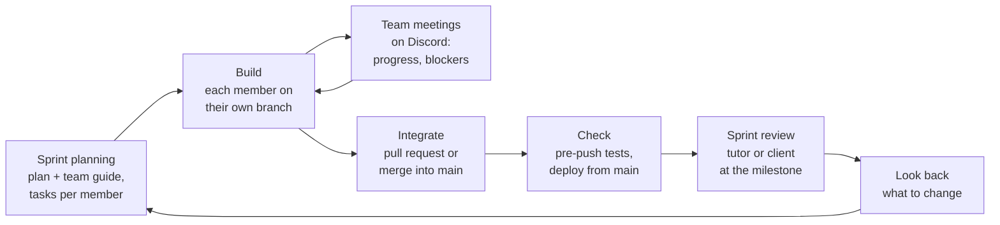
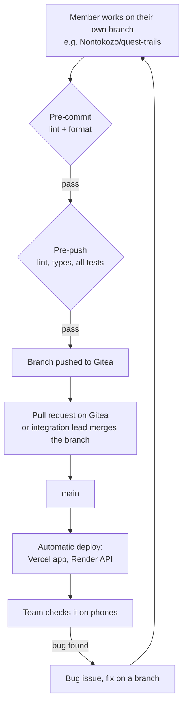
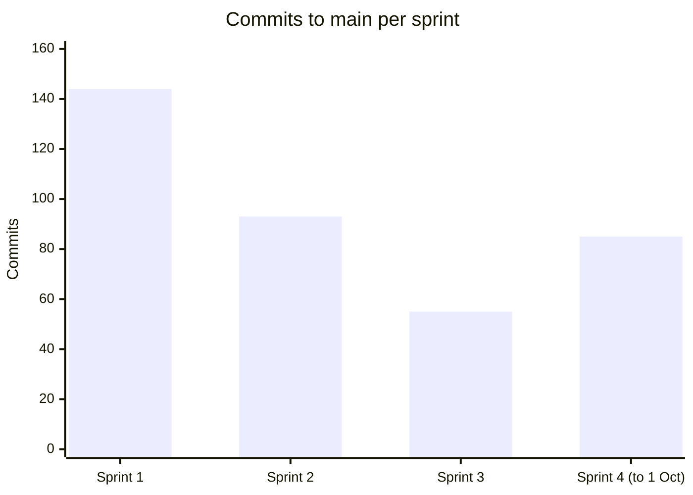

# Project Methodology

How the team plans, builds, reviews and delivers Wits Quest. This page describes the process we actually followed, backed by our meeting records, sprint plans and git history.

---

## Approach: Agile (Scrum-based) in four sprints

We use a lightweight version of **Scrum**. The work is split into four sprints that end on the course milestones. Each sprint starts with a plan that gives every member their own tasks, has regular team meetings while we build, and ends with a review by the tutor or client. What we learn from each review goes into the next plan.

We chose Scrum-style sprints because the course already has fixed milestone dates, the brief is split into tiers we can deliver one at a time, and the tutor reviews at each milestone give us the regular feedback Scrum depends on.

### Sprints

| Sprint | Dates | Goal | Done when | Review |
| :--- | :--- | :--- | :--- | :--- |
| **Sprint 1** | 4 to 25 Aug | Basic tier foundation | Map, trivia, CPU battle and login working | [Sprint 1 Review](stakeholder-reviews.md#sprint-1-review-2026-08-13) |
| **Sprint 2** | 26 Aug to 15 Sep | Make the core secure and reliable | Server checks answers and battles; works on a real phone | [Sprint 2 Review](stakeholder-reviews.md#sprint-2-review-2026-09-15) |
| **Sprint 3** | 15 to 29 Sep | Intermediate tier plus selected Advanced features | Every Intermediate feature done; live PvP playable | [Stakeholder check-in](stakeholder-reviews.md#stakeholder-check-in-app-review-2026-09-28) and final client meeting (29 Sep) |
| **Sprint 4** | 29 Sep to 11 Oct | Polish, test and submit | Everything deployed, tests passing, docs complete; feature freeze on 4 Oct | Final submission (11 Oct) |

Each sprint's plan and team guide are on the [Sprints](../sprints/README.md) page. The original plan for the whole project is the [Master Architecture Guide (PDF)](files/wits-quest-master-architecture-task-specification-guide.pdf). When Sprint 2 ran behind, we re-planned the rest of the project in [Master Guide V2](../sprints/master-guide-v2.md): we moved the dates and dropped or postponed the riskiest Advanced features, so the Basic and Intermediate tiers would be finished properly.

---

## Roles

| Role | Who | What it means in practice |
| :--- | :--- | :--- |
| **Product owner** | The client and the tutor | Set the brief, review each milestone and give the feedback we act on ([Stakeholder Reviews](stakeholder-reviews.md)) |
| **Integration lead** | Mahlatse | Merges members' branches into `main`, fixes problems that only show up once everything is combined, and keeps the deploy working |
| **Feature owners** | Every member | Each member owns their features from the screen to the database: building, testing and documenting them |
| **Documentation** | Kgothatso  | Keep this site in step with the app (shared with feature owners, who document their own work) |

We don't have a dedicated Scrum Master. Meetings are run by whoever calls them, and the action items are written down so everyone knows who does what.

### What each member owns

| Member | Features they own (all sprints) |
| :--- | :--- |
| Mahlatse | Battles (CPU, live, async), spectating, server location checks, offline answers, the API, integration and deployment |
| Junior | Campus map and location, walking directions, trading, automatic event placement, code quality checks |
| Kgothatso | Login and sign-up, achievements, daily streaks, analytics, documentation |
| Nontokozo | Card collection and decks, Card Forge, quest trails, ranked seasons, territory control, real campus content, card pictures |
| Oratile | Anti-cheat and trust scores, QR code check-in, sound, documentation |
| Rea | Admin console, content review (draft to published), campaigns, mobile layout and UI review |

Who built which feature in each sprint is on [Features by Sprint](sprint-features.md).

---

## Sprint events

| Event | How we do it | Evidence |
| :--- | :--- | :--- |
| **Sprint planning** | A written plan and team guide for each sprint, splitting the work into tasks with an owner and a due date | [Sprints](../sprints/README.md), [Sprint 4 Plan](../sprints/SPRINT4_PLAN.md) |
| **Team meetings** | Voice calls on the Big-O Discord server, usually weekly and more often before a milestone. Decisions and action items are written down | [Meeting Records](../meetings/index.md): 9 meetings from 6 Aug to 8 Oct |
| **Sprint review** | A demo to the tutor or client at each milestone. We record their feedback and what we changed | [Stakeholder Reviews](stakeholder-reviews.md) |
| **Looking back** | At the end of a sprint we agree what to change. For example, after Sprint 1 we added automatic code checks, and on 28 Sep we agreed to test locally before every pull request | [Sprint 1 Close-Out](../meetings/index.md#2026-08-13-sprint-1-close-out), [28 Sep meeting](../meetings/index.md#2026-09-28-final-client-meeting-prep-pr-process) |
| **User testing** | Students play the game on campus and fill in a feedback form; on 8 Oct the team tested the whole app together | [User Feedback](user-feedback.md), [8 Oct meeting](../meetings/index.md#2026-10-08-overall-app-testing) |

## Tracking work

- **Sprint task lists:** each sprint plan lists every task with its owner and status. The [Sprint 3 Plan](../sprints/SPRINT3_TASK_BOARD.md) is a full task board, and the [Sprint 4 Plan](../sprints/SPRINT4_PLAN.md) lists who does what.
- **Bugs** go into Gitea Issues with a severity and an owner ([Bug Tracking](../development/bug-tracking.md)).
- **Decisions** are recorded with the reason for them ([Decisions Log](../development/decisions-log.md)).

---

## How code gets into the app

1. **Branches:** each member builds on their own branch, named `<name>/<feature>` (for example `oratile/qr-checkin` or `Nontokozo/quest-trails`).
2. **Checks before sharing:** husky runs lint and formatting on every commit, and lint, type-checks and the full test suites on every push. A failing check blocks the commit or push.
3. **Getting into `main`:** finished work goes in through a pull request on Gitea (for example #91 quest trails, #129 and #131 anti-cheat, #133 QR check-in, #134 coverage gate), or the integration lead merges the member's branch. Small fixes needed to make the combined app work are committed straight to `main` by the integration lead.
4. **Deploy:** every push to `main` deploys automatically ([Deployment](../development/deployment.md)).
5. **Check on phones:** game features are tried on real phones on campus, and anything broken becomes a bug.

Details and naming rules are on the [Git Workflow](../development/git-workflow.md) page.

### Commit messages

We use **Conventional Commits** (`feat(trails): ...`, `fix(async-pvp): ...`). About three quarters of the commits on `main` follow it (280 of 377 up to 1 Oct). The rest are mostly early Sprint 1 commits from before we agreed the format.

---

## The process in numbers

From the git history of `main` (4 Aug to 1 Oct 2026), the meeting records and the sprint plans:

| Measure | Value |
| :--- | :--- |
| Sprints | 4, each ending on a course milestone |
| Commits on `main` | 377 (not counting merges) |
| Contributors | All 6 members |
| Pull requests | Numbered up to #134 on Gitea |
| Member branches | 49 |
| Team meetings recorded | 9 |
| Tutor and client reviews recorded | 5 |
| Automated tests | 745 (193 frontend, 552 backend), all passing on 8 Oct |

Sprint 1 had the most commits because everyone was building their first features at the same time. Sprint 3 had fewer, larger pieces of work (trading, ranked, territory, anti-cheat), merged as whole branches.

---

## How we changed the process

Agile means changing how we work when something isn't working. These are the changes we made:

| When | Problem | Change |
| :--- | :--- | :--- |
| After Sprint 1 | No automatic checks, and the tutor pointed it out | Added husky hooks for lint, formatting, type-checks and tests |
| Sprint 2 | Sprint 2 ran behind the original plan | Re-planned in Master Guide V2: new dates, riskiest features postponed |
| Sprint 2 | One big repo was hard to share | Split copies of `frontend/` and `backend/` into their own repos automatically ([D-03](../development/decisions-log.md#d-03-mirror-the-monorepo-into-frontend-and-backend-repos)) |
| Sprint 3 | The Gitea runners were too slow to wait for | Moved the full test run to each developer's pre-push hook; Gitea CI is run by hand |
| 28 Sep | Pull requests were opened before the feature worked | Test every feature locally before opening a pull request |
| Sprint 4 | Submission close | Feature freeze on 4 Oct; the last week is for fixes, testing and docs |

---

## Code quality

Sprint 1 had no automatic code checks, and the tutor pointed this out in the Sprint 1 review. Since Sprint 2:

- **Before every commit**, husky runs ESLint and Prettier on the changed files. Badly formatted code can't be committed.
- **Before every push**, husky runs the full check: lint, type-check and all tests for both frontend and backend. A failing check stops the push.
- **Coverage gates:** the frontend test run fails below 80% coverage and the backend below 60% ([Test Results](../development/testing.md)).

---

## Definition of Done

A task is done only when all of these are true:

1. It is merged into `main`, through a pull request or by the integration lead.
2. It has tests, and all tests pass, including the coverage gate.
3. Type-check and lint pass.
4. Any endpoint that changes data checks the login and validates the input on the server.
5. It has no open high-severity bugs.
6. No passwords or keys are in the code or docs.
7. Game features work on a real phone on campus (GPS, distance check, offline mode).
8. The docs are updated if it adds a feature, an endpoint or a table.
