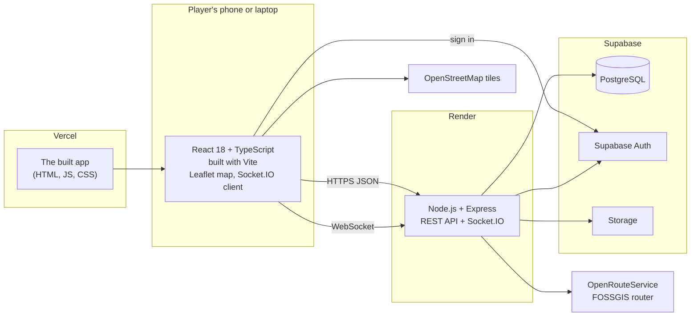

# Tech Stack

Every technology Wits Quest is built with, and why we chose it. The reasons are our own: what the team already knew, what the game needed, and what a free student budget allowed. The longer comparisons (Supabase against Firebase and Auth0, Leaflet against MapBox) are on [Technical Decisions](../development/technical-decisions.md). Licences are on [Third-Party Code](../development/third-party.md).

---

## The stack at a glance

| Layer | Technology | Version |
| :--- | :--- | :--- |
| Language | TypeScript (frontend and backend) | 5.x |
| Frontend framework | React | 18.2 |
| Build tool | Vite | 5.4 |
| Map | Leaflet + react-leaflet, OpenStreetMap tiles | 1.9 / 4.2 |
| Live battles | Socket.IO (server and client) | 4.x |
| Backend runtime | Node.js | 20 |
| Web framework | Express | 4.18 |
| Database | PostgreSQL on Supabase | 15 |
| Login | Supabase Auth | supabase-js 2.x |
| File storage | Supabase Storage (card pictures) | |
| Walking directions | OpenRouteService, with FOSSGIS as backup | |
| Offline play | Service worker (`sw.js`) + IndexedDB queue | |
| Testing | Vitest, React Testing Library, Supertest, jsdom | 1.6 |
| Code quality | ESLint, Prettier, husky, lint-staged | 10 / 3 / 9 / 16 |
| App hosting | Vercel | |
| API hosting | Render (free plan) | |
| Docs | MkDocs Material on GitHub Pages | |
| Source control | Git on the Wits Gitea server, docs mirrored to GitHub | |
| CI/CD | GitHub Actions (deploy), Gitea Actions (checks), husky hooks | |

---

## Frontend

### React 18
**What it does:** draws every screen of the game: the map, cards, battles, ranks and the admin console.

**Why we chose it:**

- **We already knew it.** Most of the team had built with React in earlier courses, so we didn't lose time learning a framework while building the game.
- **It splits the work cleanly.** Each member owns a part of the game, and each part is a self-contained set of components one person can build.
- **Its libraries cover our exact needs:** `react-leaflet` for the map, `socket.io-client` for live battles and `@supabase/supabase-js` for login.

**Turned down:** Vue (nobody had shipped with it) and Angular (too heavy for a 15-week project).

### TypeScript
**What it does:** adds types to JavaScript, in both the app and the API.

**Why:** one language end to end. The game types (cards, battle state, rounds) mean the same thing on both sides, and the compiler catches mistakes before they reach a phone. `strict` mode is on in both `tsconfig.json` files.

### Vite
**What it does:** runs the app while we develop and builds the production bundle.

**Why:** it starts in about a second and reloads changes instantly, and Vitest (our test runner) uses the same config. Create React App, the older option, is no longer maintained.

### Leaflet + react-leaflet with OpenStreetMap
**What it does:** draws the campus map, the event markers, the 25 m unlock circles and the walking route.

**Why:** it's free and needs no account or API key. The map is a tool for the game, not a showpiece, so we didn't need MapBox's paid styled tiles. The tutor suggested MapBox in the Sprint 1 review; we compared the two on [Technical Decisions](../development/technical-decisions.md#map-rendering-leaflet-react-leaflet-not-mapbox).

### Smaller libraries

| Library | What it does | Why this one |
| :--- | :--- | :--- |
| `lucide-react` | Icons on buttons and the bottom bar | One consistent icon set, and only the icons we use are bundled |
| `canvas-confetti` | The celebration when a card is won | Tiny and needs no setup |
| `html5-qrcode` | Scans the QR code at an event | Works in the phone browser's camera, no app needed |
| `qrcode` | Draws event QR codes in the admin console | Lets admins print a code for each event |
| Google Fonts (Outfit, Shippori Mincho B1, Caveat) | The game's typefaces | Free, under the Open Font License |

### Offline play: service worker + IndexedDB
**What it does:** if a player answers trivia inside a building with no signal, the answer is saved on the phone and sent when the connection comes back.

**Why:** campus buildings are often dead zones, and a player shouldn't lose a card for being inside the Great Hall. We wrote the service worker (`public/sw.js`) ourselves instead of adding a plugin, so we control exactly what is cached.

---

## Backend

### Node.js + Express
**What it does:** the REST API that applies every game rule (location checks, trivia marking, battles, rewards, trades and anti-cheat).

**Why:**

- **Same language as the app.** Nobody switches between JavaScript and Python or Java, which matters for a team taking five other courses.
- **Good at real-time work.** Node handles WebSockets well, and live PvP needs them.
- **Simple and well known.** Express is the most widely used Node web framework, so help and examples are easy to find.

**Turned down:** Python with FastAPI (two languages, no shared types) and Java with Spring (too much setup for our timeline).

### Socket.IO
**What it does:** runs live PvP battles, the ranked queue and spectating.

**Why:** a live battle needs both players to see each move immediately. Socket.IO adds rooms and automatic reconnection on top of WebSockets. If a player drops out, they have 60 seconds to reconnect and carry on.

### Smaller backend libraries

| Library | What it does |
| :--- | :--- |
| `cors` | Only lets the Wits Quest app call the API from a browser |
| `dotenv` | Reads secrets from `.env` when running locally |
| `multer` | Receives card picture uploads in the admin console |
| `ws` | The WebSocket layer Socket.IO is built on |

---

## Database, login and storage: Supabase

**What it does:** gives us a hosted PostgreSQL database, user accounts (Supabase Auth) and file storage for card pictures, from one service.

**Why:**

- **Our data is relational.** Players, cards, decks, battles, events and trades all link to each other, which suits SQL. It's also what the databases course taught us.
- **Safer login.** In Sprint 1 we stored our own password hashes. The tutor pointed out the risk, so in Sprint 2 we moved to Supabase Auth, and our code never touches a password now.
- **One free plan covers database, login and storage**, instead of three separate services, each with its own keys.

**Turned down:** Firebase (NoSQL, Google lock-in), Auth0 (login only), and running our own Postgres with custom login (our Sprint 1 setup). The full table is on [Technical Decisions](../development/technical-decisions.md#backend-as-a-service-supabase-vs-the-competition).

---

## External services

| Service | What we use it for | Why |
| :--- | :--- | :--- |
| **OpenRouteService** | Walking directions to the next event | Free walking routes (`foot-walking`); the key stays on the server |
| **FOSSGIS router** | Backup walking directions | Free, needs no key and has no daily quota, so routes keep working when OpenRouteService's quota runs out ([API Quick Start](../development/api-quickstart.md#external-api-walking-directions)) |
| **OpenStreetMap** | Map tiles | Free, open map data that covers the Wits campus well |

---

## Hosting and delivery

| Service | Hosts | Why |
| :--- | :--- | :--- |
| **Vercel** | The app (`wits-quest.vercel.app`) | Free, fast global hosting for a static React build, with deploys from the command line |
| **Render** | The API (`wits-quest.onrender.com`) | One of the few free hosts that runs a long-lived Node server with WebSockets. The trade-off is that it sleeps after 15 idle minutes |
| **Supabase** | The database | See above |
| **GitHub Pages** | This documentation | Free, and builds from the docs repo |

How a change gets deployed is on [Deployment](../development/deployment.md).

---

## Development tools

| Tool | What it does | Why |
| :--- | :--- | :--- |
| **Git + Gitea** | Source control on the university server | Required by the course; Issues track our work ([Project Tracker](../tools/project-tracker.md)) |
| **Vitest** | Runs the frontend and backend tests | Shares Vite's config, and is fast enough to run on every push |
| **React Testing Library + jsdom** | Tests screens the way a player uses them | Tests what the player sees, not internal details |
| **Supertest** | Calls the API in tests without starting a server | Tests real routes, middleware and status codes |
| **ESLint + Prettier** | Finds bugs and formats code the same way for everyone | See [Code Quality](../tools/code-quality.md) |
| **husky + lint-staged** | Runs the checks before every commit and push | Nobody has to remember to run them |
| **GitHub Actions** | Deploys the app and API on every push to `main` | Vercel and Render deploy hooks in one workflow |
| **Swagger UI (OpenAPI)** | Interactive API docs at `/api/docs` | Lets anyone try the API in the browser ([Swagger UI](../development/swagger.md)) |
| **Lighthouse + autocannon** | Speed, accessibility and load tests | See [Test Results at a Glance](../development/test-report.md) |
| **Figma** | UI designs and mockups | See [UI Design](../planning/ui-design.md) |
| **Discord + Google Meet** | Team meetings and calls with the tutor | See [Team Meetings](../meetings/index.md) |
