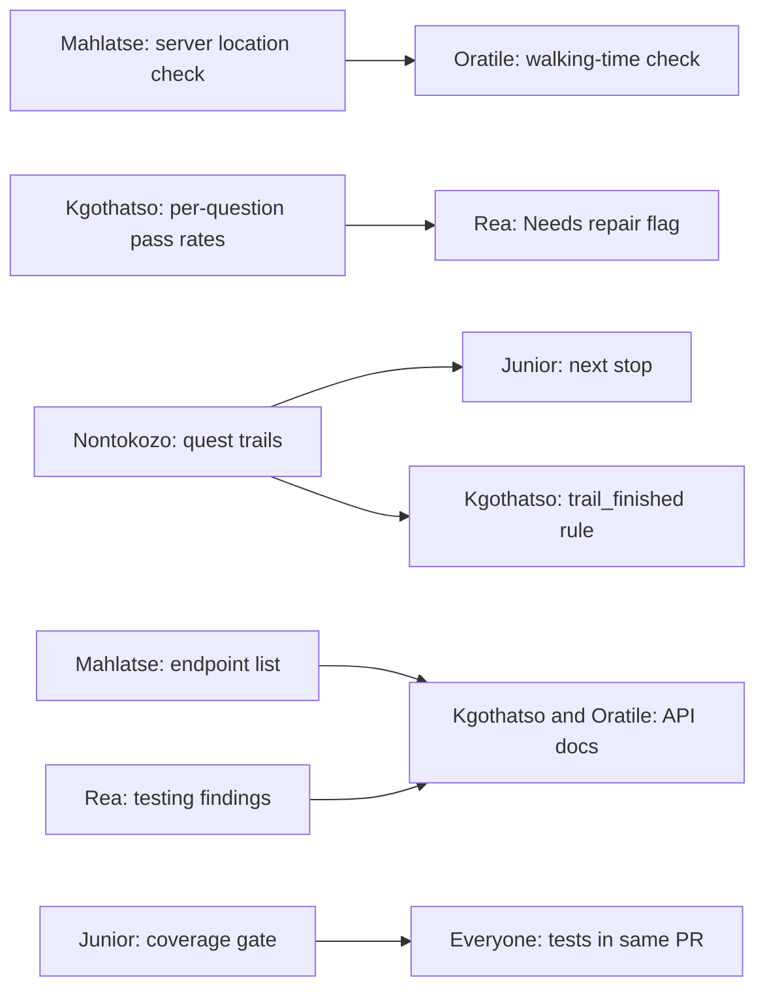

# Sprint 3 Plan

**Sprint:** 15 → 29 Sep 2026 · **Milestone 3 demo: Tue 29 Sep** · **Final submission: Sun 11 Oct**

This page distributes the [Sprint 3 Team Guide](./WITS_QUEST_SPRINT3_GUIDE.md) into one checklist per team member. Each row is a task from the guide, with its story number, due date, fix IDs (`F##`) and files. Update your own rows as work moves, the same day it moves. This board is part of the methodology evidence.

**Status key:** ⬜ Not started · 🔄 In progress · 🔍 In review · ✅ Merged and verified

!!! note "How to fill this in"
    Set **Status** when you start and when you finish. Put the PR link in **PR / evidence**. A task is ✅ only when it meets [Done Means](#done-means): tests in the same PR, CI green, reviewed PR citing its fix IDs, mobile-checked by Rea, docs updated, and working on a real phone.

## Workload at a glance

| Member | Area | Stories | M3 | Final |
| :--- | :--- | :---: | :---: | :---: |
| **Mahlatse** | Check-ins, Battles & API | 1, 2, 3, 4, 5 | 5 | 0 |
| **Oratile** | Anti-Cheat & Documentation | 6, 7, 8 (+27 docs) | 2 | 1 |
| **Kgothatso** | Achievements, Analytics, Streaks & Documentation | 9, 10, 11 (+27 docs) | 3 | 0 |
| **Rea** | Mobile UI, Curation & User Testing | 12, 13, 14, 15, 16 | 5 | 0 |
| **Junior** | Trading, Map, Security & Quality | 17, 18, 19, 20, 21 | 4 | 1 |
| **Nontokozo** | Cards, Trails, Content, Ranked & Territory | 22, 23, 24, 25, 26 | 3 | 2 |
| **Total** | | 26 stories + documentation | 22 | 4 |

## Hand-offs between members

Work that unblocks someone else. If you own the left column, land it early.

| From | To | What is handed over | Needed by |
| :--- | :--- | :--- | :--- |
| Mahlatse | Oratile and others | Server-side location check (story 1). Other features build on it | Thu 24 Sep |
| Kgothatso | Rea | Per-question pass rates for the "Needs repair" flag | Before Curation review |
| Nontokozo | Junior | Quest trails, so "next stop" can point to the next trail step | Before map demo |
| Nontokozo | Kgothatso | Server-side trail completion, so the `trail_finished` achievement rule can be enabled | Before achievements demo |
| Mahlatse | Kgothatso & Oratile | Final endpoint list and before/after timings for the API reference | Sun 27 Sep |
| Rea | Kgothatso & Oratile | "You said → we changed → commit" list and testing findings | After each testing round |
| Rea | Everyone | **Mobile-checked** sign-off on every new screen before it merges | Every PR |
| Junior | Everyone | Coverage gate in CI (60%, then 80%) so tests ship with each feature | Sat 26 Sep |
| Mahlatse | Nontokozo | Pairing on live PvP socket code for ranked matchmaking (Final) | Final |

## Mahlatse — Check-ins, Battles & API

| Story | Task | Due | Fix IDs | Files / where | Status | PR / evidence |
| :-: | :--- | :--- | :--- | :--- | :---: | :--- |
| 1 | Server-side location check: phone sends position with every answer; server refuses outside radius or time window. Lock down `/trivia/checkin` and delete unguarded routes in `server.ts` | M3 · Thu 24 Sep | F1, F3, F4 | `utils/presence.ts` (new), `content.ts`, `TriviaModal.tsx` | ⬜ | |
| 2 | Offline "as at the time": queued answers save position and time, and the server judges them against those | M3 | F43 | `offlineQueue.ts` | ⬜ | |
| 3 | Server CPU battles: phone sends only the chosen stat; server plays rounds, decides winner and pays rewards | M3 | F2, F31 | `battle.ts`, `battleResolution.ts`, `BattleArena.tsx` | ⬜ | |
| 4 | Spectate: "Watch" button on live matches, plus a full two-phone test of live PvP | M3 | — | Live PvP screens | ⬜ | |
| 5 | API design and performance: endpoint audit, `/api/v1` versioning (old paths keep working), fix slow trust-score and analytics queries, record before/after timings, hand endpoint list to docs | M3 | — | All routes; trust-score and analytics endpoints | ⬜ | |

## Oratile — Anti-Cheat & Documentation

| Story | Task | Due | Fix IDs | Files / where | Status | PR / evidence |
| :-: | :--- | :--- | :--- | :--- | :---: | :--- |
| 6 | Walking-time check: refuse and flag an answer that comes faster than the walk between events allows | M3 | — | Builds on Mahlatse's location check | ⬜ | |
| 7 | QR proof: scan a QR code at the landmark when GPS is too poor; admins print each event's code from the console | M3 | — | Admin console, map/trivia flow | ⬜ | |
| 8 | Trust responses: stricter checks → rewards held for review → no cards, ranked or trading; count duplicate answers and accounts that only play each other | Final | — | Anti-cheat services, admin console | ⬜ | |
| 27 | Documentation (shared with Kgothatso): features, API, database, testing, plus methodology, stakeholder and user-feedback evidence | M3 + Final | — | `docs/` | ⬜ | |

## Kgothatso — Achievements, Analytics, Streaks & Documentation

| Story | Task | Due | Fix IDs | Files / where | Status | PR / evidence |
| :-: | :--- | :--- | :--- | :--- | :---: | :--- |
| 9 | Admin-created achievements: rule type, target, name, icon; server checks after every answer and match; pop-up on unlock; replace hard-coded list and remove the two sign-up badges | M3 | — | `utils/achievements.ts`, admin console | ⬜ | |
| 10 | Analytics: pass rate per question and card drop rate vs intended rate per rarity | M3 | — | Analytics screen | ⬜ | |
| 11 | Streaks: consecutive days grow it, a missed day resets it, XP ×1.10 at 3 days and ×1.25 at 7 | M3 | F28, F38 | Progression routes | ⬜ | |
| 27 | Documentation (shared with Oratile) and methodology evidence: board history, stand-up and meeting notes, PR history, burndown | M3 + Final | — | `docs/` | ⬜ | |

## Rea — Mobile UI, Curation & User Testing

| Story | Task | Due | Fix IDs | Files / where | Status | PR / evidence |
| :-: | :--- | :--- | :--- | :--- | :---: | :--- |
| 12 | Mobile and accessible: 360 px wide, 44 px tap targets, no zoom-on-typing, contrast, semantic HTML, ARIA labels, screen-reader checks, "More" menu for the admin console; test on a real Android and a real iPhone | M3 (current screens) · Final (new) | F16, F53 | All screens, admin console | ⬜ | |
| 13 | Review step: draft → pending review → published; a second admin approves, nobody approves their own item | M3 | — | Curation, content routes | ⬜ | |
| 14 | Campaigns: saved start and end dates, events go live and retire by themselves | M3 | — | Campaign admin, scheduler | ⬜ | |
| 15 | "Needs repair": flag questions almost everyone gets wrong (uses Kgothatso's per-question rates); editing a question resets its stats | M3 | — | Curation | ⬜ | |
| 16 | User testing: two rounds with 8+ students, set script and Google Form, findings logged, "you said → we changed → commit" list | M3 · Round 1 Fri 25 Sep · Round 2 Mon 28 Sep | — | Bug tracker, [User Feedback](../project/user-feedback.md) | ⬜ | |

## Junior — Trading, Map, Security & Quality

| Story | Task | Due | Fix IDs | Files / where | Status | PR / evidence |
| :-: | :--- | :--- | :--- | :--- | :---: | :--- |
| 17 | Trading: offer cards for cards, swap completes for both or neither in one transaction; daily cap, fair value, no new or low-trust accounts | M3 | F22 | Trading routes and screen | ⬜ | |
| 18 | Security: CORS locked to our sites, login check on the last public telemetry route, deployed API reachable from outside | M3 | F10 | Backend server config | ⬜ | |
| 19 | Next stop: nearest active event not yet done (or next trail step) with distance and direction, walking route via OpenRouteService with cache and straight-line fallback | M3 | — | `MapExplorer.tsx`, `/api/routing` | ⬜ | |
| 20 | Testing gate and bug tracker: CI fails under 60% coverage (80% for final), API and UI tests for every feature, labels, severity, "found in user testing", bug → fix commit links | M3 | — | CI config, [Bug Tracking](../development/bug-tracking.md) | ⬜ | |
| 21 | Automatic event placement: walkable paths, kept apart, sensible number live, rotated, no area left empty; run from the console | Final | — | Placement service, admin console | ⬜ | |

## Nontokozo — Cards, Trails, Content, Ranked & Territory

| Story | Task | Due | Fix IDs | Files / where | Status | PR / evidence |
| :-: | :--- | :--- | :--- | :--- | :---: | :--- |
| 22 | Card Forge: scrap a duplicate for Essence, or 2 duplicates + 100 Essence for +5 on every stat; server-side so a double tap can't spend twice | M3 | F20, F40 | `routes/forge.ts`, `CardForge.tsx` | ⬜ | |
| 23 | Quest trails: admins chain events, steps done in order, bonus card paid once at the end | M3 | F21 | Trails routes and admin | ⬜ | |
| 24 | Real campus content: at least 20 events, 40 questions, 30 cards with artwork; delete test rows and dummy accounts | M3 | — | Admin console, production database | ⬜ | |
| 25 | Ranked + seasons: queue by similar Elo, only ranked matches change Elo, seasons archive and soft-reset (pair with Mahlatse on live PvP sockets) | Final | F19 | Ranked matchmaking | ⬜ | |
| 26 | Territory: campus zones, influence from answers and wins, most influence holds the zone, server settles simultaneous moves, live map | Final | F23 | `TerritoryMap.tsx`, territories | ⬜ | |

## Documentation deliverables (Kgothatso & Oratile)

Documentation carries 15% of the Milestone 3 mark, and other criteria are marked from the evidence it holds.

| Deliverable | Where it lives | Fed by | Status |
| :--- | :--- | :--- | :---: |
| Features | [Project Overview](../project/overview.md), [Requirements](../project/requirements.md) | Every member's finished stories | ⬜ |
| API reference and quick start | [Endpoint Catalogue](../development/api-endpoints.md), [API Quick Start](../development/api-quickstart.md) | Mahlatse's endpoint list; Junior's availability check | ⬜ |
| Database | [Database Plan](../database/database-plan.md), [Schema](../database/database-schema.md) | Migrations in `docs/database/migrations/` | ⬜ |
| Testing | [Test Results & Coverage](../development/testing.md), [Testing Documentation](../development/testing-documentation.md) | Junior's CI coverage reports | ⬜ |
| User feedback and improvement list | [User Feedback](../project/user-feedback.md) | Rea's two testing rounds | ⬜ |
| Bug tracker and fix register | [Bug Tracking](../development/bug-tracking.md) | Everyone logs bugs; Junior maintains labels and links | ⬜ |
| Methodology evidence | [Methodology](../project/methodology.md), [Meetings](../meetings/index.md), [Git Workflow](../development/git-workflow.md) | Sprint board history, stand-up notes, PR history, burndown | ⬜ |
| No broken links on the site | `mkdocs build` in CI | Everyone who edits docs | ⬜ |

## Everyone

- Write tests with your feature, in the same PR.
- Log every bug you find in the tracker, including ones from user testing.
- Follow the git methodology: a branch per task, a PR with a description and a reviewer, no direct pushes to `main`.
- Move your card on the sprint board the day you start and the day you finish.
- Be at the daily stand-up. Kgothatso and Oratile keep the notes.

## Done Means

- Tests ship in the same PR, and CI is green (lint, `tsc`, coverage ≥60%, builds).
- Merged through a reviewed PR that cites its fix IDs and its bug-tracker items.
- Any database change ships as a file in `docs/database/migrations/`, and Mahlatse has run it.
- Rea has ticked **mobile-checked**.
- The docs page for it is updated.
- It works on a real phone on campus.
