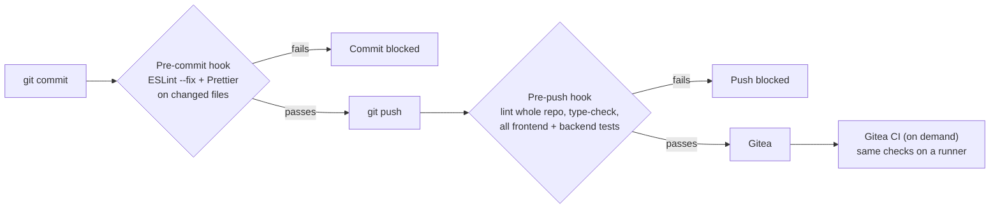

# Code Quality

The tools we use to keep the code clean and consistent, and how we enforce them so nobody can skip them.

---

## The tools

| Tool | What it checks | Where it's set up |
| :--- | :--- | :--- |
| **ESLint** (with `typescript-eslint`, `eslint-plugin-react`, `eslint-plugin-react-hooks`) | Bugs and bad patterns: unused variables, wrong React hook use, stray `console.log` calls, `any` types | `eslint.config.js` |
| **Prettier** | Formatting: quotes, semicolons, line length, indentation, so all code looks the same whoever wrote it | `.prettierrc.json` |
| **eslint-config-prettier** | Turns off ESLint's formatting rules so they never fight Prettier | `eslint.config.js` |
| **TypeScript, `strict` mode** | Type errors: wrong arguments, missing fields, possibly-undefined values | `frontend/tsconfig.json`, `backend/tsconfig.json` |
| **Vitest coverage gates** | Code without tests: the run fails if coverage drops below the gate | `frontend/vite.config.ts` (80%), `backend/vitest.config.ts` (60%) |
| **husky + lint-staged** | Runs all of the above automatically before code leaves a laptop | `.husky/`, `package.json` |

### Our Prettier settings

```json
{
  "semi": true,
  "singleQuote": true,
  "trailingComma": "all",
  "printWidth": 100,
  "tabWidth": 2
}
```

### Our main ESLint rules

| Rule | Level | Why |
| :--- | :--- | :--- |
| ESLint and `typescript-eslint` recommended | Error | Catches real bugs |
| React and React Hooks recommended | Error | Hooks used wrongly cause bugs that are hard to find |
| `no-console` (except `warn` and `error`) | Warning | Debug logging shouldn't ship |
| `@typescript-eslint/no-explicit-any` | Warning | `any` turns off type checks. We kept it as a warning because older code uses it in `catch` blocks, and we fix it as we touch those files |
| `@typescript-eslint/no-unused-vars` | Warning | Dead code |

---

## How we enforce them

The checks run on their own at three points, so code that breaks them can't reach `main` by accident.



| When | What runs | If it fails |
| :--- | :--- | :--- |
| **Every commit** | `lint-staged`: ESLint (with auto-fix) and Prettier on the changed `.ts`, `.tsx`, `.js` and `.jsx` files; Prettier on changed `.json`, `.md` and `.css` | The commit is blocked |
| **Every push** | The pre-push hook: lint the whole repo, type-check frontend and backend, run all frontend and backend tests with their coverage gates | The push is blocked |
| **On demand** | Gitea Actions (`.gitea/workflows/ci.yml`): lint, type-check, tests and builds on a Gitea runner | The run is marked failed |
| **Pull request** | A teammate reads the change, and the [pull request checklist](../development/git-workflow.md#pull-request-checklist) is ticked | Changes are requested |

The hooks are installed automatically by `npm install` (the `prepare` script runs `husky`), so every member has them without doing anything.

Anyone can also run the checks by hand:

```bash
npm run lint          # ESLint on the whole repo
npm run format:check  # Prettier, without changing files
npm run format        # Prettier, fixing files
npm test              # frontend and backend tests with coverage
```

---

## How it changed over the project

| When | What happened |
| :--- | :--- |
| **Sprint 1** | No automatic checks. The tutor pointed this out in the [Sprint 1 review](../project/stakeholder-reviews.md#sprint-1-review-2026-08-13) |
| **Sprint 2** | Added ESLint, Prettier, husky and lint-staged, and turned on TypeScript `strict` mode |
| **Sprint 3** | Added coverage gates (frontend 80%, backend 60%). Moved the full test run into the pre-push hook because the Gitea runners were slow |
| **Sprint 4** | 946 tests passing; backend coverage 81.75%, frontend gated files 92.18% ([results](../development/test-report.md)) |

## Other code-quality habits

- **Server checks everything that matters.** Location, trivia answers and battle results are decided on the server, never trusted from the app.
- **One error shape.** Every API error is JSON `{ "error": "..." }` with the right status code ([API Architecture](../development/api-architecture.md)).
- **No secrets in code.** Keys live only in `.env` files (ignored by git) and in the hosting dashboards.
- **Conventional Commits.** Commit messages follow `type(area): what changed` ([Git Methodology](../development/git-workflow.md#commit-messages)).
