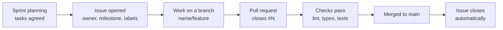

# Project Tracker

We track our work with **Gitea Issues** in the source repo, [big-o/Wits-Quest](https://sdp.ms.wits.ac.za/big-o/Wits-Quest/issues) on the university Gitea server. Each sprint plan in these docs lists the same tasks with owners and due dates, so the plan and the tracker stay in step.

---

## Why Gitea Issues

We chose Issues over a Gitea Projects board ([Decision D-01](../development/decisions-log.md#d-01-gitea-issues-for-tracking-work)):

- **Issues link to the code.** A pull request that says `closes #42` closes the issue when it merges, so every change points to its task, and every task to its change.
- **Everything is in one place.** Each issue has an owner, labels, a sprint milestone and its own discussion thread, next to the code.
- **A Projects board would add nothing.** In Gitea, Projects is just a view on top of Issues. It lives at the organisation level and has to be linked to each repo by hand, which is extra work for the same data.

**Turned down:** Gitea Projects (extra setup, same data), Trello, Notion and Jira (separate accounts, no link to commits), and spreadsheets (no links or discussion).

---

## How an issue is set up

| Field | What we put there | Example |
| :--- | :--- | :--- |
| **Title** | What needs doing, in plain words | "Answer trivia only inside the event's radius" |
| **Assignee** | The one person who owns it | Mahlatse |
| **Milestone** | The sprint it belongs to | Sprint 3 |
| **Labels** | The kind of work, such as `bug` for anything broken ([Bug Tracker](../development/bug-tracking.md)) | `bug` |
| **Description** | What "done" looks like, and steps to reproduce for a bug | |

## How work moves

1. **Planning:** at the start of each sprint we agree the tasks in a meeting and write them into the sprint plan (for example the [Sprint 3 task board](../sprints/SPRINT3_TASK_BOARD.md), with 26 stories).
2. **Issues:** each task becomes an issue with an owner and the sprint milestone.
3. **Work:** the owner builds it on their own branch ([Git Methodology](../development/git-workflow.md)).
4. **Pull request:** the pull request names the issue (`closes #N`), and the checks must pass.
5. **Done:** when it merges, Gitea closes the issue. The milestone shows how much of the sprint is finished.

## Where to see progress

| What | Where |
| :--- | :--- |
| Open and closed tasks | [Gitea Issues](https://sdp.ms.wits.ac.za/big-o/Wits-Quest/issues) (filter by milestone or label) |
| Code changes and reviews | [Gitea pull requests](https://sdp.ms.wits.ac.za/big-o/Wits-Quest/pulls), numbered up to #134 |
| Each sprint's tasks and owners | [Sprints](../sprints/README.md) and the [Sprint 4 Plan](../sprints/SPRINT4_PLAN.md) |
| Bugs | [Bug Tracker](../development/bug-tracking.md) |
| Decisions and their reasons | [Decisions Log](../development/decisions-log.md) |
| What we agreed in meetings | [Team Meetings](../meetings/index.md) |

!!! note "Login needed"
    The Gitea server is the university's, so the Issues and pull request links need a Wits student login.
