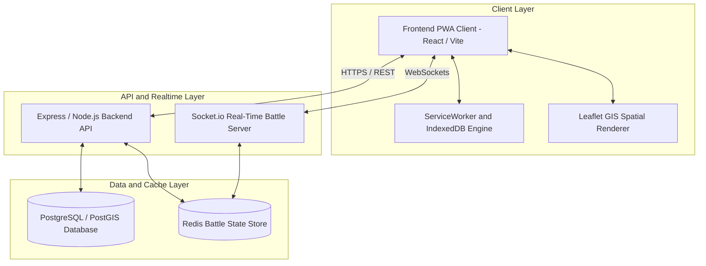

# Wits Quest - System Architecture Diagram

```mermaid
graph TD
    subgraph Client ["Client Layer"]
        PWA["Frontend PWA Client - React / Vite"]
        SW["ServiceWorker and IndexedDB Engine"]
        Map["Leaflet GIS Spatial Renderer"]
    end

    subgraph API_Layer ["API and Realtime Layer"]
        API["Express / Node.js Backend API"]
        WS["Socket.io Real-Time Battle Server"]
    end

    subgraph Data_Layer ["Data and Cache Layer"]
        DB[("PostgreSQL / PostGIS Database")]
        Cache[("Redis Battle State Store")]
    end

    PWA <--> SW
    PWA <--> Map
    PWA <-->|HTTPS / REST| API
    PWA <-->|WebSockets| WS
    API <--> DB
    API <--> Cache
    WS <--> Cache
```
