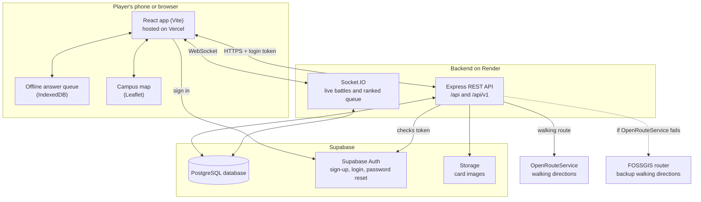

# System Architecture

How the parts of Wits Quest fit together. The app and the API are separate programs that talk over HTTPS and WebSockets.

- **The app** shows the map, cards and battles. It signs players in directly with Supabase Auth and sends the login token with every API call.
- **The API** checks the token, applies all the game rules (location, answers, battles, rewards) and reads and writes the database. Live battles run over Socket.IO on the same server, which keeps the match state while it's being played.
- **Supabase** provides the database, login and image storage. It does not generate our API. Every endpoint is our own code.
- **OpenRouteService** is the external API we call for walking directions to the next event. If it fails, the API asks the free **FOSSGIS** walking router instead, and the app draws a straight line only if both fail. Routes are cached for an hour.
