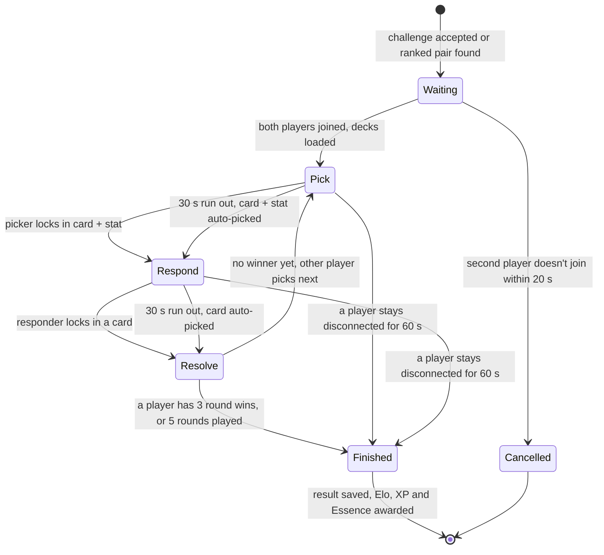
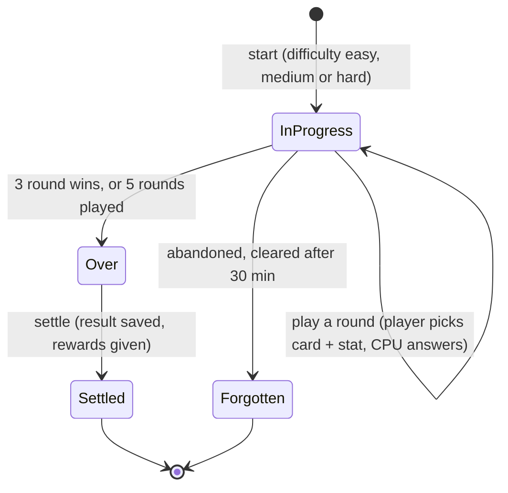
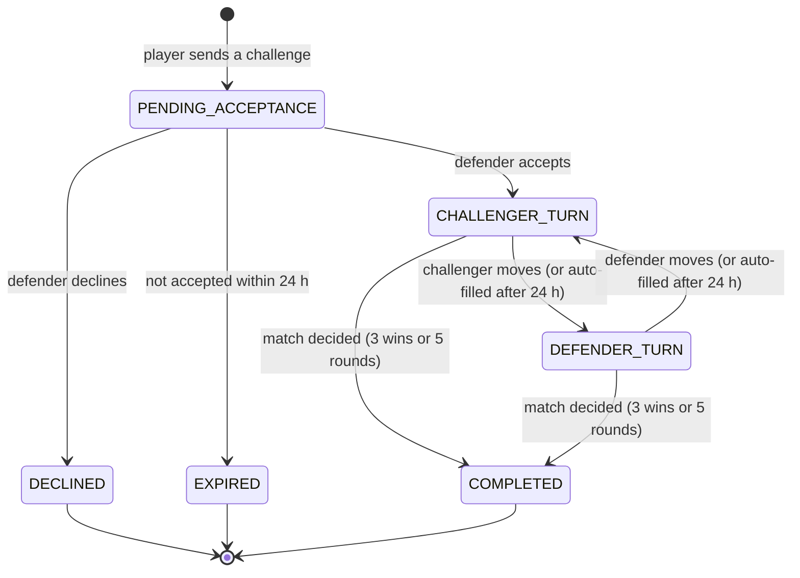
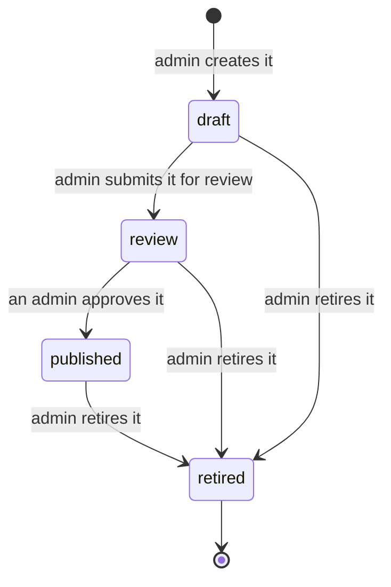
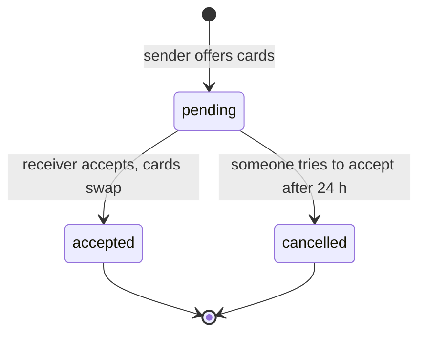

# State Diagrams

The things in Wits Quest that move through set stages, and what moves them on. The server enforces every one of these. The app only shows the current state and sends the player's choice.

---

## Live PvP match

Two players battle in real time over Socket.IO (`backend/src/services/battleSocketHandler.ts`). Each round has two turns. The **picker** chooses a card and a stat. The other player sees the stat (not the card) and **responds** with one of their cards. The picker swaps every round, so both players pick equally.

**Rules checked on every turn:** the card must be in the player's deck, a card can't be played twice in one match, and each stat can be used at most twice per match. In **Resolve**, the two cards' values for the chosen stat are compared. For Attack, 30% of the defender's Defense is taken off first. A draw is possible when both players win the same number of rounds.

## CPU battle

The same round rules, but against the computer, through `POST /api/battle/cpu/...`. The match is kept in the server's memory until it ends.

## Async challenge

A turn-based match played over hours or days (`async_pvp_challenges.status`). Every action has a 24-hour deadline. If a player misses it, the server auto-fills that one move and the match carries on.

## Content lifecycle

Cards, events and trivia questions all follow the same steps (`status` column). New admin content starts as a draft, and players only ever see `published` content.

Content can only be published from `review`, so nothing goes live without passing through it. Any admin can approve, including the one who submitted it. Retired cards stay in the collections of players who already own them.

Quest trails use a shorter version: `draft`, `published` and `retired`, with no review step.

## Trade offer

The database also allows `rejected`, but there's no endpoint yet for rejecting or withdrawing an offer. An offer that's never accepted stays `pending` until someone tries to accept it after it expires.
