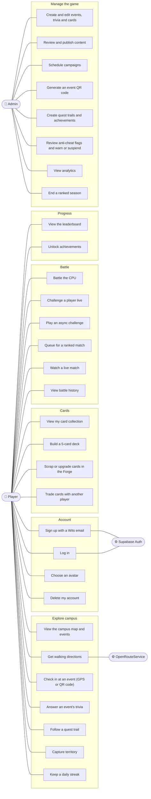

# Use Case Diagram

What each kind of user can do in Wits Quest. There are two roles with different powers: **players** (role `STUDENT`) and **admins** (role `ADMIN`). The `LECTURER` role exists in the database, but it has no extra powers yet, so lecturers use the game like players.

Some actions are blocked for players with a low trust score (see [Anti-cheat](#notes)).

## Notes

- **An admin is also a player.** Admins can do everything a player can, plus the "Manage the game" actions. An admin can't see the admin screens unless their role is `ADMIN`.
- **Answering trivia includes checking in.** The server only accepts an answer if the player was really at the event. See the [answer sequence](06_sequence_diagrams.md#answer-an-events-trivia).
- **Capturing territory and keeping a streak happen automatically.** A correct answer counts toward the streak and adds influence in the zone around the event.
- **Anti-cheat limits some actions.** A player's trust score is worked out from their movement flags. Below 40 they can't play ranked. Below 20 they also can't play async challenges, and get no cards from the multi-question trivia route (`POST /api/trivia/answer`). The main event answer route doesn't check trust yet. A suspended player can't trade. (The trust rules also say players below 40 can't trade, but the trade endpoints don't check this yet.)
