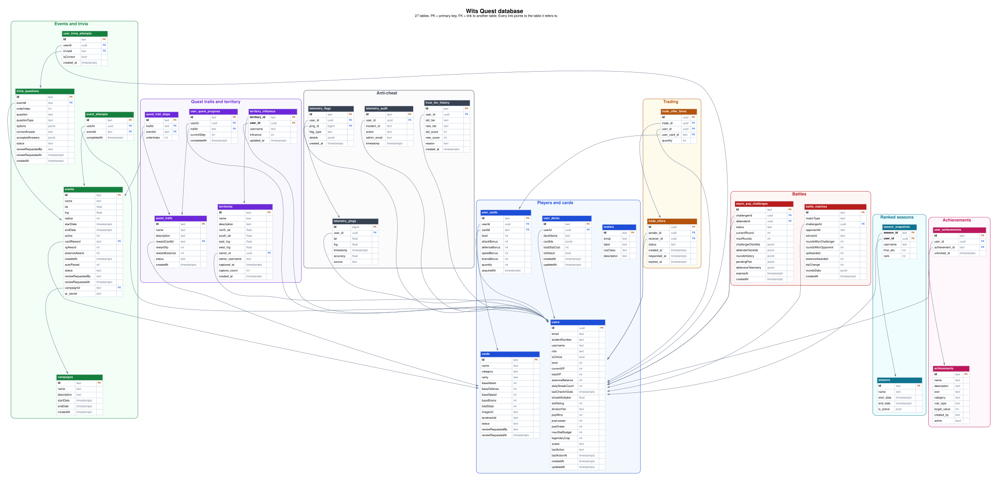
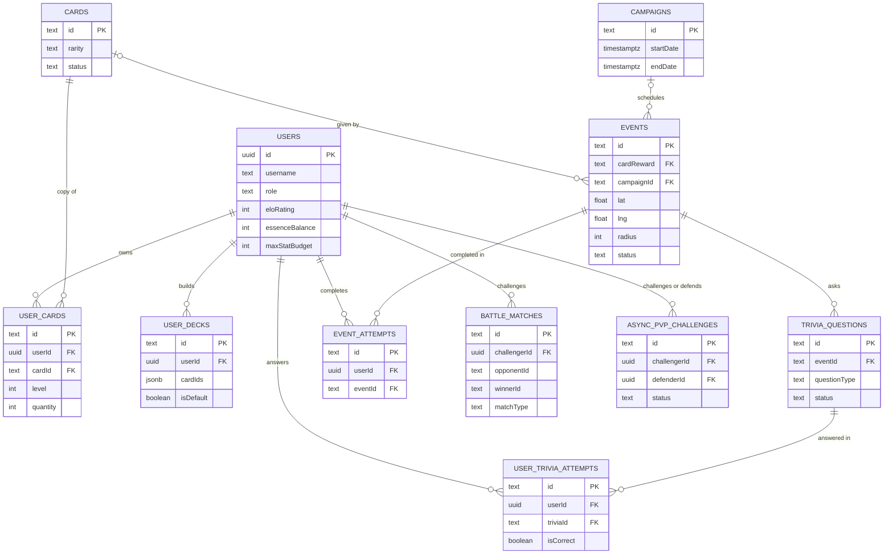
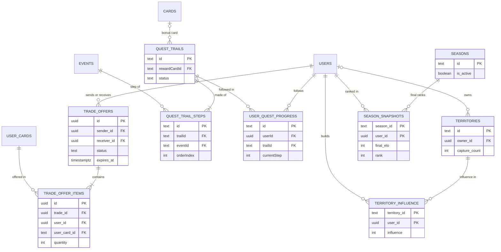
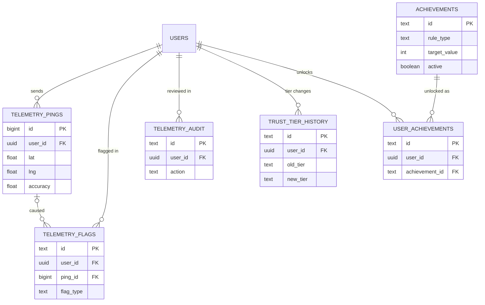

# Entity Relationship Diagram (ERD)

How the database tables link to each other. To keep the diagrams readable, each table shows only its key and link columns; every column is listed on [Database Schema](../database/database-schema.md).

**How to read the lines:** `||--o{` means "one to many" (one player owns many cards). `||--o|` means "one to zero or one".

---

## The whole database

Every table and every column in one picture, with each link drawn as an arrow to the table it points to. Click it to open it full size and zoom in.

[Download as PNG](../database/images/database-diagram.png)

The diagrams below show the same links split into three smaller pictures.

---

## Players, cards, events and battles

`battle_matches.opponentId` and `winnerId` are not links, because they can also hold `CPU_BOT` or `DRAW`.

## Trading, trails, territory and seasons

## Anti-cheat and achievements

`avatars` stands alone: `users.avatar` holds an avatar id, but the database doesn't enforce the link.
