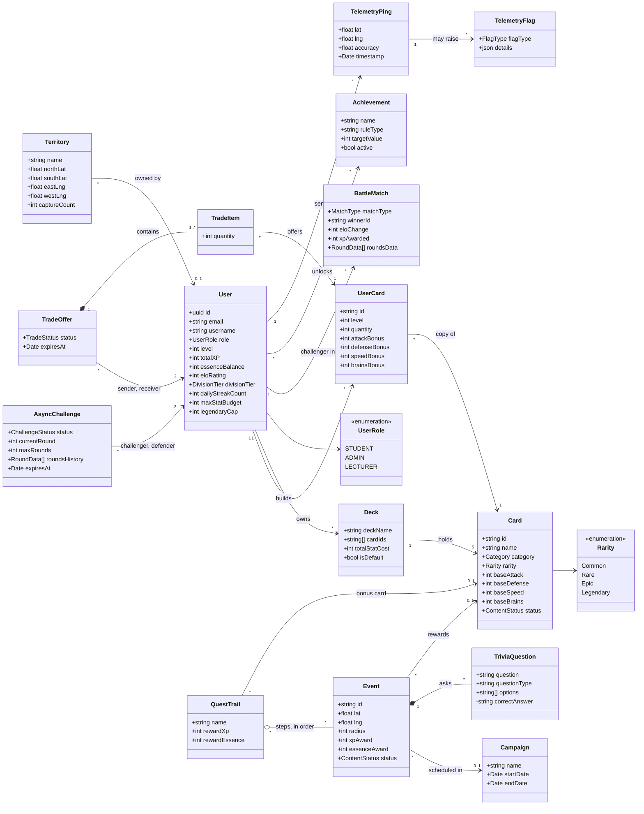

# Class Diagram

Wits Quest is written in TypeScript as modules of functions rather than classes, so these diagrams show the **main types and the modules that work on them**. The first diagram is the game's domain model. The second shows how the backend code is organised.

---

## Domain model

The main things in the game, their key fields, and how they relate. Fields match the TypeScript types in `backend/src/models/schema.ts` and the database tables (see [Database Schema](../database/database-schema.md) for every column).

`correctAnswer` is marked private (`-`) because the API never sends it to the app.

## Backend structure

How a request moves through the backend code. **Routes** check the login and the input, **services and utils** hold the game rules, and only the **Supabase client** talks to the database. The rules are kept in plain functions with no database calls where possible, so they can be unit tested on their own.

```mermaid
classDiagram
    direction TB

    class Server {
        <<server.ts>>
        +Express app
        +Socket.IO io
        +mount(routes)
    }
    class AuthMiddleware {
        <<middleware/auth.ts>>
        +authMiddleware(req) userId
        +requireAdmin(req)
    }
    class TrustGate {
        <<middleware/trustGate.ts>>
        +trustGate(action)
    }

    class Routes {
        <<routes/*>>
        auth, content, battle, asyncBattle
        trades, forge, trails, territory
        ranked, telemetry, qrCheckin, routing
    }

    class BattleSocketHandler {
        <<services/battleSocketHandler.ts>>
        -activeRooms
        -rankedQueue
        +setupBattleSocketHandler(io)
        +pairRankedQueue(io)
    }
    class ApplyMatchResult {
        <<services/applyMatchResult.ts>>
        +applyMatchResult(input)
        +calculateDivisionTier(elo)
    }
    class DeckService {
        <<services/deckService.ts>>
        +getUserBattleDeck(userId)
        +checkDeckBudget(cards, limits)
    }
    class EventPlacementService {
        <<services/eventPlacementService.ts>>
        +rotateEvents(force)
        +startEventRotationScheduler()
    }

    class BattleResolution {
        <<utils/battleResolution.ts>>
        +resolveRound(cardA, cardB, stat)
        +canUseStat(counts, stat)
        +isMatchDecided(aWins, bWins)
    }
    class CpuBattle {
        <<utils/cpuBattle.ts>>
        +createMatch()
        +playRound()
        +calculateRewards(match)
    }
    class AsyncChallengeState {
        <<utils/asyncChallengeState.ts>>
        +deriveAsyncTurnState()
        +nextAvailableCard()
    }
    class Presence {
        <<utils/presence.ts>>
        +verifyPresence(claim, event)
    }
    class AntiCheat {
        <<utils/antiCheat.ts>>
        +evaluatePing(current, previous)
        +minWalkingTime(a, b)
    }
    class Streak {
        <<utils/streak.ts>>
        +touchStreak(userId)
    }
    class Achievements {
        <<utils/achievements.ts>>
        +checkAndAwardAchievements(userId)
    }
    class SupabaseClient {
        <<db/supabaseClient.ts>>
        +from(table)
        +rpc(function)
        +auth.getUser(token)
    }

    Server --> AuthMiddleware
    Server --> Routes
    Server --> BattleSocketHandler
    Routes --> TrustGate
    Routes --> CpuBattle
    Routes --> AsyncChallengeState
    Routes --> Presence
    Routes --> AntiCheat
    Routes --> Streak
    Routes --> Achievements
    Routes --> DeckService
    Routes --> ApplyMatchResult
    BattleSocketHandler --> BattleResolution
    BattleSocketHandler --> DeckService
    BattleSocketHandler --> ApplyMatchResult
    CpuBattle --> BattleResolution
    AsyncChallengeState --> BattleResolution
    Server --> EventPlacementService
    Routes --> SupabaseClient
    BattleSocketHandler --> SupabaseClient
    ApplyMatchResult --> SupabaseClient
    DeckService --> SupabaseClient
    Presence --> SupabaseClient
    AuthMiddleware --> SupabaseClient
```

The app (frontend) follows the same idea: screens in `screens/` call `services/apiClient.ts` for HTTP and `utils/websocketClient.ts` for live battles, and never talk to the database directly.
