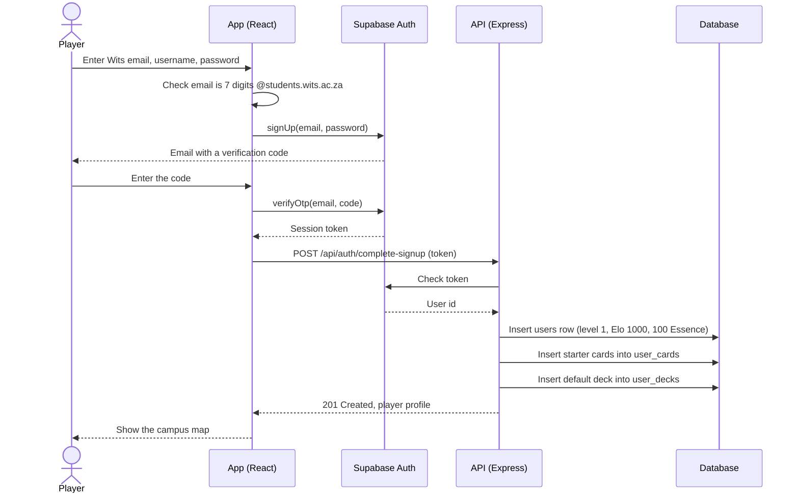
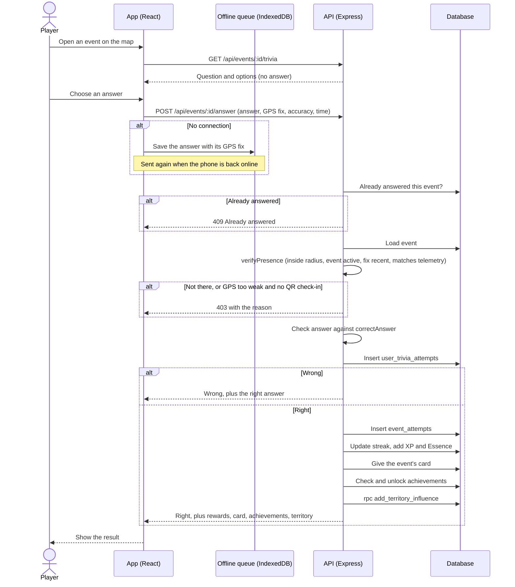
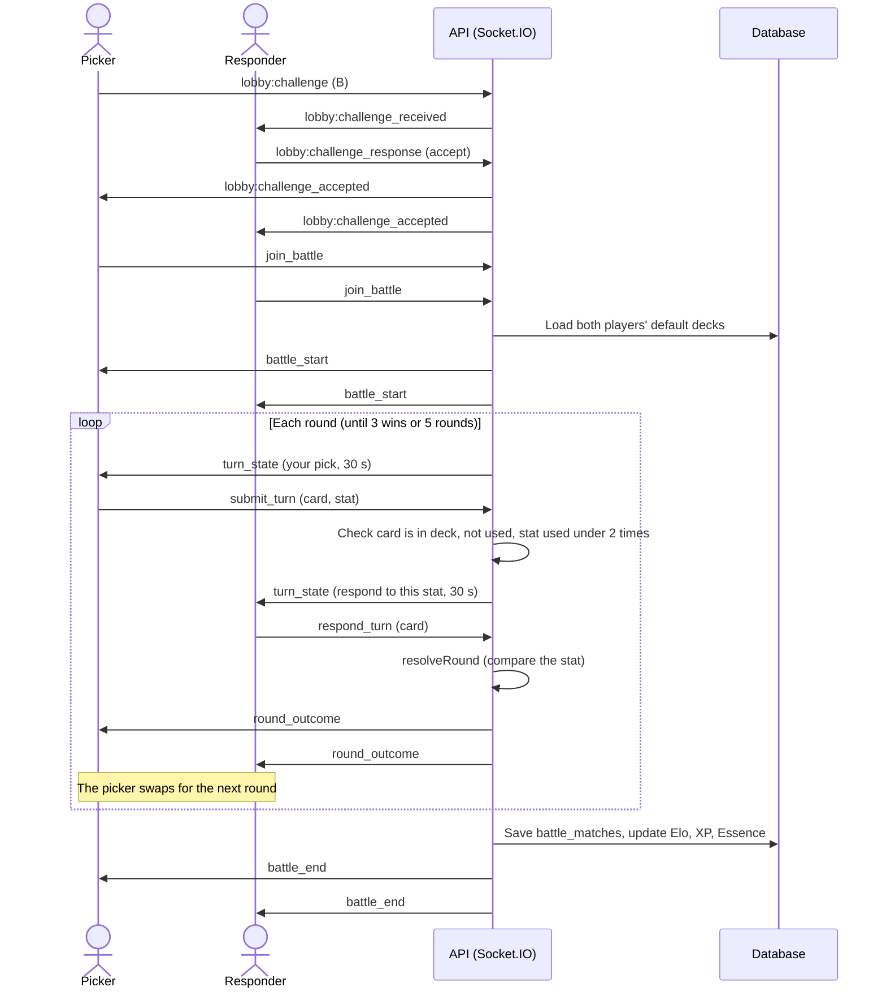
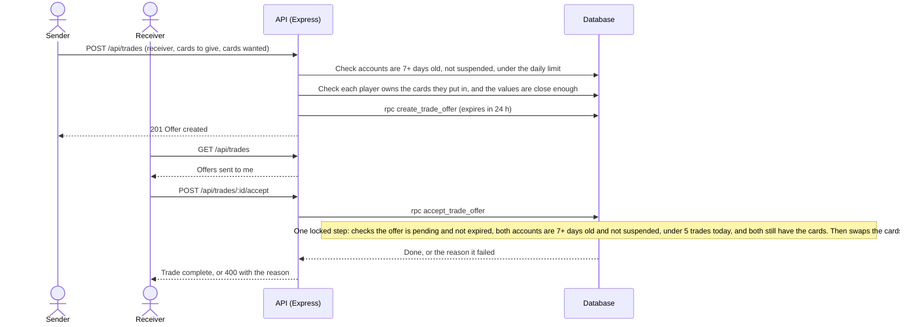
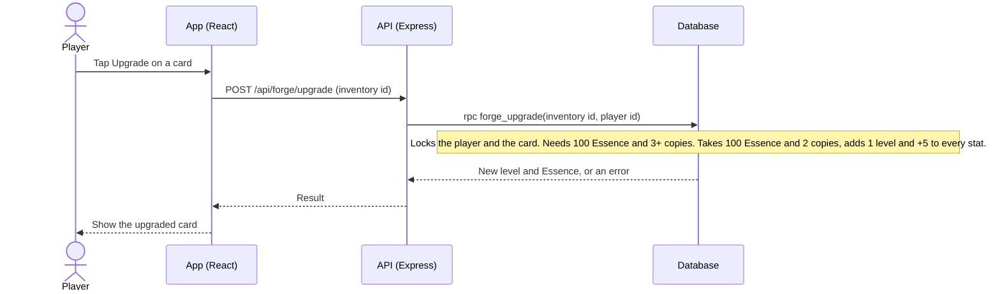

# Sequence Diagrams

Step by step, what happens between the app, the API and the database for the game's main actions. Every request after login carries the player's Supabase token, and the API works out who the player is from the token, never from the request body.

---

## Sign up

## Answer an event's trivia

The most important flow for fairness: the server decides whether the player was really there and whether the answer is right.

## Live PvP round

Live battles use Socket.IO. The server holds the match and decides every round.

If a turn's 30 seconds run out, the server picks for that player. If a player disconnects for more than 60 seconds, the other player wins.

## Trade cards

## Upgrade a card in the Forge

