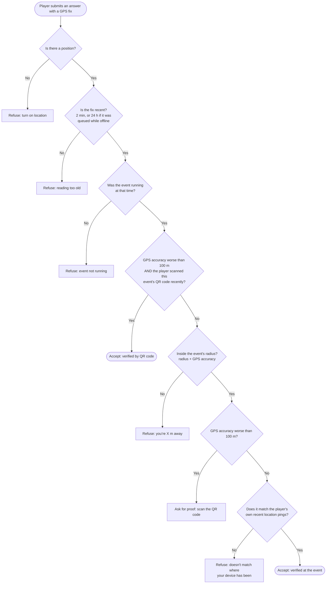
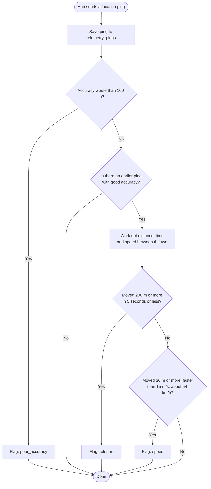
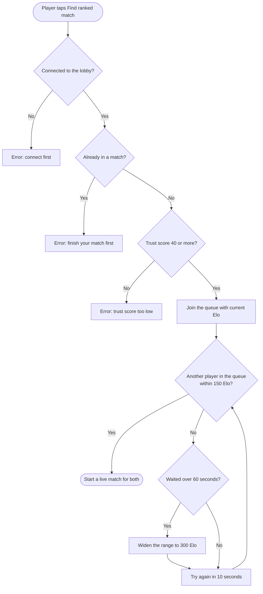

# Activity Diagrams

The decisions the server makes, step by step, for the game's trickiest checks. Each one follows the real code, so the order of the checks matches what happens.

---

## Checking a player was really at an event

Runs every time a player answers an event's trivia (`verifyPresence` in `backend/src/utils/presence.ts`). The app sends the GPS fix it took when the player answered: position, accuracy and time.

## Checking each location ping for cheating

Runs on every location ping the app sends while the game is open (`evaluatePing` in `backend/src/utils/antiCheat.ts`). Flags don't block the player straight away. They lower the player's trust score, which admins review.

Small jumps (under 30 m, or within the GPS accuracy) are ignored, because a phone standing still reports positions a few metres apart.

## Finding a ranked opponent

Runs when a player joins the ranked queue, and again every 10 seconds for everyone waiting (`backend/src/services/battleSocketHandler.ts`).

After the match, both players' Elo changes and their division is worked out again (see [Database Plan](../database/database-plan.md#divisions)).
