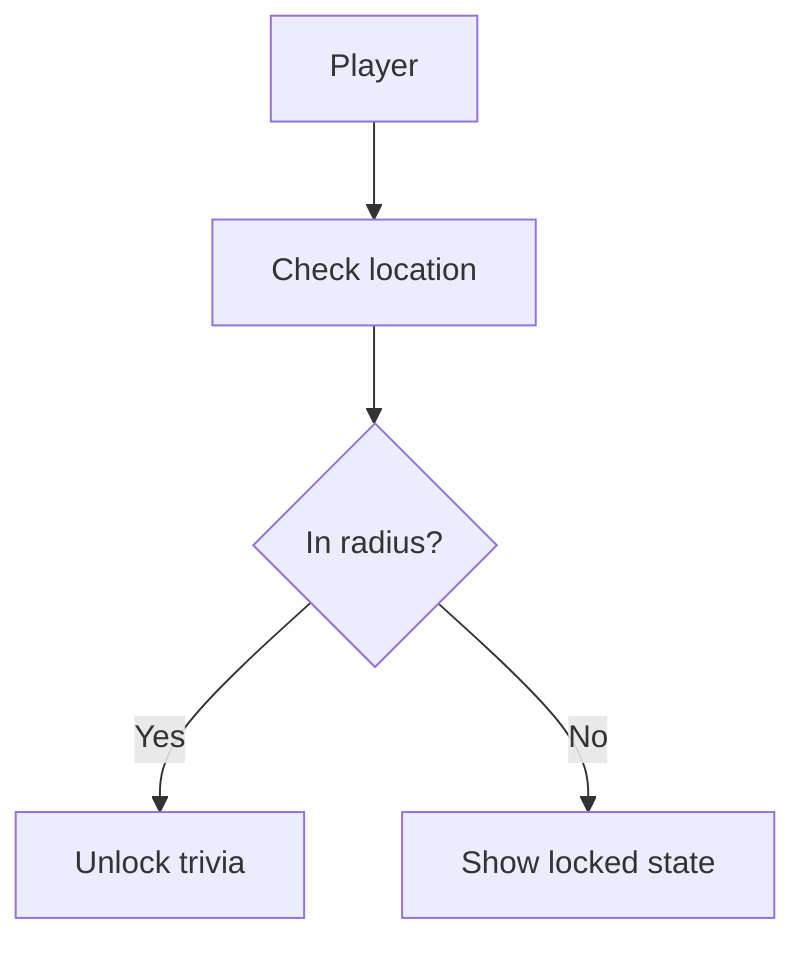

# UML Diagrams

This section holds the system's UML documentation. None of these have been authored yet — each page below is a scaffold describing what should go in it and how to add the diagram.

| Diagram | Page | Status |
| :--- | :--- | :--- |
| Use Case | [use-case.md](use-case.md) | 🔲 Not started |
| Class Diagram | [class-diagram.md](class-diagram.md) | 🔲 Not started |
| Sequence Diagrams | [sequence-diagrams.md](sequence-diagrams.md) | 🔲 Not started |
| Activity Diagrams | [activity-diagrams.md](activity-diagrams.md) | 🔲 Not started |

## How to add a diagram

The site now uses `mkdocs-material` with Mermaid support enabled (`pymdownx.superfences`), so diagrams can be written directly as text and rendered live — no image export needed. Just fence a diagram as ` ```mermaid `:

````markdown

````

Install the extra dependency once:

```bash
pip install mkdocs-material
```

If you'd still rather draw a diagram visually (draw.io, Lucidchart, etc.) and embed an image instead of writing Mermaid, that still works — export as PNG/SVG into `uml/images/` and embed with:

```markdown

```

The database ERD in [Database Plan](../database/database-plan.md) and the [System Architecture Diagram](../development/architecture.md#system-architecture-diagram) are both already written in Mermaid and will render live now.
