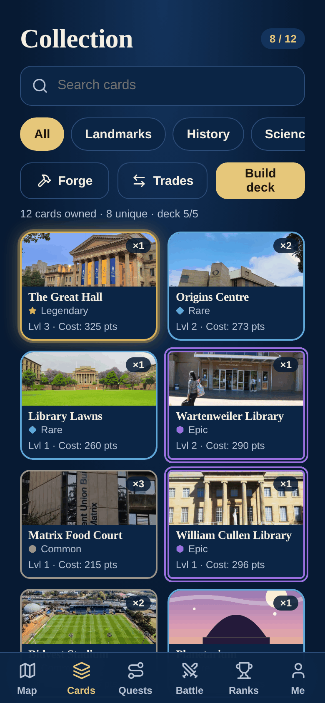
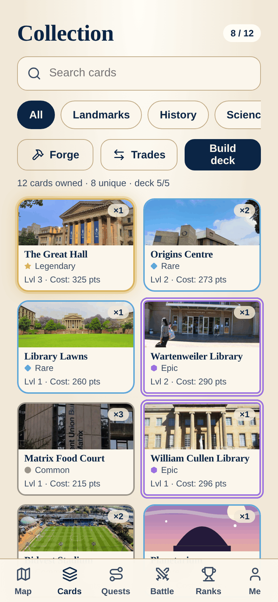
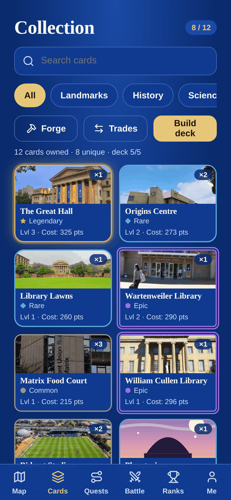
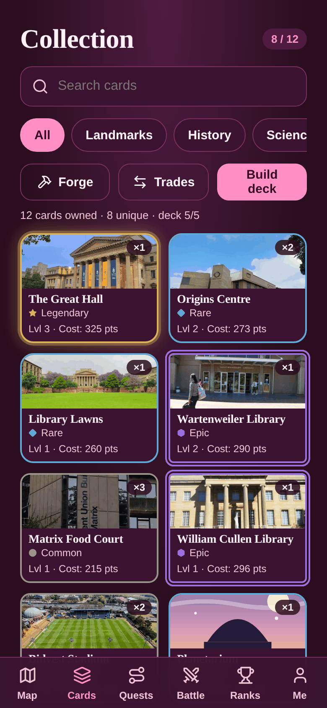
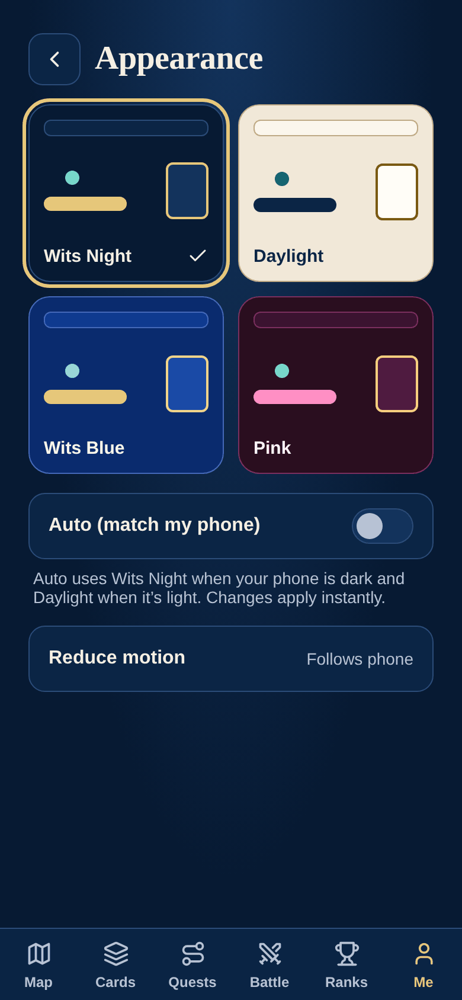

# Accessibility

How Wits Quest works for as many players as possible, including players who are colourblind, have low vision, use a screen reader, or play outside in bright sun.

**Result:** on 10 Oct, Lighthouse scored accessibility **100** on Login, Cards, Quests, Battle, Ranks and Me, and on Cards and Battle in all four themes. The Map scored 92 to 96. Text contrast passed on every screen ([Test Results](../development/test-report.md#2-lighthouse)).

---

## Four themes, for different people and places

Players choose a theme under **Me → Appearance**. They can also pick **Auto**, which follows the phone's light or dark setting. The choice is saved on the phone and applied before the first paint, so the screen never flashes the wrong colours.

| Theme | Colours | Who it helps |
| :--- | :--- | :--- |
| **Wits Night** (default) | Navy and gold | Comfortable in low light and at night; dark screens also save battery |
| **Daylight** | Warm paper with navy text | The strongest contrast, for playing outside in direct sun, and for players with low vision who read dark text on a light background more easily |
| **Wits Blue** | Royal blue, white and gold | Players who prefer a brighter dark theme |
| **Pink** | Rose with bubblegum accents | Players who want a softer palette. Warnings stay coral, never pink, so they still stand out |
| **Auto** | Night or Daylight, following the phone | Players who already use the phone's dark mode or a night schedule |

=== "Wits Night"

    { width="240" }

=== "Daylight"

    { width="240" }

=== "Wits Blue"

    { width="240" }

=== "Pink"

    { width="240" }

=== "Choosing a theme"

    { width="240" }

!!! note "About these screenshots"
    Taken on 10 Oct from a local build of the app with sample player data ("Thandi" is not a real player). The fonts are the browser's fallbacks, because Google Fonts couldn't be loaded where the screenshots were taken.

Each theme is a set of colour tokens (`frontend/src/theme/themes.css`). Every screen uses those tokens, never fixed colours, so all screens follow the theme the same way.

### Contrast in every theme

We worked out the contrast ratio of each theme's main colour pairs. WCAG AA needs 4.5:1 for normal text, and AAA needs 7:1.

| Theme | Text on background | Secondary text on cards | Button text on button | Warning text | Success text |
| :--- | :---: | :---: | :---: | :---: | :---: |
| Wits Night | 15.2 : 1 | 8.6 : 1 | 10.9 : 1 | 7.2 : 1 | 8.7 : 1 |
| Daylight | 12.7 : 1 | 8.2 : 1 | 14.3 : 1 | 6.1 : 1 | 5.9 : 1 |
| Wits Blue | 12.3 : 1 | 7.3 : 1 | 10.9 : 1 | 6.1 : 1 | 6.9 : 1 |
| Pink | 16.2 : 1 | 10.2 : 1 | 8.1 : 1 | 9.1 : 1 | 9.8 : 1 |

Every pair passes AA, and most pass AAA. Lighthouse's contrast check agreed: no contrast failures on any screen in any theme.

### Colourblind players

About 1 in 12 men has some colour blindness, most often red–green. So the game never uses colour as the only signal:

- **Card rarity uses colour, frame shape and an icon.** Common, Rare, Epic and Legendary each have their own frame and icon as well as a colour, and these stay the same in every theme. A player who can't tell the colours apart can still tell the rarity.
- **Win and lose are written out.** Battle results, correct and wrong answers, and errors always come with words ("Correct!", "You won the round"), not just a green or red flash.
- **Warnings aren't red-on-green.** Warnings are coral and success is teal, which stay distinguishable for the most common types of colour blindness, and every warning has text.
- **Choice of theme.** If one theme's colours are hard to tell apart, a player can switch to another; Daylight has the most contrast.

---

## Semantic HTML

We use HTML elements for what they mean, so screen readers, keyboards and browsers understand the page without extra work.

| What | How we do it | Why it matters |
| :--- | :--- | :--- |
| **Page language** | `<html lang="en">` | Screen readers pronounce the text correctly |
| **Real buttons** | 150+ `<button>` elements, not clickable `
`s | Buttons can be reached with Tab and pressed with Enter or Space, and screen readers announce them as buttons |
| **Navigation** | The bottom bar and the admin sidebar are `<nav>` elements, and the current tab has `aria-current="page"` | Screen readers announce the navigation, and which tab you're on |
| **Forms** | Login, sign-up and verification are real `<form>` elements with `<label>`s (31 labels) | Each field is announced with its name, and Enter submits the form |
| **Headings** | `<h1>` for each screen's title and `<h2>` for its sections | Screen reader users can jump between sections |
| **Dialogs** | Sheets, the QR scanner, the account menu and onboarding use `role="dialog"` with `aria-modal="true"` | Screen readers know a pop-up is open and keep focus inside it |
| **Live updates** | Achievement pop-ups, trade results and trivia results use `role="status"` / `aria-live="polite"`; errors use `role="alert"` | Changes are read out without the player having to look for them |
| **Tabs and choices** | Tab rows use `role="tablist"`; the theme picker is a `radiogroup` of `radio`s | The right control type is announced |
| **Icon buttons** | 58 `aria-label`s, on buttons that show only an icon | A button with only an icon still has a name |

## Other accessibility features

- **Zoom stays on.** The viewport lets players pinch-zoom (WCAG 1.4.4). Form fields use 16 px text, so iPhones don't zoom in by themselves when a field is tapped.
- **Less motion.** With the phone's "reduce motion" setting on, the theme fade and other animations are switched off (`prefers-reduced-motion`).
- **Safe areas.** The top and bottom bars leave room for notches and home bars (`env(safe-area-inset-*)`), so nothing is hidden under them.
- **Readable fonts.** Outfit for everyday text, with a serif only for titles.
- **Offline notice.** When the phone loses signal, a banner says so in words, and answers wait to sync.

## What we still want to fix

From the 10 Oct Lighthouse run:

| Issue | Where | Fix |
| :--- | :--- | :--- |
| Event markers on the map have no name for screen readers | Map | Give each Leaflet marker an `aria-label` with the event's name, and make it reachable by keyboard |
| The player's own marker is a small tap target | Map | Enlarge its tap area to at least 44 px |
| Two buttons' names don't match what they show | Map (compass), Me (display name) | Use the visible text in the accessible name |
| Some text is under 12 px | Map credit, parts of Me | Raise it to 12 px or more |
| No `<main>` landmark | Every screen | Wrap each screen's content in `<main>` |
