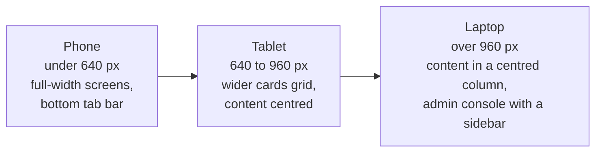

# Responsiveness

Wits Quest is built for phones first, because players walk around campus with it. The same app also works on tablets and laptops, and the layout changes with the screen size.

---

## How the layout adapts

| Screen size | What changes |
| :--- | :--- |
| **Small phones** (under 430 px) | Tighter spacing and smaller headings so everything fits without sideways scrolling |
| **Phones** (430 to 640 px) | The main design: full-width screens, the six-tab bar at the bottom within thumb reach, and sheets that slide up from the bottom |
| **Tablets** (640 to 960 px) | The cards grid shows more columns; content is centred with a maximum width so lines don't get too long |
| **Laptops** (over 960 px) | Game screens sit in a centred column (up to 560 to 680 px wide) so they look like the phone version; the map fills the window; the admin console shows its sidebar next to the content |
| **Narrow admin windows** | The admin event editor switches from side-by-side map and form to stacked |

How it's built:

- **Viewport tag:** `width=device-width, initial-scale=1`, with pinch-zoom left on.
- **Media queries** at 430, 600, 640, 700, 768 and 960 px, plus `matchMedia` in the admin event editor.
- **Flexible layout:** flexbox and grids with `max-width` and `margin: 0 auto`, so content stretches on small screens and stops at a readable width on big ones.
- **Phone notches and home bars:** the top bar, bottom bar and sheets pad themselves with `env(safe-area-inset-*)`, so nothing hides under a notch.
- **No accidental zoom:** form fields use 16 px text, so iPhones don't zoom in when a field is tapped.
- **Big tap targets:** buttons such as close buttons are at least 44 × 44 px, Apple's and Google's minimum.
- **Printing:** a print style for the admin's event QR cards.

## Tested on

| Device | How |
| :--- | :--- |
| Android and iPhone phones | The team and user testers played on their own phones on campus ([User Feedback](../project/user-feedback.md): question 5 asks which device) |
| Phone profile in Lighthouse | Emulated Moto G Power, 412 × 823 ([Test Results](../development/test-report.md#2-lighthouse)) |
| Chrome at phone and laptop sizes | Checked by hand at each size before release |
| Laptop browsers | Chrome, Edge and Firefox, mostly for the admin console |

What players said: **9 of 10** testers said text was readable and buttons were easy to tap on their phone, and nobody said buttons were hard to tap.
