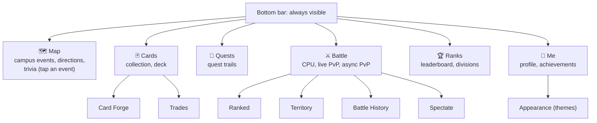

# Structure

How the app's screens are organised, how many taps it takes to get anywhere, and how new players learn their way around.

---

## Six tabs, one tap away

Every main part of the game is a tab in the bottom bar, so any of them is **one tap** from anywhere. Everything else is at most **two taps** deep, and a screen opened from inside a tab keeps that tab highlighted, so players always know where they are.

| Tab | What's in it | Opens from inside it |
| :--- | :--- | :--- |
| **Map** | The campus map, events near you, walking directions; tap a glowing event to answer its trivia | Trivia, QR scanner |
| **Cards** | Your collection and your five-card deck | Card Forge, Trades |
| **Quests** | Quest trails: routes of campus events to walk in order | |
| **Battle** | Battle Kudu (CPU), live PvP, async PvP, spectate | Ranked, Territory, Battle History |
| **Ranks** | The leaderboard and divisions | Challenge a player |
| **Me** | Profile, avatar, achievements, account | Appearance |

Admins get their own console with a sidebar instead of the bottom bar: Spatial Events, Question & Card Authoring, Campaign Scheduling, Curation Governance, Anti-Cheat Telemetry, Campus Heatmaps and Progression.

## How complex is it?

| Measure | Value |
| :--- | :--- |
| Main sections | 6, always visible |
| Most taps to reach any player screen | 2 |
| Taps to the core action (answer trivia) | 3, from the Map, which is the home screen |
| Screens that open from inside a tab | 8 (Forge, Trades, Ranked, Territory, History, Spectate, Appearance, Trivia) |
| Back navigation | Every inner screen has a back button in its header that returns to its tab |

We kept the structure flat on purpose. In Sprint 4 the screens were grouped into six tabs with sub-screens, so the bottom bar fits on a small phone and every label stays readable. Map navigation scored **2.8 / 5** in the Sprint 2 feedback and **4.2 / 5** in Sprint 3 ([User Feedback](../project/user-feedback.md#sprint-2-sprint-3-at-a-glance)).

## Helping new players

| Help | Where | What it does |
| :--- | :--- | :--- |
| **First-run walkthrough** | Shown once, after the first sign-in | Kudu, the mascot, explains the game in three steps: explore campus, answer to collect, build a deck and battle |
| **Kudu, the guide** | Top bar, login and battle screens | The mascot appears with short notes, and is the CPU opponent in battles |
| **Player handbook** | [Game Overview & Tiers](../project/overview.md), [Core Features](../project/core-features.md) and the [CPU Battle Rules](../development/cpu-battle-rules.md) | How to play, how cards and battles work, and the battle rules in full |
| **Clear labels** | Everywhere | Every tab and button has a word label as well as an icon |
