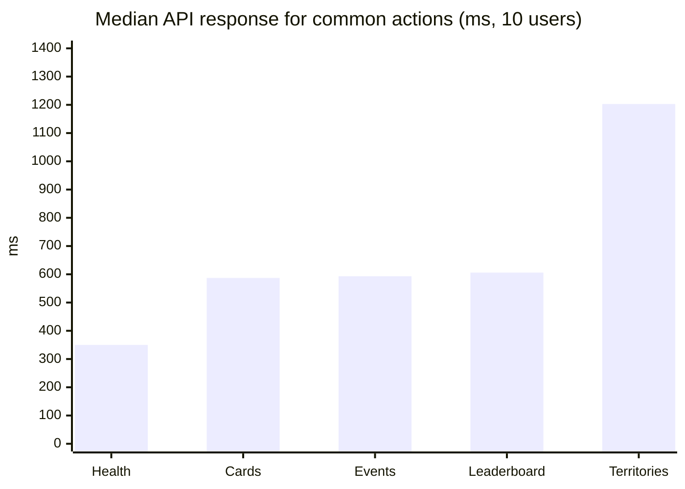
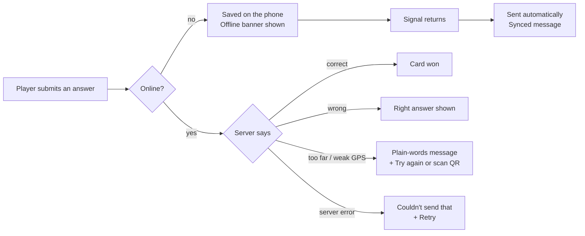

# User Experience

How quick and easy Wits Quest is to use, how it deals with errors, and what happens when a player closes the app and comes back. What players told us is on [User Feedback](../project/user-feedback.md). How the layout adapts to screen size is on [Responsiveness](responsiveness.md), and how the screens are organised is on [Structure](structure.md).

---

## How long things take

The tap counts below come from the app's own screens. The times come from the [10 Oct load test and Lighthouse run](../development/test-report.md), on a phone profile with slow 4G.

| Task | Taps | Time | Notes |
| :--- | :---: | :--- | :--- |
| **Open the app (first visit)** | 0 | About 10 s on slow 4G; 1 to 3 s on Wi-Fi | The whole app downloads once. Later visits load from the browser cache |
| **Open the Map after signing in** | 0 | First paint 1.0 s, map ready at 3.1 s | The Map is the first screen after login |
| **Sign up** | About 6 | Under a minute, plus the verification email | Name, Wits email, password twice, then the 6-digit code from the email |
| **Sign in again later** | 0 | Instant | The session is remembered (see [below](#closing-and-reopening-the-app)) |
| **Answer a trivia question** | 3 | A few seconds; the server answers in about 0.6 s | Tap the glowing event on the map → pick an answer → submit. A won card appears at once |
| **Start a battle against Kudu (CPU)** | 2 to 3 | Seconds | Battle tab → choose the CPU battle → play |
| **Build a deck** | 1 + 5 picks | Under a minute | Cards tab → tap five cards → save. The draft is kept if you leave half-way |
| **Change the theme** | 3 | Instant | Me → Appearance → pick a theme |
| **Load the leaderboard** | 1 | About 0.6 s median | Ranks tab |
| **Get directions to the next event** | 0 to 1 | About 1 s | Shown on the map; cached for an hour |

What players said about speed: **7 of 10** found the game "fast and responsive", none said "very slow", and **9 of 10** said text was readable and buttons were easy to tap ([User Feedback](../project/user-feedback.md#performance-and-recommendation-overall)).

---

## How errors are handled

We want every error to say **what went wrong and what to do next**, in plain words, never a code or a blank screen.

### Errors the player can fix

| Situation | What the player sees |
| :--- | :--- |
| Not a Wits email at sign-up | "Use your @students.wits.ac.za or @wits.ac.za email", shown before anything is sent |
| Password too short, or the two don't match | "Password must be at least … characters" / "Passwords do not match" |
| Incomplete verification code | "Please enter the complete 6-digit code" |
| Too far from the event | **"A little further"**, with a button to try again |
| GPS signal too weak inside a building | **"GPS is weak here"**, with the option to scan the event's QR code instead |
| Location permission turned off | **"Location needed"**, with a button to try again |
| Question already answered | **"Already answered"**, with the right answer shown, and no retry |
| Moved impossibly fast (anti-cheat) | **"That was quick!"**. The answer isn't counted, and there's no accusation |
| A move that isn't allowed in a battle | "It's not your turn to pick." / "That card has already been played this match." |

### Errors the player can't fix

| Situation | What happens |
| :--- | :--- |
| **No signal** | An "Offline mode" banner appears. Trivia answers are saved on the phone and sent automatically when the signal comes back, followed by "Synced 2 offline answers — 1 correct" |
| **Server error** | A short "Couldn't send that" message with a retry button. The server sends a friendly `{ "error": "..." }` message and keeps the details in its log |
| **Opponent drops out of a live battle** | The screen shows "Opponent reconnecting…". They have 60 seconds to come back before the match is settled |
| **Walking-route service down** | The app tries the backup router, then draws a straight line, so the map always shows a way to the event |
| **Server asleep (free hosting)** | The first request after a quiet spell can take up to a minute while Render starts the server again. We keep it awake with a ping during marking |
| **Storage blocked (private browsing)** | The theme and onboarding settings still work for that session; they just aren't saved |

---

## Closing and reopening the app

**Players don't have to log in again.** If a player closes the tab or the browser and opens Wits Quest later, they're still signed in.

| What | Kept when the app is reopened? | How |
| :--- | :--- | :--- |
| **Being signed in** | ✅ Yes | Supabase Auth saves the session on the phone and renews the token automatically. Players stay signed in until they sign out |
| **Cards, decks, XP, rank, trades** | ✅ Yes | Stored on the server, so they're the same on any device |
| **A deck half-built** | ✅ Yes | The draft is saved on the phone and restored when the Cards tab opens |
| **Answers made offline** | ✅ Yes | Kept in IndexedDB on the phone until they've been sent |
| **Theme** | ✅ Yes | Saved on the phone and applied before the first paint |
| **First-run tutorial** | ✅ Shown once | Remembered per player per device, so it doesn't repeat |
| **An async PvP match** | ✅ Yes | The match lives on the server; the player carries on from their next turn |
| **A live PvP match** | ⏱ For 60 seconds | Reopening within 60 seconds reconnects to the same match; after that the match is settled |
| **The screen they were on** | ↩ Opens on the Map | The app always opens on the Map, the home screen. Everything else is one tap away in the bottom bar |

---

## What we changed because of user experience feedback

| Players said | What we did |
| :--- | :--- |
| "Give instructions on how to play" (Sprints 2 and 3) | A first-run walkthrough with Kudu, the mascot, explaining explore → answer → battle in three steps |
| Sign-up and verification were confusing | Checks the email and password before sending, with clear messages; verification by a 6-digit code |
| Hard to find your way around the map (2.8 / 5 in Sprint 2) | Directions to the next event and a clearer map; the score rose to 4.2 / 5 in Sprint 3 |
| Visual design 3.4 / 5 in Sprint 2 | The redesign with themes; the score rose to 4.8 / 5 in Sprint 3 |

The full story of each change is on [Improvement](../project/improvement.md).
